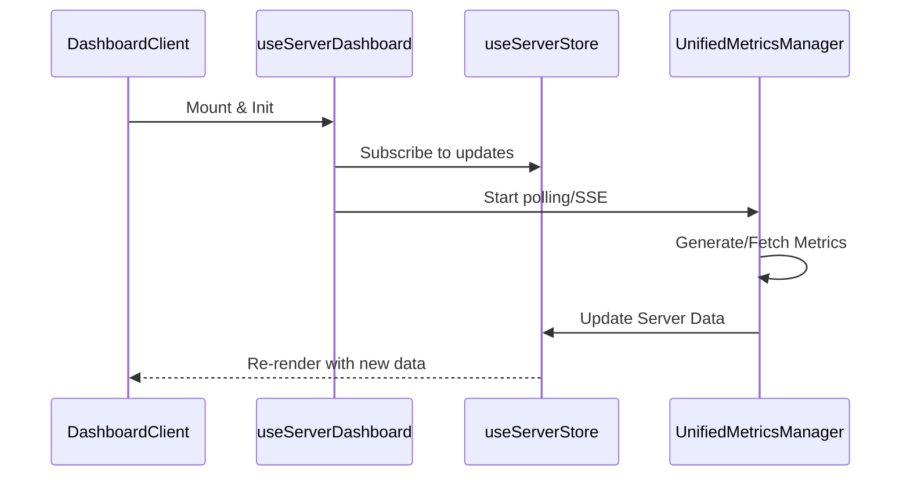
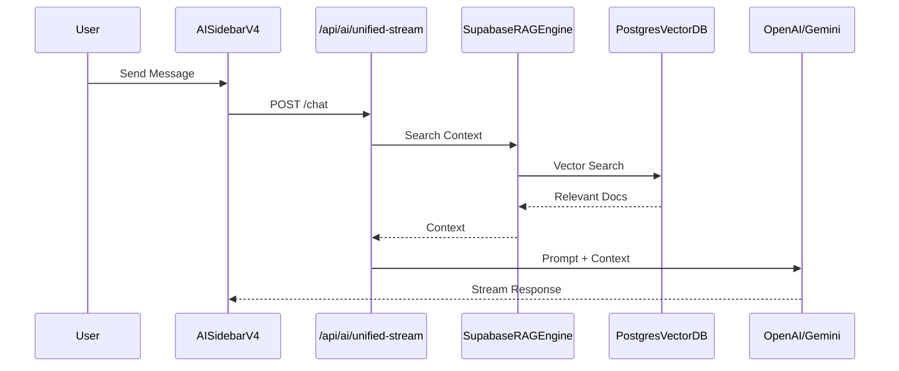

# Component Interaction Analysis

## Overview

This document provides an analysis of the component interactions within the OpenManager Vibe v5 project. It covers the high-level architecture, data flow in key features, and service layer integrations.

## High-Level Architecture

The application follows a modern Next.js App Router architecture with a strong emphasis on client-side state management using Zustand and server-side logic encapsulated in service modules.

```mermaid
graph TD
    Client[Client Layer (Next.js)]
    Store[State Management (Zustand)]
    Service[Service Layer]
    API[API Routes]
    DB[(Supabase / Postgres)]
    AI[AI Services (OpenAI / Gemini)]

    Client --> Store
    Client --> API
    API --> Service
    Service --> DB
    Service --> AI
    Store <--> Service : Data Sync
```

## Key Components & Interactions

### 1. Dashboard Module

The dashboard is the central hub of the application, displaying real-time server metrics and status.

**Key Components:**

- `DashboardClient`: Main container component.
- `useServerDashboard`: Custom hook orchestrating data fetching and state management.
- `useServerStore`: Global store for server data.
- `ServerCard`: UI component for individual server display.
- `UnifiedMetricsManager`: Service responsible for generating and updating metrics.

**Data Flow:**



### 2. AI Sidebar & RAG Engine

The AI Sidebar provides intelligent assistance using RAG (Retrieval-Augmented Generation).

**Key Components:**

- `AISidebarV4`: Main UI component for the AI chat interface.
- `useChat` (Vercel AI SDK): Hook for managing chat state and streaming.
- `SupabaseRAGEngine`: Core engine for retrieving relevant context.
- `PostgresVectorDB`: Vector database for semantic search.
- `MemoryRAGCache`: In-memory caching for performance.

**Interaction Flow:**



### 3. State Management Structure

The project uses multiple Zustand stores to manage different aspects of the application state.

- **`serverDataStore`**: Manages the list of servers and their real-time metrics.
- **`useAISidebarStore`**: Manages chat history, session state, and UI visibility.
- **`auth-store`**: Manages user authentication and permissions.
- **`systemStore`**: Manages global system settings and status.

## Directory Structure Analysis

- **`src/app`**: Contains the route definitions and page layouts.
- **`src/components`**: Reusable UI components.
- **`src/domains`**: Feature-specific components (e.g., `ai-sidebar`).
- **`src/services`**: Business logic, API clients, and helper classes.
- **`src/stores`**: Global state definitions.
- **`src/hooks`**: Custom React hooks for logic reuse.

## Recent Refactoring Impact

Recent refactoring efforts have improved modularity:

- **`useServerDashboard.ts`**: Split into `types`, `utils`, and specialized hooks (`useServerPagination`, etc.), reducing complexity.
- **`supabase-rag-engine.ts`**: Modularized into `rag-types`, `rag-utils`, `memory-rag-cache`, and `keyword-extractor`, improving maintainability and testability.
