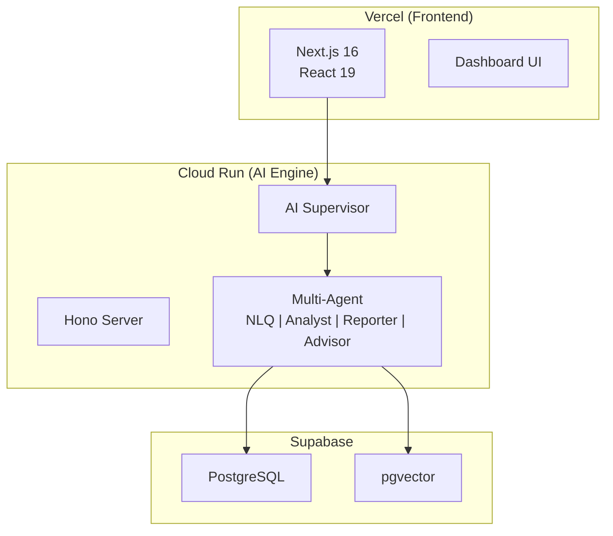

# Reference

> **최종 갱신**: 2026-01-16
> 기술 레퍼런스 문서

---

## System Overview



---

## Quick Links

| 카테고리 | 설명 | 바로가기 |
|----------|------|----------|
| **Architecture** | 시스템 아키텍처, AI 엔진 | [→ architecture/](./architecture/) |
| **API** | API 엔드포인트 레퍼런스 | [→ api/](./api/) |
| **Platforms** | 배포 플랫폼 (Vercel, GCP) | [→ platforms/](./platforms/) |
| **Security** | 보안 정책, OAuth | [→ security/](./security/) |
| **Performance** | 성능 최적화 | [→ performance/](./performance/) |

---

## Key Documents

### Architecture
- [AI Engine Architecture](./architecture/ai/ai-engine-architecture.md) - AI 엔진 상세 명세
- [System Architecture](./architecture/system/system-architecture-current.md) - 시스템 구조

### API
- [API Endpoints](./api/endpoints.md) - API 엔드포인트 목록

### Platforms
- [Vercel Deploy](./platforms/vercel/vercel.md) - Vercel 배포
- [GCP Firewall](./platforms/gcp/firewall-setup.md) - GCP 방화벽

### Security
- [GitHub OAuth](./security/github-oauth.md) - OAuth 설정

---

## Directory Structure

```
reference/
├── architecture/        # 시스템 아키텍처
│   ├── ai/              # AI 엔진 (6개)
│   ├── system/          # 시스템 구조
│   ├── db/              # 데이터베이스
│   └── design/          # 설계 문서
│
├── api/                 # API 레퍼런스 (2개)
├── platforms/           # 배포 플랫폼
│   ├── vercel/          # Vercel 설정
│   └── gcp/             # GCP 설정
│
├── performance/         # 성능 최적화 (6개)
├── security/            # 보안 정책 (3개)
└── rag/                 # RAG 마이그레이션
```

---

## Related

- [Getting Started](../QUICK-START.md) - 시작 가이드
- [Guides](../guides/) - How-to 가이드
- [Troubleshooting](../troubleshooting/) - 문제 해결
