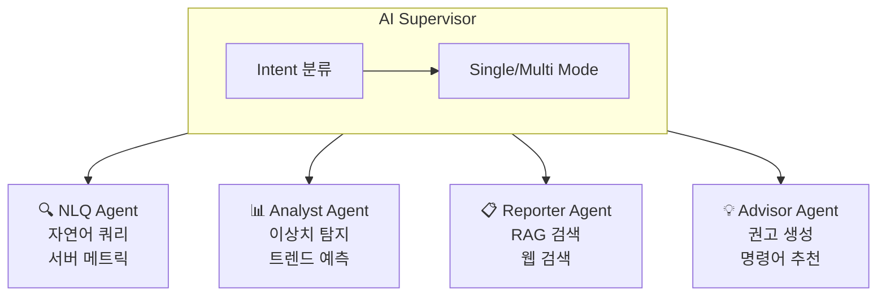

# AI Engine 5W1H 분석

> **OpenManager VIBE v5 AI Engine의 육하원칙(5W1H) 기반 아키텍처 분석**

**프로젝트 버전**: v5.87.0
**최종 업데이트**: 2026-01-14
**관련 문서**: [AI Engine Architecture](./ai-engine-architecture.md)

---

## 목차

1. [누가 (WHO)](#1-누가-who---핵심-컴포넌트)
2. [무엇을 (WHAT)](#2-무엇을-what---제공-기능)
3. [언제 (WHEN)](#3-언제-when---실행-시점)
4. [어디서 (WHERE)](#4-어디서-where---배포-환경)
5. [왜 (WHY)](#5-왜-why---설계-철학)
6. [어떻게 (HOW)](#6-어떻게-how---구현-방식)
7. [Quick Reference](#7-quick-reference)

---

## 1. 누가 (WHO) - 핵심 컴포넌트

### 1.1 Entry Point

| 컴포넌트 | 파일 | 역할 |
|----------|------|------|
| **Hono Server** | `src/server.ts` | HTTP 서버, 라우팅, 미들웨어 |
| **AI Supervisor** | `src/services/ai-sdk/supervisor.ts` | 요청 분석 및 에이전트 라우팅 |
| **Orchestrator** | `src/services/ai-sdk/agents/orchestrator.ts` | 멀티 에이전트 조율 |

### 1.2 4대 전문 에이전트



| 에이전트 | 파일 | 전문 분야 | 도구 |
|----------|------|-----------|------|
| **NLQ Agent** | `nlq-agent.ts` | 자연어 → 서버 메트릭 조회 | `getServerMetrics`, `filterServers` |
| **Analyst Agent** | `analyst-agent.ts` | 이상치 탐지, 트렌드 예측 | `detectAnomalies`, `predictTrends` |
| **Reporter Agent** | `reporter-agent.ts` | RAG 검색, 웹 검색 | `searchKnowledgeBase`, `searchWeb` |
| **Advisor Agent** | `advisor-agent.ts` | RCA, 명령어 추천 | `findRootCause`, `recommendCommands` |

### 1.3 Model Provider (3중 폴백)

```typescript
// 우선순위: Cerebras → Mistral → Groq(예비)
const fallbackChain = [
  { provider: 'cerebras', model: 'llama-3.3-70b' },    // Primary
  { provider: 'mistral', model: 'mistral-small-latest' }, // Secondary
  { provider: 'groq', model: 'llama-3.3-70b-versatile' }, // Reserved for NLQ
];
```

---

## 2. 무엇을 (WHAT) - 제공 기능

### 2.1 API 엔드포인트

| 경로 | 메서드 | 설명 |
|------|--------|------|
| `/health` | GET | 상태 체크 (API 키, 서비스 상태) |
| `/monitoring` | GET | 상세 모니터링 (업타임, 메모리) |
| `/api/chat` | POST | 대화형 AI 쿼리 |
| `/api/supervisor` | POST | 멀티 에이전트 쿼리 |
| `/api/orchestrate` | POST | 직접 오케스트레이션 |
| `/graphrag/query` | POST | GraphRAG 하이브리드 검색 |

### 2.2 12개 AI 도구

#### Metrics 카테고리
| 도구 | 설명 |
|------|------|
| `getServerMetrics` | 서버 CPU/메모리/디스크 조회 |
| `getServerMetricsAdvanced` | 시간범위, 필터, 집계 포함 |
| `filterServers` | 조건 기반 서버 필터링 |

#### RCA 카테고리
| 도구 | 설명 |
|------|------|
| `buildIncidentTimeline` | 장애 타임라인 구성 |
| `correlateMetrics` | 메트릭 간 상관관계 분석 |
| `findRootCause` | 근본 원인 분석 (RCA) |

#### Analyst 카테고리
| 도구 | 설명 |
|------|------|
| `detectAnomalies` | 이상치 탐지 |
| `predictTrends` | 트렌드 예측 |
| `analyzePattern` | 패턴 분석 |

#### Reporter 카테고리
| 도구 | 설명 |
|------|------|
| `searchKnowledgeBase` | GraphRAG 하이브리드 검색 |
| `recommendCommands` | CLI 명령어 추천 |
| `searchWeb` | Tavily 실시간 웹 검색 |

### 2.3 데이터 소스

```
┌─────────────────────────────────────────────────────────┐
│                    AI Engine                            │
└────────────┬────────────────────────────────────────────┘
             │
    ┌────────┼────────┬────────────┬────────────┐
    ▼        ▼        ▼            ▼            ▼
┌────────┐ ┌────────┐ ┌──────────┐ ┌──────────┐ ┌────────┐
│Supabase│ │ Redis  │ │ Vercel   │ │  Tavily  │ │  Mock  │
│pgVector│ │ Cache  │ │ Frontend │ │Web Search│ │  Data  │
└────────┘ └────────┘ └──────────┘ └──────────┘ └────────┘
 1024d 벡터   Circuit    메트릭 API   실시간 검색   개발용
 지식베이스   Breaker     서버 상태
```

---

## 3. 언제 (WHEN) - 실행 시점

### 3.1 서버 생명주기

```
┌─────────────────────────────────────────────────────────────┐
│ 1. 초기화 (Startup)                                         │
│    - API 키 검증 (Mistral, Groq, Cerebras, Tavily)          │
│    - Supabase 연결 확인                                     │
│    - Circuit Breaker 초기화 (CLOSED 상태)                   │
├─────────────────────────────────────────────────────────────┤
│ 2. 요청 처리 (Runtime)                                      │
│    - Intent 분류 → Single/Multi Mode 결정                   │
│    - Provider 선택 → Fallback Chain 적용                    │
│    - Tool 실행 → 결과 반환                                  │
├─────────────────────────────────────────────────────────────┤
│ 3. 장애 대응 (Failure)                                      │
│    - Circuit Breaker OPEN → 캐시 응답                       │
│    - Provider 장애 → 다음 Provider로 Fallback               │
│    - 전체 장애 → Fallback 응답 반환                         │
└─────────────────────────────────────────────────────────────┘
```

### 3.2 요청 처리 흐름

```
User Request
    │
    ▼ (0ms)
┌─────────────────┐
│ Intent 분류     │  ← 키워드 기반 빠른 분류
└────────┬────────┘
         │
    ┌────┴────┐
    ▼         ▼
 Simple    Complex
    │         │
    ▼         ▼ (50-100ms)
┌─────────┐ ┌──────────────┐
│ Single  │ │ Multi-Agent  │
│ Agent   │ │ Orchestrator │
└────┬────┘ └──────┬───────┘
     │             │
     ▼             ▼ (100-500ms)
┌─────────────────────────────┐
│ Tool Execution              │
│ - RAG Search: ~200ms        │
│ - Web Search: ~500ms        │
│ - Metrics Query: ~100ms     │
└──────────────┬──────────────┘
               │
               ▼ (Total: 500ms-2s)
         Response
```

---

## 4. 어디서 (WHERE) - 배포 환경

### 4.1 하이브리드 아키텍처

```
┌─────────────────────────────────────────────────────────────────┐
│                         Vercel Edge                             │
│  ┌───────────────────────────────────────────────────────────┐  │
│  │ Next.js 15 Frontend                                       │  │
│  │ - UI/Interactive 기능                                     │  │
│  │ - Edge Runtime 최적화                                     │  │
│  │ - 10초 타임아웃 제한                                      │  │
│  └─────────────────────────────┬─────────────────────────────┘  │
└────────────────────────────────┼────────────────────────────────┘
                                 │ HTTPS
                                 ▼
┌─────────────────────────────────────────────────────────────────┐
│                    Google Cloud Run                             │
│  ┌───────────────────────────────────────────────────────────┐  │
│  │ AI Engine (Hono Server)                                   │  │
│  │ - 무제한 타임아웃 (LLM 처리)                              │  │
│  │ - Multi-Agent Orchestration                               │  │
│  │ - Region: asia-northeast1 (Seoul)                         │  │
│  └───────────────────────────────────────────────────────────┘  │
└─────────────────────────────────────────────────────────────────┘
```

### 4.2 디렉토리 구조

```
cloud-run/ai-engine/
├── src/
│   ├── server.ts                 # Hono 서버 엔트리
│   ├── routes/                   # API 라우트
│   │   ├── ai.ts                 # /api/chat, /api/supervisor
│   │   └── graphrag.ts           # /graphrag/query
│   ├── services/
│   │   └── ai-sdk/
│   │       ├── supervisor.ts     # AI Supervisor
│   │       ├── model-provider.ts # 3중 Provider
│   │       └── agents/           # 4대 에이전트
│   │           ├── orchestrator.ts
│   │           ├── nlq-agent.ts
│   │           ├── analyst-agent.ts
│   │           ├── reporter-agent.ts
│   │           └── advisor-agent.ts
│   ├── tools-ai-sdk/             # 12개 AI 도구
│   │   ├── index.ts
│   │   ├── server-metrics.ts
│   │   ├── rca-analysis.ts
│   │   ├── analyst-tools.ts
│   │   └── reporter-tools.ts
│   └── lib/
│       ├── config-parser.ts      # 환경변수 파싱
│       ├── model-config.ts       # API 키 검증
│       ├── embedding.ts          # Mistral 1024d
│       └── llamaindex-rag-service.ts  # GraphRAG
├── package.json
├── Dockerfile
└── deploy.sh
```

---

## 5. 왜 (WHY) - 설계 철학

### 5.1 핵심 설계 결정

| 결정 | 이유 | 대안 |
|------|------|------|
| **Cloud Run 분리** | Vercel 10초 타임아웃 회피 | Vercel Pro (비용↑) |
| **3중 Provider** | 단일 Provider 장애 대응 | 단일 Provider (리스크↑) |
| **GraphRAG 하이브리드** | Vector만으로 부족한 연관 검색 | Vector Only (품질↓) |
| **Dual-Mode Supervisor** | 단순 질문에 불필요한 Multi-Agent 비용 절감 | Always Multi (비용↑) |
| **Mistral 1024d** | 무료 tier + 고품질 임베딩 | OpenAI (비용↑) |

### 5.2 무료 tier 최적화

```
┌─────────────────────────────────────────────────────────────┐
│ Free Tier 전략                                              │
├─────────────────────────────────────────────────────────────┤
│ 1. Cerebras (Primary)      - 무료 70B 모델                  │
│ 2. Mistral (Secondary)     - 무료 tier 임베딩 + 추론       │
│ 3. Groq (Reserved)         - NLQ 전용, 빠른 응답           │
│ 4. Tavily (Web Search)     - 1000회/월 무료                │
│ 5. Supabase (RAG)          - 무료 pgVector                 │
└─────────────────────────────────────────────────────────────┘
```

### 5.3 회복 탄력성 (Resilience)

```
Circuit Breaker 상태 전이:

    CLOSED ──(5회 연속 실패)──► OPEN
       ▲                          │
       │                     (30초 대기)
       │                          │
       └──(성공)── HALF_OPEN ◄────┘
                      │
                   (실패)
                      │
                      ▼
                    OPEN
```

---

## 6. 어떻게 (HOW) - 구현 방식

### 6.1 Vercel AI SDK 6 기반

```typescript
// supervisor.ts - Dual-Mode 분기
export async function runSupervisor(query: string) {
  const intent = classifyIntent(query);

  if (intent.complexity === 'simple') {
    // Single Agent Mode
    return await runSingleAgent(query, intent.agent);
  } else {
    // Multi-Agent Mode
    return await runOrchestrator(query);
  }
}
```

### 6.2 Multi-Agent 오케스트레이션

```typescript
// orchestrator.ts - Agent Handoff
const orchestrator = agent({
  name: 'orchestrator',
  model: getModel('supervisor'),
  tools: {
    ...allTools,
    handoffToNLQ: handoff({ agent: nlqAgent }),
    handoffToAnalyst: handoff({ agent: analystAgent }),
    handoffToReporter: handoff({ agent: reporterAgent }),
    handoffToAdvisor: handoff({ agent: advisorAgent }),
  },
});
```

### 6.3 GraphRAG 하이브리드 검색

```typescript
// llamaindex-rag-service.ts
export async function hybridGraphSearch(
  queryEmbedding: number[],
  options: GraphSearchOptions
): Promise<HybridResult[]> {
  // 1. Vector Search (pgVector)
  const vectorResults = await searchWithEmbedding(queryEmbedding, {
    threshold: 0.3,
    limit: options.maxVectorResults,
  });

  // 2. Graph Traversal (Knowledge Graph)
  const graphResults = await traverseKnowledgeGraph(vectorResults, {
    maxHops: options.maxGraphHops,
  });

  // 3. Merge & Deduplicate
  return mergeResults(vectorResults, graphResults);
}
```

### 6.4 API 키 검증 (Whitespace 방지)

```typescript
// model-config.ts
export function validateAPIKeys() {
  // Trim whitespace to prevent false positives
  const mistralKey = getMistralApiKey()?.trim();
  const groqKey = getGroqApiKey()?.trim();
  const cerebrasKey = getCerebrasApiKey()?.trim();

  return {
    mistral: !!mistralKey,
    groq: !!groqKey,
    cerebras: !!cerebrasKey,
    all: !!mistralKey && !!groqKey && !!cerebrasKey,
  };
}
```

---

## 7. Quick Reference

### 7.1 Health Check

```bash
# AI Engine 상태 확인
curl https://ai-engine-490817238363.asia-northeast1.run.app/health

# 예상 응답
{
  "status": "healthy",
  "apiKeys": { "mistral": true, "groq": true, "cerebras": true, "tavily": true },
  "supabase": true
}
```

### 7.2 Query 예시

```bash
# 서버 상태 조회 (NLQ Agent)
curl -X POST /api/supervisor \
  -d '{"query": "web-01 서버 CPU 사용량 알려줘"}'

# 장애 분석 (Multi-Agent)
curl -X POST /api/supervisor \
  -d '{"query": "어제 발생한 장애의 원인을 분석하고 해결 방법을 추천해줘"}'
```

### 7.3 관련 문서

| 문서 | 경로 | 내용 |
|------|------|------|
| AI Engine 상세 아키텍처 | `docs/reference/architecture/ai/ai-engine-architecture.md` | 기술 상세 명세 |
| AI 라우팅 아키텍처 | `docs/reference/architecture/ai/ai-routing-architecture.md` | 라우팅 로직 |
| 배포 가이드 | `cloud-run/ai-engine/README.md` | Cloud Run 배포 |

---

**생성일**: 2025-12-31
**작성자**: Claude Code (AI-assisted)
**검증**: Codex AI Review
