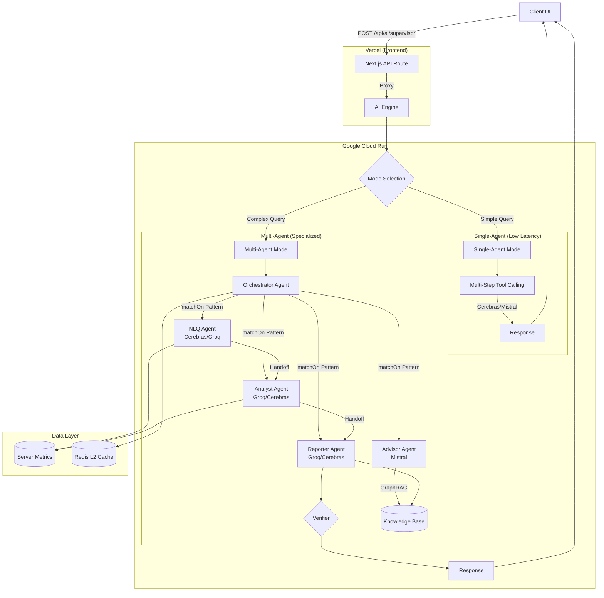
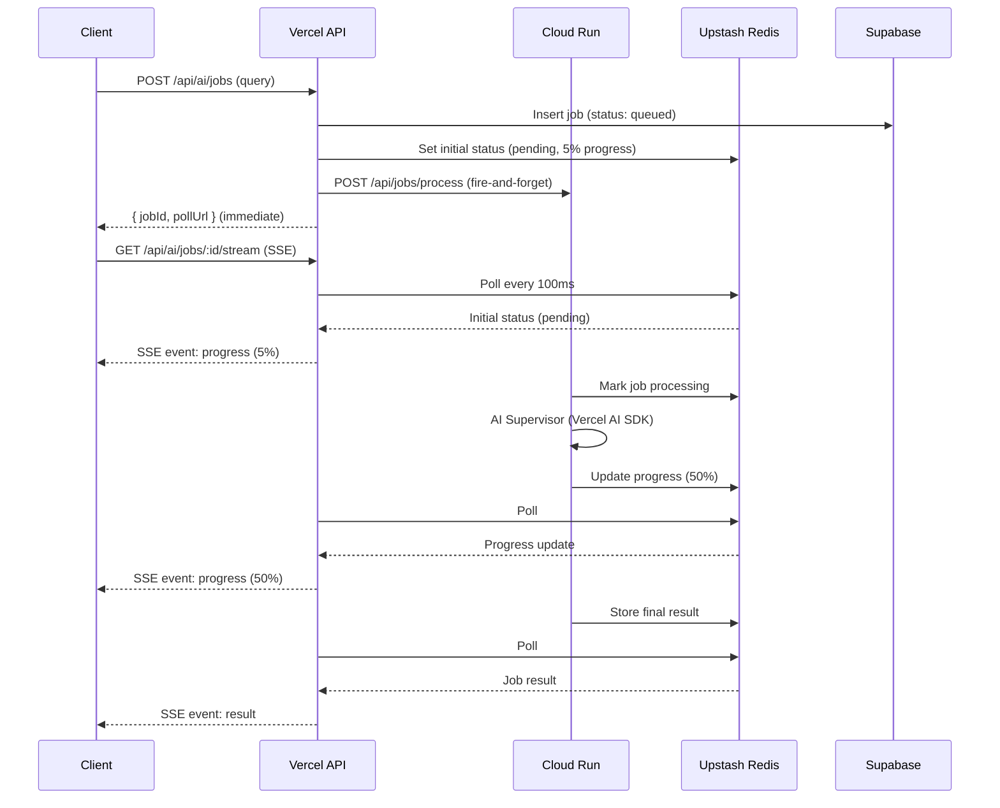
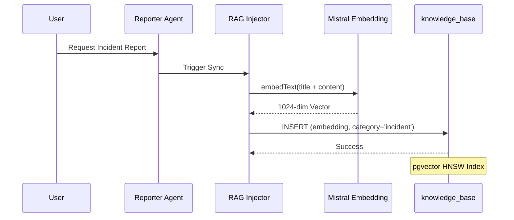
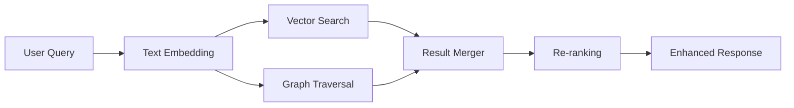

# AI Engine Architecture

> **v5.88.0** | Updated 2026-01-18

## Overview

The AI Engine for OpenManager Vibe is a **Multi-Agent System** built on **Vercel AI SDK** with `@ai-sdk-tools/agents`. It uses a dual-mode Supervisor pattern with specialized agents for different tasks, running on **Google Cloud Run** with frontend on **Vercel**.

## Architecture (v5.87.0, Updated 2026-01-13)

### Deployment Mode

| Mode | Backend | Status |
|------|---------|--------|
| **Cloud Run** | `cloud-run/ai-engine/` (Vercel AI SDK) | ✅ Active (Primary) |
| **Vercel** | `src/app/` (Next.js Frontend) | ✅ Active (Frontend Only) |
| ~~Cloud Run~~ | ~~`cloud-run/rust-inference/`~~ | ❌ Removed |
| ~~Cloud Run~~ | ~~LangGraph/LangChain~~ | ❌ Removed (v5.92.0) |

> **Note**: LangGraph/LangChain migrated to Vercel AI SDK (2025-12-28) due to Cerebras multi-turn tool calling limitations. New architecture uses `@ai-sdk-tools/agents` for multi-agent orchestration.

### Agent Stack

| Agent | Primary Provider | Fallback | Role | Tools |
|-------|------------------|----------|------|-------|
| **Orchestrator** | Cerebras llama-3.3-70b | Mistral mistral-small-2506 | Fast intent routing (~200ms) | Agent handoffs |
| **NLQ Agent** | Cerebras llama-3.3-70b | Groq llama-3.3-70b-versatile | Server metrics queries (simple + complex) | `getServerMetrics`, `getServerMetricsAdvanced`, `filterServers` |
| **Analyst Agent** | Groq llama-3.3-70b-versatile | Cerebras llama-3.3-70b | Anomaly detection, trend prediction | `detectAnomalies`, `predictTrends`, `analyzePattern`, `correlateMetrics`, `findRootCause` |
| **Reporter Agent** | Groq llama-3.3-70b-versatile | Cerebras llama-3.3-70b | Incident reports, timeline | `buildIncidentTimeline`, `findRootCause`, `correlateMetrics`, `searchKnowledgeBase` |
| **Advisor Agent** | Mistral mistral-small-2506 | Groq llama-3.3-70b-versatile | Troubleshooting, knowledge search | `searchKnowledgeBase` (GraphRAG), `recommendCommands` |
| **Verifier** | Mistral mistral-small-2506 | Cerebras llama-3.3-70b | Response validation | N/A |

> **Note**: 실제 export되는 Agent는 4개 (NLQ, Analyst, Reporter, Advisor)입니다. Verifier는 별도의 검증 컴포넌트로, 응답 품질 검증을 담당하며 Agent handoff 대상이 아닙니다.

> **Dual-Mode Strategy**: Single-agent mode for simple queries (low latency), Multi-agent mode for complex queries (specialized handling). Cerebras for fast routing/NLQ, Groq for analysis/reporting stability.

### Frontend Features → Agent Mapping

| Feature | Vercel API Route | Cloud Run Endpoint | Primary Agent | Handoff Agents |
|---------|------------------|-------------------|---------------|----------------|
| **AI Chat (NLQ)** | `/api/ai/supervisor` | `/api/ai/supervisor` | Orchestrator | NLQ, Analyst, Reporter, Advisor |
| **Auto Incident Report** | `/api/ai/incident-report` | `/api/ai/incident-report` | Reporter | - (Direct call) |
| **Intelligent Monitoring** | `/api/ai/intelligent-monitoring` | `/api/ai/analyze-server` | Analyst | - (Direct call) |

> **Note**: Advisor는 Chat을 통한 Orchestrator handoff로만 사용됩니다 (전용 UI 없음).

### Free Tier Limits (2025-01 기준)

| Provider | Daily Limit | TPM | RPM | Usage |
|----------|-------------|-----|-----|-------|
| **Cerebras** | 1M tokens/day | 60K | 30 | Orchestrator, NLQ Agent |
| **Groq** | ~1K requests/day | 12K | Variable | Analyst, Reporter Agent |
| **Mistral** | Limited (may require paid) | - | - | Advisor, Verifier |

> **주의**: OpenRouter 무료 모델은 일일 50회 제한으로 저사용량 시나리오에만 적합합니다.

### Key Features

- **Dual-Mode Supervisor**: Single-agent (simple) vs Multi-agent (complex) mode auto-selection
- **Agent Handoffs**: Pattern-based routing with `matchOn` keywords and regex
- **Multi-Step Tool Calling**: Vercel AI SDK `maxSteps` for reliable tool execution
- **Fallback Chains**: Per-agent provider fallbacks (Cerebras → Groq, Groq → Cerebras)
- **User-Triggered Design**: All AI features are explicitly user-initiated (no auto-triggers)
- **Circuit Breaker**: Model health monitoring with automatic failover
- **GraphRAG Integration**: Advisor agent uses hybrid vector + graph search
- **Protocol Adaptation**: SSE with Keep-Alive to prevent timeouts
- **Response Verification**: Verifier agent validates outputs before response

#### New in v5.87.0 (2026-01-13)

- **LangGraph → Vercel AI SDK Migration**: Complete rewrite using `@ai-sdk-tools/agents`
- **Dual-Mode Supervisor**: Auto-selects single vs multi-agent based on query complexity
- **Agent Specialization**:
  - NLQ Agent (Cerebras → Groq fallback): Simple + complex server queries
  - Analyst Agent (Groq → Cerebras fallback): Anomaly detection, trend prediction
  - Reporter Agent (Groq → Cerebras fallback): Incident reports, timeline
  - Advisor Agent (Mistral): Troubleshooting with GraphRAG
- **Fallback Optimization**: Cerebras for fast routing, Groq for analysis stability
- **Test Coverage**: 65 unit tests including multi-agent orchestrator tests

#### Previous Versions

<details>
<summary>v5.91.0 and earlier (LangGraph era)</summary>

**v5.91.0** (LangGraph)
- RCA Agent, Capacity Agent, Agent Dependencies
- Workflow Caching, Web Search Migration to Tavily

**v5.90.0**
- Triple-Provider Strategy, Rate Limit Distribution

**v5.89.0**
- Dual-Provider Architecture, Advanced NLQ Tool

**v5.88.0**
- Gemini API Key Failover, LangChain maxRetries Fix

**v5.87.0**
- GraphRAG Hybrid Search, Redis L2 Caching

</details>

### Resilience & Performance

#### 3-Way Provider Fallback

모든 에이전트는 3중 Fallback 체계를 갖추고 있어 특정 제공자(API) 장애 시 자동으로 다음 순위 모델로 전환됩니다.

```
Primary (Cerebras) ──[fail]──► Secondary (Groq) ──[fail]──► Tertiary (Mistral)
       │                              │                            │
       └──────────────────────────────┴────────────────────────────┘
                              ↓ Success
                         Response to User
```

| Agent | Primary | Secondary | Tertiary |
|-------|---------|-----------|----------|
| Orchestrator | Cerebras | Mistral | - |
| NLQ Agent | Cerebras | Groq | Mistral |
| Analyst Agent | Groq | Cerebras | Mistral |
| Reporter Agent | Groq | Cerebras | Mistral |
| Advisor Agent | Mistral | Groq | - |

#### Circuit Breaker & Retry

| 메커니즘 | 동작 |
|---------|------|
| **Circuit Breaker** | API 실패 반복 시 해당 제공자를 일시 차단하여 불필요한 대기 시간 감소 |
| **Exponential Backoff** | Rate Limit(429) 발생 시 지수적으로 재시도 간격 증가 (1s → 2s → 4s) |
| **Health Check** | 주기적으로 차단된 제공자의 복구 상태 확인 후 자동 복원 |

#### Fast Path & Forced Routing

LLM 호출 없이 RegExp 기반 Pre-filter가 처리하여 속도와 비용을 최적화합니다.

| 패턴 | 처리 방식 | 예시 |
|------|----------|------|
| **Fast Path** | 단순 인사말은 LLM 없이 즉시 응답 | "안녕", "고마워" |
| **Forced Routing** | 키워드 매칭으로 특정 에이전트 직접 호출 | "보고서 만들어줘" → Reporter |
| **LLM Routing** | 복잡한 의도는 Orchestrator가 LLM으로 판단 | "왜 서버가 느려졌어?" |

```typescript
// Pre-filter 우선순위
1. Fast Path Check (RegExp)     // ~1ms
2. Forced Routing (Keywords)    // ~1ms
3. LLM Intent Classification    // ~200ms (Cerebras)
```

#### Observability (Langfuse)

모든 에이전트의 실행 과정이 Langfuse로 추적되어 실시간 모니터링 및 디버깅이 가능합니다.

| 추적 항목 | 설명 |
|----------|------|
| **Input/Output** | 각 에이전트의 입력 메시지 및 응답 |
| **Tool Calls** | 호출된 도구 목록 및 결과 |
| **Latency** | 에이전트별 처리 시간 |
| **Token Usage** | Prompt/Completion 토큰 수 |
| **Handoff Chain** | 에이전트 간 위임 경로 |

### Agent Communication Patterns

| Pattern | Description | Use Case |
|---------|-------------|----------|
| **Return-to-Supervisor** | Agent sets `returnToSupervisor=true` | Need different agent's expertise |
| **Command Pattern** | Explicit `toAgent` in DelegationRequest | Direct delegation to specific agent |
| **Verification Loop** | Verifier checks output before response | Quality assurance & hallucination check |

## Architecture Diagram

> 📊 **High-Resolution Diagram**: [AI Engine Architecture (PNG)](../../system/diagrams/ai-engine-architecture.png) | [SVG](../../system/diagrams/ai-engine-architecture.svg)
>
> *Source: [`ai-engine-architecture.mmd`](../../system/ai-engine-architecture.mmd) - Updated 2025-12-30*



<details>
<summary>📋 ASCII Fallback (Mermaid 렌더링 실패 시)</summary>

```
                    ┌─────────────────────────────────────────────────────┐
                    │                  Client UI                          │
                    └────────────────────┬────────────────────────────────┘
                                         │ POST /api/ai/supervisor
                    ┌────────────────────▼────────────────────────────────┐
                    │              Vercel (Frontend)                      │
                    │  Next.js API Route ──► Proxy to Cloud Run          │
                    └────────────────────┬────────────────────────────────┘
                                         │
                    ┌────────────────────▼────────────────────────────────┐
                    │            Google Cloud Run (AI Engine)             │
                    │                                                     │
                    │  ┌─────────────────────────────────────────────┐   │
                    │  │            Mode Selection                    │   │
                    │  │    Simple ─────────┬───────── Complex       │   │
                    │  └────────────────────┼─────────────────────────┘   │
                    │                       │                              │
                    │    ┌──────────────────┼──────────────────┐         │
                    │    │                  │                   │         │
                    │    ▼                  ▼                   │         │
                    │  Single-Agent     Multi-Agent             │         │
                    │  (Cerebras)       ┌───────────────────────┤         │
                    │                   │   Orchestrator        │         │
                    │                   │         │             │         │
                    │           ┌───────┼────┬────┼────┬────────┤         │
                    │           ▼       ▼    ▼    ▼    ▼        │         │
                    │         NLQ   Analyst Reporter Advisor    │         │
                    │           │       │     │       │         │         │
                    │           └───────┴─────┴───────┘         │         │
                    │                   │                        │         │
                    │               Verifier                     │         │
                    │                   │                        │         │
                    └───────────────────┼────────────────────────┘         │
                                        │                                   │
                    ┌───────────────────▼─────────────────────────────────┐
                    │                Data Layer                            │
                    │  ┌────────────┐  ┌────────────┐  ┌────────────┐     │
                    │  │   Redis    │  │  Supabase  │  │  pgVector  │     │
                    │  │   Cache    │  │  Metrics   │  │    RAG     │     │
                    │  └────────────┘  └────────────┘  └────────────┘     │
                    └──────────────────────────────────────────────────────┘
```
</details>

### Interactive Diagrams (FigJam)

| Diagram | Description | Link |
|---------|-------------|------|
| **System Architecture** | Full AI engine overview | [View](https://www.figma.com/online-whiteboard/create-diagram/9a4b29bd-0376-4e0a-8e22-3b9bd008854a) |
| **Agent Routing Flow** | Supervisor → Agent routing | [View](https://www.figma.com/online-whiteboard/create-diagram/22dbc5b3-44c1-44e7-9eee-1fa0cf8e402a) |
| **Multi-Agent Communication** | Inter-agent delegation | [View](https://www.figma.com/online-whiteboard/create-diagram/a32f26ab-5d3c-40f6-a8ed-4eb5ec0ed843) |
| **Supervisor Execution Flow** | Query → Supervisor → Agents → Verifier flow | [View](https://www.figma.com/online-whiteboard/create-diagram/eb37f54b-2795-4320-bd2e-c41854a7ec52) |

## State Interfaces

### Vercel AI SDK Types (v5.87.0)

The core interfaces for AI SDK multi-agent orchestration:

### SupervisorRequest

```typescript
interface SupervisorRequest {
  messages: Array<{ role: 'user' | 'assistant'; content: string }>;
  sessionId: string;
  enableTracing?: boolean;
  mode?: 'single' | 'multi' | 'auto';  // Execution mode
}
```

### SupervisorResponse

```typescript
interface SupervisorResponse {
  success: boolean;
  response: string;
  toolsCalled: string[];              // Names of tools invoked
  toolResults: Record<string, unknown>[];
  usage: {
    promptTokens: number;
    completionTokens: number;
    totalTokens: number;
  };
  metadata: {
    provider: string;                 // 'cerebras' | 'groq' | 'mistral'
    modelId: string;
    stepsExecuted: number;            // Multi-step tool calling count
    durationMs: number;
    mode?: 'single' | 'multi';
    handoffs?: Array<{ from: string; to: string; reason?: string }>;
    finalAgent?: string;              // Last agent that handled the query
  };
}
```

### MultiAgentRequest/Response

```typescript
interface MultiAgentRequest {
  messages: Array<{ role: 'user' | 'assistant'; content: string }>;
  sessionId: string;
  enableTracing?: boolean;
}

interface MultiAgentResponse {
  success: true;
  response: string;
  toolsCalled: string[];
  handoffs: Array<{ from: string; to: string; reason?: string }>;
  finalAgent: string;
  usage: { promptTokens: number; completionTokens: number; totalTokens: number };
  metadata: { provider: string; modelId: string; totalRounds: number; durationMs: number };
}
```

<details>
<summary>Legacy LangGraph Types (v5.91.0 and earlier)</summary>

### AgentState (16 Fields)

| Field | Type | Purpose |
|-------|------|---------|
| `messages` | BaseMessage[] | Conversation history |
| `sessionId` | string | Session identifier |
| `routerDecision` | RouterDecision | Supervisor routing decision |
| `delegationRequest` | DelegationRequest | A2A delegation info |
| `agentResults` | AgentResult[] | Results from executed agents |
| `modelHealth` | CircuitBreakerState | Model health tracking |
| `finalResponse` | string | Final response to user |

</details>

## API Specification

### Main Endpoint

**`POST /api/ai/supervisor`** - Multi-Agent AI Processing (Cloud Run)

### Request Format

```json
{
  "messages": [
    { "role": "user", "content": "서버 5번 CPU 상태 알려줘" }
  ],
  "sessionId": "optional-session-id"
}
```

### Response Format (Streaming - AI SDK v5 Protocol)
The Cloud Run engine uses a simulated streaming protocol compatible with Vercel AI SDK v5, enhanced with custom events.

```
Headers:
- Content-Type: text/event-stream; charset=utf-8
- X-Vercel-AI-Data-Stream: v1
- X-Backend: cloud-run

Body Parts:
0:"Hello! I'm checking the server status..."  // Text content
8:[{"type":"progress","message":"Analyzing metrics..."}] // Custom annotation (Keep-alive)
8:[{"type":"verification","isValid":true,"confidence":0.98}] // Verification result
d:{"finishReason":"stop","verified":true}     // Finish signal
```

> **Note**: The frontend proxy (`src/app/api/ai/supervisor/route.ts`) parses this stream and converts `0:` parts to plain text for the client, while handling `8:` parts for UI updates (progress, verification status).

### Additional Cloud Run Endpoints

| Endpoint | Method | Purpose |
|----------|--------|---------|
| `/api/ai/embedding` | POST | Single text embedding |
| `/api/ai/embedding/batch` | POST | Batch text embeddings |
| `/api/ai/embedding/stats` | GET | Embedding service statistics |
| `/api/ai/generate` | POST | Text generation (non-streaming) |
| `/api/ai/generate/stream` | POST | Text generation (streaming SSE) |
| `/api/ai/generate/stats` | GET | Generate service statistics |
| `/api/ai/graphrag/search` | POST | GraphRAG hybrid search |
| `/api/ai/graphrag/stats` | GET | GraphRAG statistics |
| `/api/ai/cache/stats` | GET | Redis cache statistics |
| `/api/ai/cache/invalidate` | POST | Invalidate cache entries |
| `/rag/sync-incidents` | POST | Manual RAG incident sync |
| `/rag/stats` | GET | RAG injection statistics |
| `/health` | GET | Health check |
| `/warmup` | GET | Cold start warmup |
| `/api/jobs/process` | POST | Async job processing (from Vercel) |
| `/api/jobs/:id` | GET | Get job result from Redis |
| `/api/jobs/:id/progress` | GET | Get job progress for UI feedback |

### Async Job Queue (v5.89.1, Updated 2025-12-30)

For long-running AI queries that may exceed Vercel's 120s timeout, an async job queue pattern is implemented:



**Key Components:**
- **Job Creation**: `/api/ai/jobs` creates job in Supabase + Redis initial state
- **Vercel SSE**: `/api/ai/jobs/:id/stream` - Server-side Redis polling with SSE streaming to client
- **Cloud Run Worker**: `/api/jobs/process` - Background job processing
- **Redis Store**: Job results with 5-min TTL (job:*), progress with 5-min TTL (job:progress:*)

**Job Status Flow:**
```
queued (Supabase) → pending (Redis) → processing (Redis) → completed/failed (Redis)
```

**Graceful Degradation:**
- Redis 장애 시에도 Job 생성 진행 (Supabase 기반 폴백)
- SSE 스트림은 폴링 API로 폴백 가능

**Benefits:**
- No Vercel timeout issues (job creation returns immediately)
- Real-time progress updates via SSE (100ms polling interval)
- Immediate progress feedback (5% on creation, updates during processing)
- 93% reduction in Redis commands vs client polling (6K vs 90K/month)
- Cancellable long-running queries

## Data & Memory

| Component | Technology | Purpose |
|-----------|------------|---------|
| **Vector Store** | Supabase (pgvector) | RAG knowledge base |
| **GraphRAG** | Supabase + pgvector | Hybrid vector + graph knowledge retrieval |
| **Checkpointer** | PostgresCheckpointer | Session state persistence |
| **Redis L2 Cache** | Upstash Redis | Response caching, session optimization (TTL: 1hr) |
| **Metrics History** | Supabase `server_metrics_history` | Server metrics for anomaly detection (6hr window) |
| **Conversation History** | Supabase `conversation_history` | Compressed conversation storage |
| **Realtime** | Supabase Realtime | Live dashboard updates |
| **Client State** | Zustand | Chat history, UI state |

### RAG Incident Injection (v5.85.0, 2025-12-30)

Generated incident reports can be synced to the `knowledge_base` table for RAG search by Reporter Agent.



**Key Features:**
- **Sync Trigger**: Manual or auto-sync from incident reports
- **Embedding Model**: Mistral `mistral-embed` (1024-dim)
- **Dedup Logic**: Uses `session_id` in tags to prevent duplicates
- **Content Extraction**: Title, root cause, recommendations, timeline from payload

**Endpoints:**
| Endpoint | Method | Description |
|----------|--------|-------------|
| `/rag/sync-incidents` | POST | Manual sync trigger (limit, daysBack params) |
| `/rag/stats` | GET | Sync statistics (total, synced, pending) |

### GraphRAG Architecture



GraphRAG combines:
- **Vector Search**: Semantic similarity via pgvector (cosine distance)
- **Graph Traversal**: Entity-relationship exploration for context
- **Hybrid Scoring**: Weighted combination of vector + graph relevance

### Redis Caching Strategy

| Cache Type | TTL | Key Pattern | Purpose |
|------------|-----|-------------|---------|
| **Response Cache** | 1 hour | `ai:response:{hash}` | Repeated query optimization |
| **Session Cache** | 24 hours | `ai:session:{sessionId}` | Conversation state |
| **Embedding Cache** | 7 days | `ai:embed:{hash}` | Embedding reuse |
| **Job Result** | 5 min | `job:{jobId}` | Async job status & result (created by Vercel on job creation) |
| **Job Progress** | 5 min | `job:progress:{jobId}` | Real-time progress updates (SSE polling) |

> **Note (2025-12-30)**: Job entries are initialized by Vercel at job creation time to enable immediate SSE progress feedback. Cloud Run updates the status as processing progresses.

## Environment Variables

### Vercel (Frontend + Proxy)

| Variable | Required | Description |
|----------|----------|-------------|
| `CLOUD_RUN_AI_URL` | Yes | Cloud Run AI Engine endpoint |
| `CLOUD_RUN_API_SECRET` | Yes | Cloud Run authentication secret |
| `CLOUD_RUN_ENABLED` | Yes | Enable Cloud Run backend (`true`) |
| `NEXT_PUBLIC_SUPABASE_URL` | Yes | Supabase project URL |
| `SUPABASE_SERVICE_ROLE_KEY` | Yes | Supabase service role key |
| `USE_LOCAL_DOCKER` | Dev | Force local Docker in development |
| `AI_ENGINE_MODE` | Dev | `AUTO` (local) or `CLOUD` (Cloud Run) |

### Cloud Run (AI Engine)

| Variable | Required | Description |
|----------|----------|-------------|
| `CEREBRAS_API_KEY` | Yes | Cerebras (Llama 3.3-70b) API key - Orchestrator, NLQ |
| `GROQ_API_KEY` | Yes | Groq (Llama 3.3-70b) API key - Analyst, Reporter |
| `MISTRAL_API_KEY` | Yes | Mistral API key - Advisor, Embedding (1024-dim) |
| `CLOUD_RUN_API_SECRET` | Yes | API authentication secret |
| `UPSTASH_REDIS_URL` | Yes | Upstash Redis REST URL |
| `UPSTASH_REDIS_TOKEN` | Yes | Upstash Redis REST token |
| `SUPABASE_URL` | Yes | Supabase project URL (for GraphRAG) |
| `SUPABASE_SERVICE_KEY` | Yes | Supabase service role key |
| `PORT` | No | Server port (default: 8080) |

## File Structure

```
# Cloud Run AI Engine (Primary Backend)
cloud-run/ai-engine/
├── src/
│   ├── server.ts               # Hono HTTP server (main entry)
│   ├── tools-ai-sdk/           # Vercel AI SDK tool definitions
│   ├── lib/
│   │   ├── cache-layer.ts      # Multi-tier caching (L1: Memory, L2: Redis)
│   │   ├── redis-client.ts     # Upstash Redis client (L2 cache)
│   │   ├── hybrid-cache.ts     # Multi-tier caching orchestration
│   │   ├── graph-rag-service.ts # GraphRAG hybrid search service
│   │   ├── embedding.ts        # Text embedding utilities
│   │   ├── config-parser.ts    # YAML config parsing
│   │   ├── incident-rag-injector.ts # RAG incident injection (v5.85.0)
│   │   └── context-compression/ # Context compression for long conversations
│   │       ├── compression-trigger.ts    # Token threshold detection
│   │       ├── summary-generator.ts      # Conversation summarization
│   │       └── context-compressor.ts     # Compression orchestration
│   ├── routes/
│   │   └── jobs.ts             # Async job processing endpoints
│   └── services/
│       ├── ai-sdk/             # Vercel AI SDK (v5.87.0 - Primary)
│       │   ├── supervisor.ts   # Dual-mode supervisor (single/multi)
│       │   ├── supervisor.test.ts
│       │   ├── model-provider.ts # Provider factory (Cerebras/Groq/Mistral)
│       │   └── agents/         # @ai-sdk-tools/agents multi-agent system
│       │       ├── index.ts    # Agent exports
│       │       ├── orchestrator.ts      # Orchestrator with handoffs
│       │       ├── orchestrator.test.ts # Unit tests (19 tests)
│       │       ├── nlq-agent.ts         # NLQ (Cerebras → Groq fallback)
│       │       ├── analyst-agent.ts     # Analyst (Groq → Cerebras fallback)
│       │       ├── reporter-agent.ts    # Reporter (Groq → Cerebras fallback)
│       │       └── advisor-agent.ts     # Advisor (Mistral + GraphRAG)
│       ├── langgraph/          # LangGraph (Legacy - Deprecated)
│       │   └── multi-agent-supervisor.ts
│       ├── embedding/          # Embedding service
│       │   └── embedding-service.ts
│       ├── generate/           # Generate service
│       │   └── generate-service.ts
│       └── scenario/           # Demo data loader
│           └── scenario-loader.ts
├── package.json                # ai, @ai-sdk-tools/agents, hono, @upstash/redis
└── Dockerfile

# Vercel Proxy Layer
src/lib/ai-proxy/
└── proxy.ts                    # Cloud Run proxy with env detection

# Vercel API Routes (Proxy to Cloud Run)
src/app/api/ai/
├── supervisor/route.ts         # Main AI endpoint proxy
├── embedding/route.ts          # Embedding proxy
├── generate/route.ts           # Generate proxy
└── jobs/
    ├── route.ts                # Job creation (POST), list (GET)
    └── [id]/
        ├── route.ts            # Job status (GET), cancel (DELETE)
        ├── stream/route.ts     # SSE streaming (Redis polling)
        └── progress/route.ts   # Progress update (PATCH)

# Frontend Hooks
src/hooks/ai/
├── useAsyncAIQuery.ts          # Async AI query with SSE
└── useJobPolling.ts            # Job polling (legacy fallback)

# Legacy (Deprecated)
src/services/langgraph/         # Superseded by cloud-run/ai-engine/
cloud-run/supabase-mcp/         # Deprecated - direct Supabase JS client
```

## Deprecated Components

| Component | Status | Replacement |
|-----------|--------|-------------|
| `services/langgraph/` (Cloud Run) | Deprecated (2025-12-28) | `services/ai-sdk/` (Vercel AI SDK) |
| `src/services/langgraph/` (Vercel) | Deprecated (2025-12-16) | `cloud-run/ai-engine/` |
| `cloud-run/supabase-mcp/` | Deprecated (2025-12-16) | Direct Supabase JS client |
| GCP VM | Removed (2025-12-16) | Cloud Run |
| `/api/ai/query` | Removed | `/api/ai/supervisor` |
| Python Unified Processor | Removed | Vercel AI SDK agents |
| GCP Cloud Functions | Removed | Cloud Run |
| `ml-analytics-engine` (Python) | Removed | Vercel AI SDK agents |
| `cloud-run/rust-inference/` (Rust) | Removed (2025-12-24) | Vercel AI SDK agents |
| `SmartRoutingEngine` | Removed | AI SDK Dual-mode Supervisor |

## Cloud Run Services

### ai-engine (Vercel AI SDK v5.87.0)

- **Runtime**: Node.js 22 + Hono
- **Framework**: Vercel AI SDK with `@ai-sdk-tools/agents`
- **Architecture**: Dual-mode Supervisor (Single-Agent / Multi-Agent)
- **Models**:
  - Cerebras Llama 3.3-70b (Orchestrator, NLQ Agent primary)
  - Groq Llama 3.3-70b-versatile (Analyst, Reporter primary, NLQ fallback)
  - Mistral mistral-small-2506 (Advisor, Verifier, Embedding)
- **Endpoint**: `https://ai-engine-xxxxx.run.app`
- **Test Coverage**: 65 unit tests (vitest)

---

## Quick Reference

### Health Check

```bash
# AI Engine 상태 확인
curl https://ai-engine-490817238363.asia-northeast1.run.app/health

# 예상 응답
{
  "status": "healthy",
  "apiKeys": { "mistral": true, "groq": true, "cerebras": true, "tavily": true },
  "supabase": true
}
```

### Query Examples

```bash
# 서버 상태 조회 (NLQ Agent)
curl -X POST /api/supervisor \
  -H "Content-Type: application/json" \
  -d '{"query": "web-01 서버 CPU 사용량 알려줘"}'

# 장애 분석 (Multi-Agent)
curl -X POST /api/supervisor \
  -H "Content-Type: application/json" \
  -d '{"query": "어제 발생한 장애의 원인을 분석하고 해결 방법을 추천해줘"}'
```
