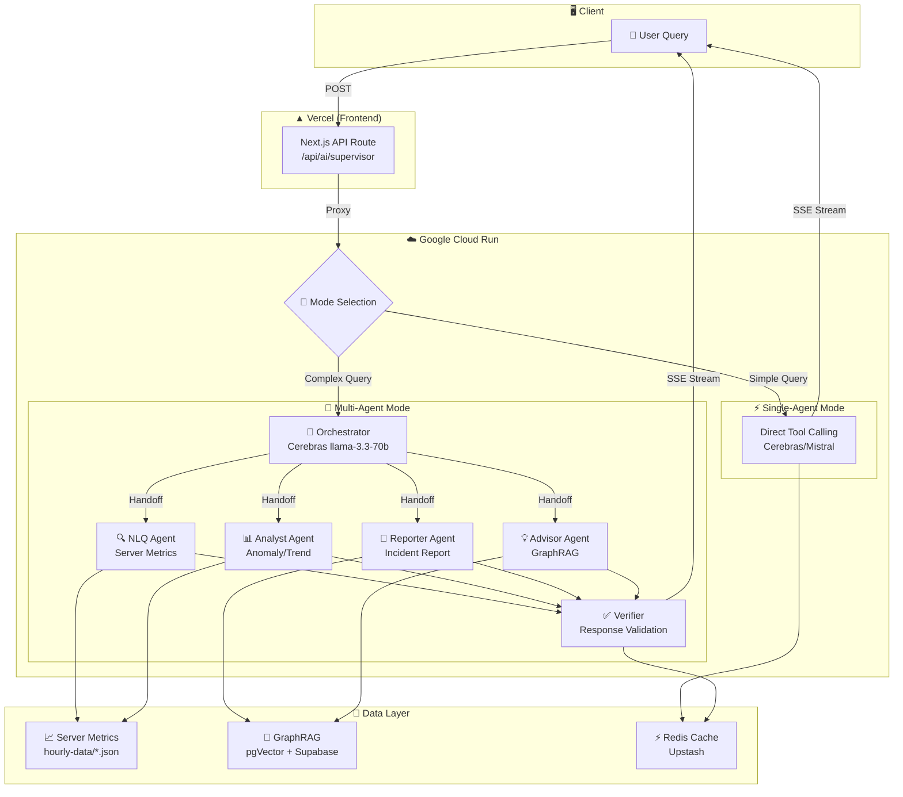

# AI Engine Architecture

> **v5.88.0** | Updated 2026-01-18

## Overview

The AI Engine for OpenManager Vibe is a **Multi-Agent System** built on **Vercel AI SDK** with `@ai-sdk-tools/agents`. It uses a dual-mode Supervisor pattern with specialized agents for different tasks, running on **Google Cloud Run** with frontend on **Vercel**.

## Architecture (v5.87.0, Updated 2026-01-13)

### Deployment Mode

| Mode | Backend | Status |
|------|---------|--------|
| **Cloud Run** | `cloud-run/ai-engine/` (Vercel AI SDK) | ✅ Active (Primary) |
| **Vercel** | `src/app/` (Next.js Frontend) | ✅ Active (Frontend Only) |
| ~~Cloud Run~~ | ~~`cloud-run/rust-inference/`~~ | ❌ Removed |
| ~~Cloud Run~~ | ~~LangGraph/LangChain~~ | ❌ Removed (v5.92.0) |

> **Note**: LangGraph/LangChain migrated to Vercel AI SDK (2025-12-28) due to Cerebras multi-turn tool calling limitations. New architecture uses `@ai-sdk-tools/agents` for multi-agent orchestration.

### Agent Stack

| Agent | Primary Provider | Fallback | Role | Tools |
|-------|------------------|----------|------|-------|
| **Orchestrator** | Cerebras llama-3.3-70b | Mistral mistral-small-2506 | Fast intent routing (~200ms) | Agent handoffs |
| **NLQ Agent** | Cerebras llama-3.3-70b | Groq llama-3.3-70b-versatile | Server metrics queries (simple + complex) | `getServerMetrics`, `getServerMetricsAdvanced`, `filterServers` |
| **Analyst Agent** | Groq llama-3.3-70b-versatile | Cerebras llama-3.3-70b | Anomaly detection, trend prediction | `detectAnomalies`, `predictTrends`, `analyzePattern`, `correlateMetrics`, `findRootCause` |
| **Reporter Agent** | Groq llama-3.3-70b-versatile | Cerebras llama-3.3-70b | Incident reports, timeline | `buildIncidentTimeline`, `findRootCause`, `correlateMetrics`, `searchKnowledgeBase` |
| **Advisor Agent** | Mistral mistral-small-2506 | Groq llama-3.3-70b-versatile | Troubleshooting, knowledge search | `searchKnowledgeBase` (GraphRAG), `recommendCommands` |
| **Verifier** | Mistral mistral-small-2506 | Cerebras llama-3.3-70b | Response validation | N/A |

> **Note**: 실제 export되는 Agent는 4개 (NLQ, Analyst, Reporter, Advisor)입니다. Verifier는 별도의 검증 컴포넌트로, 응답 품질 검증을 담당하며 Agent handoff 대상이 아닙니다.

> **Dual-Mode Strategy**: Single-agent mode for simple queries (low latency), Multi-agent mode for complex queries (specialized handling). Cerebras for fast routing/NLQ, Groq for analysis/reporting stability.

### Frontend Features → Agent Mapping

| Feature | Vercel API Route | Cloud Run Endpoint | Primary Agent | Handoff Agents |
|---------|------------------|-------------------|---------------|----------------|
| **AI Chat (NLQ)** | `/api/ai/supervisor` | `/api/ai/supervisor` | Orchestrator | NLQ, Analyst, Reporter, Advisor |
| **Auto Incident Report** | `/api/ai/incident-report` | `/api/ai/incident-report` | Reporter | - (Direct call) |
| **Intelligent Monitoring** | `/api/ai/intelligent-monitoring` | `/api/ai/analyze-server` | Analyst | - (Direct call) |

> **Note**: Advisor는 Chat을 통한 Orchestrator handoff로만 사용됩니다 (전용 UI 없음).

### Free Tier Limits (2025-01 기준)

| Provider | Daily Limit | TPM | RPM | Usage |
|----------|-------------|-----|-----|-------|
| **Cerebras** | 1M tokens/day | 60K | 30 | Orchestrator, NLQ Agent |
| **Groq** | ~1K requests/day | 12K | Variable | Analyst, Reporter Agent |
| **Mistral** | Limited (may require paid) | - | - | Advisor, Verifier |

> **주의**: OpenRouter 무료 모델은 일일 50회 제한으로 저사용량 시나리오에만 적합합니다.

### Key Features

- **Dual-Mode Supervisor**: Single-agent (simple) vs Multi-agent (complex) mode auto-selection
- **Agent Handoffs**: Pattern-based routing with `matchOn` keywords and regex
- **Multi-Step Tool Calling**: Vercel AI SDK `maxSteps` for reliable tool execution
- **Fallback Chains**: Per-agent provider fallbacks (Cerebras → Groq, Groq → Cerebras)
- **User-Triggered Design**: All AI features are explicitly user-initiated (no auto-triggers)
- **Circuit Breaker**: Model health monitoring with automatic failover
- **GraphRAG Integration**: Advisor agent uses hybrid vector + graph search
- **Protocol Adaptation**: SSE with Keep-Alive to prevent timeouts
- **Response Verification**: Verifier agent validates outputs before response

#### New in v5.87.0 (2026-01-13)

- **LangGraph → Vercel AI SDK Migration**: Complete rewrite using `@ai-sdk-tools/agents`
- **Dual-Mode Supervisor**: Auto-selects single vs multi-agent based on query complexity
- **Agent Specialization**:
  - NLQ Agent (Cerebras → Groq fallback): Simple + complex server queries
  - Analyst Agent (Groq → Cerebras fallback): Anomaly detection, trend prediction
  - Reporter Agent (Groq → Cerebras fallback): Incident reports, timeline
  - Advisor Agent (Mistral): Troubleshooting with GraphRAG
- **Fallback Optimization**: Cerebras for fast routing, Groq for analysis stability
- **Test Coverage**: 65 unit tests including multi-agent orchestrator tests

#### Previous Versions

<details>
<summary>v5.91.0 and earlier (LangGraph era)</summary>

**v5.91.0** (LangGraph)
- RCA Agent, Capacity Agent, Agent Dependencies
- Workflow Caching, Web Search Migration to Tavily

**v5.90.0**
- Triple-Provider Strategy, Rate Limit Distribution

**v5.89.0**
- Dual-Provider Architecture, Advanced NLQ Tool

**v5.88.0**
- Gemini API Key Failover, LangChain maxRetries Fix

**v5.87.0**
- GraphRAG Hybrid Search, Redis L2 Caching

</details>

### Resilience & Performance

#### 3-Way Provider Fallback

모든 에이전트는 3중 Fallback 체계를 갖추고 있어 특정 제공자(API) 장애 시 자동으로 다음 순위 모델로 전환됩니다.

```
Primary (Cerebras) ──[fail]──► Secondary (Groq) ──[fail]──► Tertiary (Mistral)
       │                              │                            │
       └──────────────────────────────┴────────────────────────────┘
                              ↓ Success
                         Response to User
```

| Agent | Primary | Secondary | Tertiary |
|-------|---------|-----------|----------|
| Orchestrator | Cerebras | Mistral | - |
| NLQ Agent | Cerebras | Groq | Mistral |
| Analyst Agent | Groq | Cerebras | Mistral |
| Reporter Agent | Groq | Cerebras | Mistral |
| Advisor Agent | Mistral | Groq | - |

#### Circuit Breaker & Retry

| 메커니즘 | 동작 |
|---------|------|
| **Circuit Breaker** | API 실패 반복 시 해당 제공자를 일시 차단하여 불필요한 대기 시간 감소 |
| **Exponential Backoff** | Rate Limit(429) 발생 시 지수적으로 재시도 간격 증가 (1s → 2s → 4s) |
| **Health Check** | 주기적으로 차단된 제공자의 복구 상태 확인 후 자동 복원 |

#### Fast Path & Forced Routing

LLM 호출 없이 RegExp 기반 Pre-filter가 처리하여 속도와 비용을 최적화합니다.

| 패턴 | 처리 방식 | 예시 |
|------|----------|------|
| **Fast Path** | 단순 인사말은 LLM 없이 즉시 응답 | "안녕", "고마워" |
| **Forced Routing** | 키워드 매칭으로 특정 에이전트 직접 호출 | "보고서 만들어줘" → Reporter |
| **LLM Routing** | 복잡한 의도는 Orchestrator가 LLM으로 판단 | "왜 서버가 느려졌어?" |

```typescript
// Pre-filter 우선순위
1. Fast Path Check (RegExp)     // ~1ms
2. Forced Routing (Keywords)    // ~1ms
3. LLM Intent Classification    // ~200ms (Cerebras)
```

#### Observability (Langfuse)

모든 에이전트의 실행 과정이 Langfuse로 추적되어 실시간 모니터링 및 디버깅이 가능합니다.

| 추적 항목 | 설명 |
|----------|------|
| **Input/Output** | 각 에이전트의 입력 메시지 및 응답 |
| **Tool Calls** | 호출된 도구 목록 및 결과 |
| **Latency** | 에이전트별 처리 시간 |
| **Token Usage** | Prompt/Completion 토큰 수 |
| **Handoff Chain** | 에이전트 간 위임 경로 |

### Agent Communication Patterns

| Pattern | Description | Use Case |
|---------|-------------|----------|
| **Return-to-Supervisor** | Agent sets `returnToSupervisor=true` | Need different agent's expertise |
| **Command Pattern** | Explicit `toAgent` in DelegationRequest | Direct delegation to specific agent |
| **Verification Loop** | Verifier checks output before response | Quality assurance & hallucination check |

## Architecture Diagram

> 📊 **Mermaid Live Editor**: [Edit Online](https://mermaid.live)



<details>
<summary>📋 ASCII Fallback (Mermaid 렌더링 실패 시)</summary>

```
┌─────────────────────────────────────────────────────────────────────────┐
│                           Client                                         │
│                     ┌──────────────┐                                    │
│                     │  User Query  │                                    │
│                     └──────┬───────┘                                    │
└────────────────────────────┼────────────────────────────────────────────┘
                             │ POST /api/ai/supervisor
                             ▼
┌─────────────────────────────────────────────────────────────────────────┐
│                    Vercel (Frontend + Proxy)                            │
│                  ┌──────────────────────┐                               │
│                  │   Next.js API Route  │                               │
│                  └──────────┬───────────┘                               │
└─────────────────────────────┼───────────────────────────────────────────┘
                              │ Proxy to Cloud Run
                              ▼
┌─────────────────────────────────────────────────────────────────────────┐
│                    Google Cloud Run (AI Engine)                         │
│                                                                          │
│                    ┌────────────────────┐                               │
│                    │   Mode Selection   │                               │
│                    └─────────┬──────────┘                               │
│                              │                                           │
│            ┌─────────────────┴─────────────────┐                        │
│            │ Simple                     Complex │                        │
│            ▼                                   ▼                         │
│  ┌──────────────────┐            ┌──────────────────────┐               │
│  │  Single-Agent    │            │     Orchestrator     │               │
│  │  (Low Latency)   │            │   Cerebras 70b       │               │
│  └────────┬─────────┘            └──────────┬───────────┘               │
│           │                                  │                           │
│           │                    ┌─────────────┼─────────────┐            │
│           │                    ▼             ▼             ▼            │
│           │              ┌─────────┐   ┌─────────┐   ┌─────────┐       │
│           │              │   NLQ   │   │ Analyst │   │Reporter │       │
│           │              └────┬────┘   └────┬────┘   └────┬────┘       │
│           │                   │             │             │             │
│           │                   │       ┌─────────┐         │             │
│           │                   │       │ Advisor │         │             │
│           │                   │       │ +RAG    │         │             │
│           │                   │       └────┬────┘         │             │
│           │                   │             │             │             │
│           │                   └─────────────┼─────────────┘             │
│           │                                 ▼                            │
│           │                    ┌────────────────────┐                   │
│           │                    │     Verifier       │                   │
│           │                    │ Response Validation│                   │
│           │                    └─────────┬──────────┘                   │
│           │                              │                               │
│           └──────────────────────────────┤                               │
│                                          ▼                               │
│                              ┌────────────────────┐                     │
│                              │   SSE Response     │                     │
│                              └────────────────────┘                     │
└─────────────────────────────────────────────────────────────────────────┘
                              │
        ┌─────────────────────┼─────────────────────┐
        ▼                     ▼                     ▼
┌───────────────┐    ┌───────────────┐    ┌───────────────┐
│  hourly-data  │    │   Supabase    │    │    Upstash    │
│  (Metrics)    │    │   (GraphRAG)  │    │    (Cache)    │
└───────────────┘    └───────────────┘    └───────────────┘
```
</details>

### Interactive Diagrams (FigJam)

| Diagram | Description | Link |
|---------|-------------|------|
| **System Architecture** | Full AI engine overview | [View](https://www.figma.com/online-whiteboard/create-diagram/9a4b29bd-0376-4e0a-8e22-3b9bd008854a) |
| **Agent Routing Flow** | Supervisor → Agent routing | [View](https://www.figma.com/online-whiteboard/create-diagram/22dbc5b3-44c1-44e7-9eee-1fa0cf8e402a) |
| **Multi-Agent Communication** | Inter-agent delegation | [View](https://www.figma.com/online-whiteboard/create-diagram/a32f26ab-5d3c-40f6-a8ed-4eb5ec0ed843) |
| **Supervisor Execution Flow** | Query → Supervisor → Agents → Verifier flow | [View](https://www.figma.com/online-whiteboard/create-diagram/eb37f54b-2795-4320-bd2e-c41854a7ec52) |

---

## Related Documentation

- **[AI Engine Internals](./ai-engine-internals.md)** - API 명세, 데이터 계층, 환경변수, 파일 구조
- **[Data Architecture](../data/data-architecture.md)** - 서버 데이터 아키텍처
