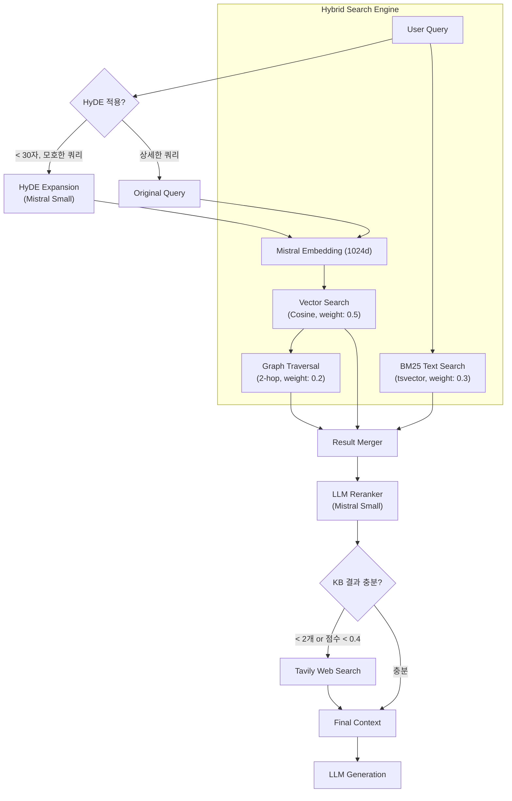

# RAG & Knowledge Engine Architecture

> **v1.1.0** | Updated 2026-01-26
>
> 검색 증강 생성(RAG) 및 지식 엔진 아키텍처 상세 문서입니다.

**관련 문서**: [AI Engine Architecture](./ai-engine-architecture.md)

---

## Overview

OpenManager Vibe AI의 RAG(Retrieval-Augmented Generation) 시스템은 **Hybrid GraphSearch** 기술을 기반으로 내부 지식과 외부 정보를 결합하여 고정밀 답변을 생성합니다.

### Key Technologies

| 기술 | 역할 | 구현체 |
|------|------|--------|
| **HyDE Expansion** | 쿼리 확장 (가설적 문서) | Mistral Small |
| **Vector Search** | 의미 기반 유사도 검색 | Mistral Embeddings (1024d) + Supabase pgvector |
| **BM25 Search** | 키워드 매칭 검색 | PostgreSQL tsvector |
| **Graph Traversal** | 관계성 기반 컨텍스트 확장 | LlamaIndex + Supabase (Graph) |
| **LLM Reranker** | 검색 결과 재정렬 | Mistral Small |
| **Web Search** | 최신 외부 정보 검색 | Tavily API |

---

## Architecture

### Retrieval Pipeline



### Data Flow

1. **Query Analysis**: 쿼리의 의도와 복잡도를 분석하여 검색 전략 수립
2. **HyDE Expansion**: 짧거나 모호한 쿼리를 가설적 답변으로 확장
3. **Hybrid Retrieval**:
   - **Vector**: 의미적으로 유사한 문서 검색 (e.g., "CPU 부하 원인")
   - **BM25**: 정확한 키워드 매칭 (e.g., "Error code 503")
   - **Graph**: 연관된 지식 노드 탐색 (e.g., 503 에러 -> WAS 서버 -> 연결 풀 설정)
4. **LLM Reranking**: 검색 결과를 쿼리 관련성 기준으로 재정렬
5. **Web Augmentation**: 내부 지식이 부족하거나 최신 정보가 필요한 경우 Tavily 검색 수행
6. **Context Construction**: 수집된 정보를 관련성 점수로 정렬하여 LLM 컨텍스트 구성

---

## Components

### 1. HyDE Query Expansion (`query-expansion.ts`)

짧거나 모호한 쿼리를 가설적 답변으로 확장하여 검색 품질을 향상시킵니다.

| 설정 | 값 | 설명 |
|------|-----|------|
| **트리거 조건** | `query.length < 30` | 짧은 쿼리에만 적용 |
| **제외 조건** | 서버명 포함 시 | 이미 구체적인 쿼리 |
| **모델** | Mistral Small | 빠른 응답 (150 토큰 제한) |
| **타임아웃** | 5초 | 지연 시 원본 쿼리 사용 |

```typescript
// 예시
"CPU 높음" → "서버의 CPU 사용률이 높은 경우, 프로세스 과부하,
              메모리 부족으로 인한 스왑, 또는 비효율적인 쿼리가
              원인일 수 있습니다..."
```

### 2. Hybrid Search Engine (`hybrid-text-search.ts`)

PostgreSQL RPC를 활용하여 Vector, Text, Graph 검색을 단일 쿼리로 수행합니다.

| 검색 타입 | 가중치 | 역할 |
|----------|:------:|------|
| **Vector Search** | 0.5 | 의미적 유사성 (Cosine) |
| **BM25 Text** | 0.3 | 키워드 정확성 |
| **Graph Traversal** | 0.2 | 연관 지식 확장 (2-hop) |

```sql
-- hybrid_search_with_text RPC 호출
SELECT * FROM hybrid_search_with_text(
  p_query_embedding := embedding,  -- vector(1024)
  p_query_text := 'CPU 사용률 높음',
  p_vector_weight := 0.5,
  p_text_weight := 0.3,
  p_graph_weight := 0.2
);
```

### 3. LLM Reranker (`reranker.ts`)

Mistral AI를 사용하여 검색 결과를 쿼리 관련성 기준으로 재정렬합니다.

| 설정 | 값 | 설명 |
|------|-----|------|
| **최대 리랭킹 문서** | 10개 | 비용 효율성 |
| **Top-K 반환** | 5개 | 최종 결과 수 |
| **최소 점수** | 0.3 | 임계값 미만 필터링 |
| **타임아웃** | 8초 | 지연 시 원본 순서 유지 |

```typescript
// 리랭킹 프롬프트
"Query: CPU 사용률이 높은 원인은?
Documents: [0] 메모리 최적화... [1] CPU 병목 현상...
Rate relevance (0-1) for each document."
```

### 4. Knowledge Graph (`llamaindex-rag-service.ts`)

LlamaIndex.TS를 사용하여 비정형 텍스트에서 지식 삼항(Subject-Predicate-Object)을 추출해 그래프를 구축합니다.

- **Extraction**: Mistral AI (Small) 모델 사용
- **Storage**: Supabase `knowledge_relationships` 테이블
- **Traversal**: 재귀적 SQL 쿼리로 2-hop까지 연관 노드 탐색

### 5. Tavily Web Search (`tavily-hybrid-rag.ts`)

내부 지식의 한계를 보완하기 위한 외부 검색 모듈입니다.

| 설정 | 값 | 설명 |
|------|-----|------|
| **트리거 조건 1** | KB 결과 < 2개 | 결과 부족 |
| **트리거 조건 2** | 평균 점수 < 0.4 | 낮은 신뢰도 |
| **최대 웹 결과** | 3개 | 컨텍스트 크기 제한 |
| **타임아웃** | 8초 | 지연 시 KB 결과만 사용 |

**신뢰 도메인 필터**:
- DevOps: `kubernetes.io`, `docs.docker.com`, `prometheus.io`
- Cloud: `docs.aws.com`, `cloud.google.com`, `learn.microsoft.com`
- Database: `postgresql.org`, `redis.io`

### 6. Incident Injector (`incident-rag-injector.ts`)

운영 중 생성된 인시던트 보고서를 지식 자산화하는 자동 파이프라인입니다.

- **Trigger**: 인시던트 보고서 승인 시
- **Processing**:
  1. 제목, 원인, 해결책 구조화
  2. Mistral Embedding 생성
  3. Knowledge Base 적재 (중복 방지 포함)

---

## Integration Point

### reporter-tools.ts

모든 RAG 컴포넌트가 통합되는 진입점입니다.

```typescript
// searchKnowledgeBase 도구 내부 흐름
async execute({ query, category, includeWebSearch }) {
  // 1. HyDE 확장 (조건부)
  if (shouldUseHyDE(query)) {
    searchQuery = await expandQueryWithHyDE(query);
  }

  // 2. 임베딩 생성
  const embedding = await embedText(searchQuery);

  // 3. 하이브리드 검색
  const results = await hybridGraphSearch(embedding, { query, useBM25: true });

  // 4. LLM 리랭킹
  if (isRerankerAvailable()) {
    results = await rerankDocuments(query, results);
  }

  // 5. Tavily 웹 검색 (조건부)
  if (includeWebSearch && isTavilyAvailable()) {
    results = await enhanceWithWebSearch(query, results);
  }

  return results;
}
```

---

## Data Schema

### `knowledge_base`
지식 원문 및 임베딩 저장

```sql
CREATE TABLE knowledge_base (
  id uuid PRIMARY KEY DEFAULT gen_random_uuid(),
  title text NOT NULL,
  content text NOT NULL,
  metadata jsonb DEFAULT '{}',
  embedding vector(1024),        -- Mistral embeddings
  search_vector tsvector,        -- BM25 인덱스
  category text,
  tags text[],
  created_at timestamptz DEFAULT now()
);

-- 인덱스
CREATE INDEX idx_kb_embedding ON knowledge_base
  USING ivfflat (embedding vector_cosine_ops);
CREATE INDEX idx_kb_search_vector ON knowledge_base
  USING gin (search_vector);
```

### `knowledge_relationships`
지식 간 연결 그래프

```sql
CREATE TABLE knowledge_relationships (
  id uuid PRIMARY KEY DEFAULT gen_random_uuid(),
  head uuid REFERENCES knowledge_base(id) ON DELETE CASCADE,
  tail uuid REFERENCES knowledge_base(id) ON DELETE CASCADE,
  relation_type text NOT NULL,   -- predicate (e.g., "causes", "resolves")
  description text,
  weight float DEFAULT 1.0,
  created_at timestamptz DEFAULT now()
);

-- 그래프 탐색 최적화
CREATE INDEX idx_kr_head ON knowledge_relationships(head);
CREATE INDEX idx_kr_tail ON knowledge_relationships(tail);
```

---

## Performance Characteristics

| 단계 | 예상 지연 | 비고 |
|------|:--------:|------|
| HyDE Expansion | +100-200ms | Mistral Small 호출 |
| Hybrid Search | ~50ms | PostgreSQL RPC |
| LLM Reranking | +200-500ms | 문서 수에 비례 |
| Tavily Search | +500-1000ms | 외부 API 호출 |
| **총합** | 1-2초 | 모든 단계 포함 시 |

---

## Version History

| 버전 | 날짜 | 변경 내용 |
|------|------|----------|
| v1.1.0 | 2026-01-26 | HyDE, Reranker, Tavily 상세 추가 |
| v1.0.0 | 2026-01-26 | 초기 문서 작성 |
