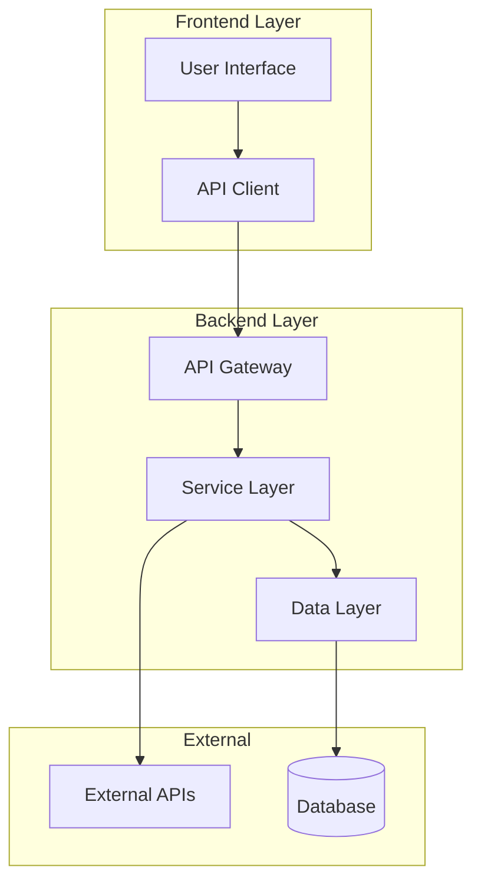
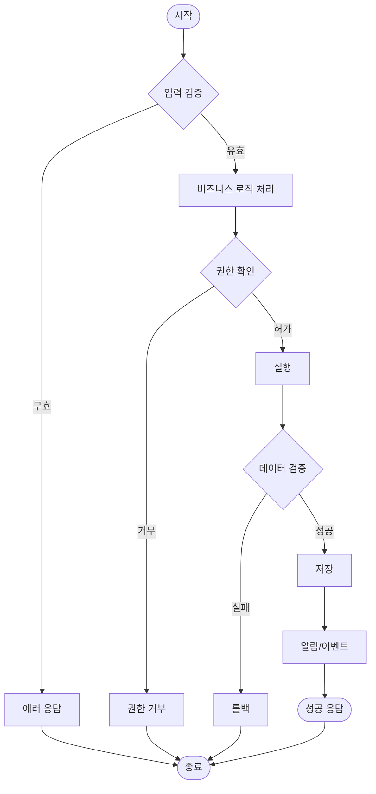
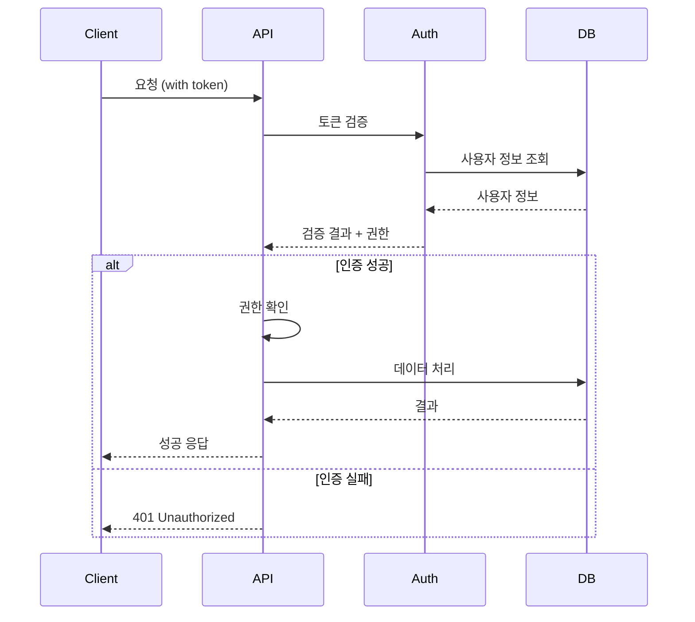

# 🏗️ 설계 문서 (Design)

> **목적**: 요구사항을 구체적인 기술 설계로 변환

## 📋 요구사항 요약

### 연결된 요구사항 문서
```yaml
requirements_source: "../requirements/[project-name].md"
requirements_summary:
  - core_problem: "[핵심 해결 문제]"
  - target_users: "[대상 사용자]"
  - key_inputs: "[주요 입력]"
  - key_outputs: "[주요 출력]"
```

## 🏛️ 시스템 아키텍처

### 전체 아키텍처 개요


### 컴포넌트 분해
```yaml
components:
  frontend:
    - name: "[컴포넌트명]"
      responsibility: "[역할]"
      technology: "[기술 스택]"
      dependencies: ["[의존성 목록]"]
  
  backend:
    - name: "[서비스명]"
      responsibility: "[역할]"
      technology: "[기술 스택]"
      interfaces: ["[인터페이스 목록]"]
  
  external:
    - name: "[외부 서비스명]"
      purpose: "[사용 목적]"
      integration: "[연동 방식]"
```

## 🔌 API 설계

### REST API 엔드포인트
```yaml
endpoints:
  - path: "/api/[resource]"
    method: "[GET/POST/PUT/DELETE]"
    purpose: "[목적]"
    auth_required: [true/false]
    
    request:
      headers:
        - name: "[헤더명]"
          required: [true/false]
          example: "[예시값]"
      
      body:
        type: "[json/form-data/etc]"
        schema: |
          {
            "field1": "string",
            "field2": "number",
            "field3": {
              "nested": "object"
            }
          }
    
    response:
      success:
        status: 200
        schema: |
          {
            "success": true,
            "data": {
              "result": "object"
            }
          }
      
      error:
        status: [400/401/404/500]
        schema: |
          {
            "success": false,
            "error": {
              "code": "ERROR_CODE",
              "message": "Error description"
            }
          }
```

### GraphQL 스키마 (해당 시)
```graphql
type Query {
  [resource]: [ResourceType]
  [resource]ById(id: ID!): [ResourceType]
}

type Mutation {
  create[Resource](input: [Resource]Input!): [Resource]Response
  update[Resource](id: ID!, input: [Resource]Input!): [Resource]Response
  delete[Resource](id: ID!): Boolean
}

type [ResourceType] {
  id: ID!
  [field1]: String!
  [field2]: Int
  [field3]: [RelatedType]
}

input [Resource]Input {
  [field1]: String!
  [field2]: Int
}

type [Resource]Response {
  success: Boolean!
  data: [ResourceType]
  error: String
}
```

## 🗃️ 데이터 모델

### 데이터베이스 스키마
```sql
-- [테이블명] 테이블
CREATE TABLE [table_name] (
    id SERIAL PRIMARY KEY,
    [field1] VARCHAR(255) NOT NULL,
    [field2] INTEGER DEFAULT 0,
    [field3] TIMESTAMP WITH TIME ZONE DEFAULT NOW(),
    [field4] JSONB,
    
    -- 인덱스
    INDEX idx_[table]_[field] ([field1]),
    INDEX idx_[table]_composite ([field1], [field2]),
    
    -- 외래키
    FOREIGN KEY ([field_id]) REFERENCES [other_table](id) ON DELETE CASCADE,
    
    -- 제약조건
    CONSTRAINT chk_[constraint_name] CHECK ([field2] >= 0),
    CONSTRAINT uk_[table]_[field] UNIQUE ([field1])
);
```

### TypeScript 타입 정의
```typescript
// 기본 엔티티 타입
export interface [EntityName] {
  id: string;
  [field1]: string;
  [field2]: number;
  [field3]: Date;
  [field4]?: [OptionalType];
}

// 생성 요청 타입
export interface Create[EntityName]Request {
  [field1]: string;
  [field2]: number;
  [field4]?: [OptionalType];
}

// 응답 타입
export interface [EntityName]Response {
  success: boolean;
  data?: [EntityName];
  error?: {
    code: string;
    message: string;
  };
}

// 필터/페이징 타입
export interface [EntityName]Filter {
  [field1]?: string;
  [field2]?: number;
  page?: number;
  limit?: number;
  sortBy?: keyof [EntityName];
  sortOrder?: 'asc' | 'desc';
}
```

## 🔄 비즈니스 로직

### 핵심 워크플로우


### 서비스 레이어 설계
```typescript
// 서비스 인터페이스
export interface [ServiceName]Service {
  create(data: Create[Entity]Request): Promise<[Entity]Response>;
  findById(id: string): Promise<[Entity] | null>;
  findAll(filter: [Entity]Filter): Promise<[Entity][]>;
  update(id: string, data: Partial<[Entity]>): Promise<[Entity]Response>;
  delete(id: string): Promise<boolean>;
}

// 서비스 구현
export class [ServiceName]ServiceImpl implements [ServiceName]Service {
  constructor(
    private repository: [Entity]Repository,
    private validator: [Entity]Validator,
    private notificationService: NotificationService
  ) {}
  
  async create(data: Create[Entity]Request): Promise<[Entity]Response> {
    // 1. 입력 검증
    const validationResult = await this.validator.validate(data);
    if (!validationResult.isValid) {
      return { success: false, error: validationResult.error };
    }
    
    // 2. 비즈니스 로직 처리
    const entity = await this.processBusinessLogic(data);
    
    // 3. 저장
    const savedEntity = await this.repository.save(entity);
    
    // 4. 사이드 이펙트 처리
    await this.notificationService.notify('entity_created', savedEntity);
    
    return { success: true, data: savedEntity };
  }
}
```

## 🖥️ UI/UX 설계

### 컴포넌트 구조
```typescript
// 메인 컴포넌트
interface [ComponentName]Props {
  [prop1]: [Type1];
  [prop2]?: [Type2];
  onAction?: (data: [ActionData]) => void;
}

export const [ComponentName]: React.FC<[ComponentName]Props> = ({
  [prop1],
  [prop2],
  onAction
}) => {
  // 상태 관리
  const [state, setState] = useState<[StateType]>([initialState]);
  
  // 이벤트 핸들러
  const handleAction = useCallback((data: [ActionData]) => {
    // 로직 처리
    onAction?.(data);
  }, [onAction]);
  
  return (
    <div className="[component-class]">
      {/* UI 구조 */}
    </div>
  );
};
```

### 상태 관리 설계
```typescript
// Redux/Zustand 스토어 설계
interface [FeatureName]State {
  [entity]: [Entity][];
  loading: boolean;
  error: string | null;
  filters: [Entity]Filter;
}

interface [FeatureName]Actions {
  load[Entity]s: (filter?: [Entity]Filter) => Promise<void>;
  create[Entity]: (data: Create[Entity]Request) => Promise<void>;
  update[Entity]: (id: string, data: Partial<[Entity]>) => Promise<void>;
  delete[Entity]: (id: string) => Promise<void>;
  setFilters: (filters: [Entity]Filter) => void;
  clearError: () => void;
}
```

## 🔒 보안 설계

### 인증/인가 흐름


### 보안 구현
```typescript
// JWT 토큰 검증 미들웨어
export const authenticateToken = (
  req: Request,
  res: Response,
  next: NextFunction
) => {
  const authHeader = req.headers['authorization'];
  const token = authHeader && authHeader.split(' ')[1];
  
  if (!token) {
    return res.status(401).json({ error: 'Access token required' });
  }
  
  jwt.verify(token, process.env.JWT_SECRET!, (err, user) => {
    if (err) {
      return res.status(403).json({ error: 'Invalid token' });
    }
    req.user = user;
    next();
  });
};

// 권한 확인 미들웨어
export const authorizeRole = (requiredRole: string) => {
  return (req: Request, res: Response, next: NextFunction) => {
    if (!req.user?.role || req.user.role !== requiredRole) {
      return res.status(403).json({ error: 'Insufficient permissions' });
    }
    next();
  };
};
```

## ⚡ 성능 최적화

### 캐싱 전략
```yaml
caching:
  redis:
    - key_pattern: "[prefix]:[id]"
      ttl: "[seconds]"
      purpose: "[캐싱 목적]"
  
  browser:
    - type: "[localStorage/sessionStorage]"
      data: "[캐시할 데이터]"
      invalidation: "[무효화 조건]"
  
  cdn:
    - assets: "[정적 리소스]"
      headers: "[캐시 헤더]"
```

### 데이터베이스 최적화
```sql
-- 인덱스 최적화
CREATE INDEX CONCURRENTLY idx_[table]_performance 
ON [table] ([frequently_queried_fields]);

-- 쿼리 최적화
EXPLAIN ANALYZE
SELECT [fields]
FROM [table]
WHERE [optimized_conditions]
ORDER BY [indexed_field]
LIMIT [reasonable_limit];
```

## 🧪 테스트 설계

### 테스트 계층
```typescript
// 단위 테스트 (Unit Tests)
describe('[ServiceName]Service', () => {
  let service: [ServiceName]Service;
  let mockRepository: jest.Mocked<[Entity]Repository>;
  
  beforeEach(() => {
    mockRepository = createMockRepository();
    service = new [ServiceName]ServiceImpl(mockRepository);
  });
  
  describe('create', () => {
    it('should create entity successfully', async () => {
      // Given
      const inputData = { [field]: '[value]' };
      const expectedEntity = { id: '1', ...inputData };
      mockRepository.save.mockResolvedValue(expectedEntity);
      
      // When
      const result = await service.create(inputData);
      
      // Then
      expect(result.success).toBe(true);
      expect(result.data).toEqual(expectedEntity);
    });
  });
});

// 통합 테스트 (Integration Tests)
describe('[FeatureName] Integration', () => {
  let app: Application;
  let db: Database;
  
  beforeAll(async () => {
    app = await createTestApp();
    db = await createTestDatabase();
  });
  
  it('should handle end-to-end workflow', async () => {
    // API 호출부터 데이터베이스 저장까지 전체 흐름 테스트
  });
});
```

## 📊 모니터링 설계

### 메트릭 수집
```yaml
metrics:
  application:
    - name: "[metric_name]"
      type: "[counter/gauge/histogram]"
      labels: ["[label1]", "[label2]"]
      purpose: "[측정 목적]"
  
  infrastructure:
    - cpu_usage: "[임계값]"
    - memory_usage: "[임계값]"
    - response_time: "[목표값]"
    - error_rate: "[허용 한계]"
```

### 로깅 전략
```typescript
// 구조화된 로깅
const logger = createLogger({
  level: process.env.LOG_LEVEL || 'info',
  format: combine(
    timestamp(),
    errors({ stack: true }),
    json()
  ),
  defaultMeta: {
    service: '[service-name]',
    version: process.env.APP_VERSION
  }
});

// 사용 예시
logger.info('Entity created', {
  entityId: entity.id,
  userId: req.user.id,
  action: 'create',
  timestamp: new Date().toISOString()
});
```

## 🚀 배포 설계

### 인프라 구성
```yaml
infrastructure:
  development:
    platform: "[플랫폼]"
    resources: "[리소스 할당]"
    
  staging:
    platform: "[플랫폼]"
    resources: "[리소스 할당]"
    
  production:
    platform: "[플랫폼]"
    resources: "[리소스 할당]"
    backup: "[백업 전략]"
    monitoring: "[모니터링 도구]"
```

### CI/CD 파이프라인
```yaml
# .github/workflows/deploy.yml
name: Deploy [ProjectName]

on:
  push:
    branches: [main]
  pull_request:
    branches: [main]

jobs:
  test:
    runs-on: ubuntu-latest
    steps:
      - uses: actions/checkout@v3
      - name: Setup Node.js
        uses: actions/setup-node@v3
        with:
          node-version: '18'
      - name: Install dependencies
        run: npm ci
      - name: Run tests
        run: npm test
      - name: Run lint
        run: npm run lint
  
  deploy:
    needs: test
    if: github.ref == 'refs/heads/main'
    runs-on: ubuntu-latest
    steps:
      - name: Deploy to production
        run: |
          # 배포 스크립트
```

## 🔄 다음 단계

```yaml
next_steps:
  - phase: "3-tasks"
    file: "../tasks/[project-name].md"
    focus: "설계를 구현 가능한 작업으로 분할"
  
  validation:
    technical_review:
      - architecture_review: "[아키텍트 검토]"
      - security_review: "[보안 검토]"
      - performance_review: "[성능 검토]"
    
    stakeholder_approval:
      - product_owner: "[제품 담당자 승인]"
      - tech_lead: "[기술 리드 승인]"
      - security_team: "[보안팀 승인]"
```

---

**✨ SDD Phase 2 완료** → **Phase 3: [작업 분할](../tasks/template.md)** 문서 작성 시작