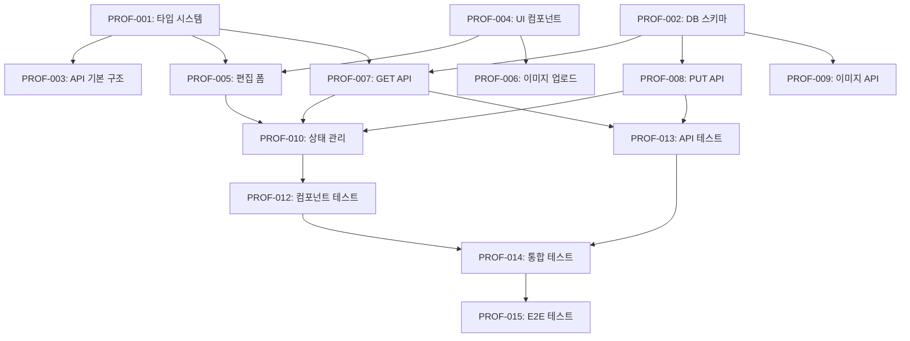

# 📋 사용자 프로필 수정 기능 작업 분할

> **기반**: [🏗️ 설계 문서](../design/user-profile-edit.md)  
> **목적**: 설계를 구현 가능한 작업 단위로 분해하여 효율적인 개발 실행 계획 수립

## 🎯 작업 개요

### 프로젝트 정보
```yaml
project: "OpenManager VIBE - 사용자 프로필 수정"
estimated_duration: "7-10일"
team_size: "1-2명 (AI 도구 활용)"
complexity: "Medium"
dependencies: ["Supabase 설정", "shadcn/ui 컴포넌트"]
```

### 완료 기준 (Definition of Done)
```yaml
coding_standards:
  - "[ ] TypeScript strict 모드 100% 준수"
  - "[ ] ESLint/Prettier 경고 0개"
  - "[ ] 파일 크기 500줄 이하 권장"
  - "[ ] 커밋 메시지 이모지 컨벤션 준수"

functionality:
  - "[ ] 모든 Acceptance Criteria 충족"
  - "[ ] 크로스 브라우저 테스트 통과"
  - "[ ] 모바일 반응형 동작 확인"
  - "[ ] 접근성 WCAG 2.1 AA 준수"

testing:
  - "[ ] 단위 테스트 커버리지 70%+"
  - "[ ] 통합 테스트 구현"
  - "[ ] E2E 테스트 시나리오 완성"
  - "[ ] 성능 테스트 (2초 이내 응답)"

documentation:
  - "[ ] API 문서 업데이트"
  - "[ ] 컴포넌트 Storybook 작성"
  - "[ ] README 사용법 추가"
```

## 📊 Phase별 작업 계획

### 🏗️ Phase 1: Foundation (1-2일)
**목적**: 프로젝트 기반 구조 설정 및 타입 정의

| 작업 ID | 작업명 | 예상 시간 | 담당 AI | 우선순위 |
|---------|--------|----------|---------|----------|
| **PROF-001** | TypeScript 타입 시스템 구축 | 3시간 | Claude Code | Critical |
| **PROF-002** | Supabase 데이터베이스 스키마 생성 | 2시간 | database-administrator | Critical |
| **PROF-003** | API Routes 기본 구조 설정 | 2시간 | codex-specialist | High |
| **PROF-004** | shadcn/ui 컴포넌트 설정 | 1시간 | Claude Code | High |

### ⚙️ Phase 2: Core Development (3-5일)
**목적**: 핵심 기능 구현 및 비즈니스 로직 개발

| 작업 ID | 작업명 | 예상 시간 | 담당 AI | 우선순위 |
|---------|--------|----------|---------|----------|
| **PROF-005** | 프로필 편집 폼 컴포넌트 구현 | 6시간 | gemini-specialist | Critical |
| **PROF-006** | 이미지 업로드 컴포넌트 구현 | 4시간 | Claude Code | High |
| **PROF-007** | GET /api/profile 엔드포인트 구현 | 3시간 | codex-specialist | Critical |
| **PROF-008** | PUT /api/profile 엔드포인트 구현 | 4시간 | codex-specialist | Critical |
| **PROF-009** | POST /api/profile/image 엔드포인트 구현 | 5시간 | qwen-specialist | High |
| **PROF-010** | 클라이언트 상태 관리 (useProfileEdit) | 4시간 | Claude Code | High |
| **PROF-011** | 폼 유효성 검증 로직 구현 | 3시간 | verification-specialist | Medium |

### 🧪 Phase 3: Integration & Quality (2-3일)
**목적**: 테스트, 최적화, 배포 준비

| 작업 ID | 작업명 | 예상 시간 | 담당 AI | 우선순위 |
|---------|--------|----------|---------|----------|
| **PROF-012** | 단위 테스트 작성 (컴포넌트) | 4시간 | test-automation-specialist | High |
| **PROF-013** | 단위 테스트 작성 (API) | 3시간 | test-automation-specialist | High |
| **PROF-014** | 통합 테스트 구현 | 5시간 | test-automation-specialist | Medium |
| **PROF-015** | E2E 테스트 시나리오 구현 | 4시간 | test-automation-specialist | Medium |
| **PROF-016** | 성능 최적화 및 캐싱 | 3시간 | ux-performance-specialist | Medium |
| **PROF-017** | 보안 검토 및 취약점 스캔 | 2시간 | security-auditor | High |
| **PROF-018** | 배포 준비 및 환경 설정 | 2시간 | vercel-platform-specialist | Medium |

## 📋 상세 작업 명세

### 🏗️ **PROF-001: TypeScript 타입 시스템 구축**

```yaml
task_id: "PROF-001"
title: "TypeScript 타입 시스템 구축"
description: "프로필 편집 기능에 필요한 모든 TypeScript 타입과 인터페이스 정의"
priority: "Critical"
effort: "3시간"
complexity: "Simple"
assigned_ai: "Claude Code"

prerequisites:
  - "프로젝트 기본 설정 완료"
  - "Zod 라이브러리 설치"

deliverables:
  - "src/types/profile.ts"
  - "src/lib/validation/profileSchema.ts"
  - "src/types/api.ts"

acceptance_criteria:
  - "[ ] UserProfile 인터페이스 정의"
  - "[ ] ProfileFormData 인터페이스 정의"
  - "[ ] ProfileUpdateRequest/Response 타입 정의"
  - "[ ] Zod 검증 스키마 구현"
  - "[ ] API 응답 타입 정의"
  - "[ ] TypeScript strict 모드 준수"

implementation_details:
  - file: "src/types/profile.ts"
    content: |
      export interface UserProfile {
        id: string;
        email: string;
        displayName?: string;
        bio?: string;
        profileImageUrl?: string;
        createdAt: string;
        updatedAt: string;
      }

dependencies: []
risks:
  - "타입 정의 누락으로 인한 컴파일 에러"
  - "Zod 스키마와 TypeScript 타입 불일치"

success_criteria:
  - "TypeScript 컴파일 에러 0개"
  - "Zod 스키마 유효성 검증 통과"
```

### 🎨 **PROF-005: 프로필 편집 폼 컴포넌트 구현**

```yaml
task_id: "PROF-005"
title: "프로필 편집 폼 컴포넌트 구현"
description: "사용자가 프로필 정보를 수정할 수 있는 React 컴포넌트 구현"
priority: "Critical"
effort: "6시간"
complexity: "Medium"
assigned_ai: "gemini-specialist"

prerequisites:
  - "PROF-001: TypeScript 타입 시스템 완료"
  - "PROF-004: shadcn/ui 컴포넌트 설정 완료"

deliverables:
  - "src/components/profile/ProfileEditForm.tsx"
  - "src/components/profile/ProfileEditForm.test.tsx"
  - "src/components/profile/ProfileEditForm.stories.tsx"

acceptance_criteria:
  - "[ ] 폼 필드 구현 (displayName, email, bio)"
  - "[ ] 실시간 유효성 검증"
  - "[ ] 로딩/에러 상태 표시"
  - "[ ] 접근성 ARIA 속성 적용"
  - "[ ] 반응형 디자인 구현"
  - "[ ] 테스트 커버리지 80%+"

implementation_details:
  - component: "ProfileEditForm"
    features:
      - "React Hook Form 사용"
      - "Zod resolver 통합"
      - "shadcn/ui 컴포넌트 활용"
      - "디바운싱 적용 (이메일 중복 검사)"

dependencies:
  - "PROF-001: TypeScript 타입 시스템"
  - "PROF-010: useProfileEdit 훅"

risks:
  - "폼 상태 관리 복잡성"
  - "실시간 검증 성능 이슈"

success_criteria:
  - "모든 UI 테스트 통과"
  - "Lighthouse 접근성 점수 90+"
```

### 🔌 **PROF-007: GET /api/profile 엔드포인트 구현**

```yaml
task_id: "PROF-007"
title: "GET /api/profile 엔드포인트 구현"
description: "현재 사용자의 프로필 정보를 조회하는 API 엔드포인트"
priority: "Critical"
effort: "3시간"
complexity: "Simple"
assigned_ai: "codex-specialist"

prerequisites:
  - "PROF-002: 데이터베이스 스키마 생성 완료"
  - "PROF-001: TypeScript 타입 시스템 완료"

deliverables:
  - "src/app/api/profile/route.ts (GET 메서드)"
  - "src/lib/auth/jwt.ts"
  - "tests/api/profile.test.ts"

acceptance_criteria:
  - "[ ] JWT 토큰 검증 구현"
  - "[ ] 사용자 ID 기반 프로필 조회"
  - "[ ] 에러 처리 (401, 404, 500)"
  - "[ ] 응답 캐싱 헤더 설정"
  - "[ ] API 문서 작성"
  - "[ ] 단위 테스트 작성"

implementation_details:
  - endpoint: "GET /api/profile"
    auth_required: true
    response_format: "ProfileApiResponse<UserProfile>"
    cache_control: "private, max-age=60"

dependencies:
  - "PROF-002: 데이터베이스 스키마"

risks:
  - "JWT 토큰 검증 실패"
  - "데이터베이스 연결 오류"

success_criteria:
  - "API 테스트 100% 통과"
  - "평균 응답시간 100ms 이하"
```

## 🔄 작업 의존성 매트릭스



## 🎯 병렬 처리 계획

### 🔄 **동시 진행 가능한 작업들**

#### Phase 1 (Day 1-2)
```bash
# 4개 작업 병렬 실행 가능
PROF-001: Claude Code        # 타입 시스템
PROF-002: database-admin     # DB 스키마  
PROF-003: codex-specialist   # API 구조
PROF-004: Claude Code        # UI 설정
```

#### Phase 2 (Day 3-5) 
```bash
# Frontend 팀
PROF-005: gemini-specialist  # 편집 폼
PROF-006: Claude Code        # 이미지 업로드
PROF-010: Claude Code        # 상태 관리

# Backend 팀
PROF-007: codex-specialist   # GET API
PROF-008: codex-specialist   # PUT API
PROF-009: qwen-specialist    # 이미지 API

# Quality 팀
PROF-011: verification-specialist  # 검증 로직
```

#### Phase 3 (Day 6-8)
```bash
# Testing 팀 (병렬)
PROF-012: test-automation    # 컴포넌트 테스트
PROF-013: test-automation    # API 테스트
PROF-014: test-automation    # 통합 테스트
PROF-015: test-automation    # E2E 테스트

# Optimization 팀 (병렬)
PROF-016: ux-performance     # 성능 최적화
PROF-017: security-auditor   # 보안 검토
PROF-018: vercel-platform    # 배포 준비
```

## 🚀 AI 도구 활용 전략

### 📊 **AI별 작업 할당 최적화**

| AI 도구 | 전문 분야 | 할당 작업 | 예상 성과 |
|---------|-----------|-----------|-----------|
| **Claude Code** | React/TypeScript | PROF-001, 004, 006, 010 | Type-First 개발 완성도 |
| **gemini-specialist** | UI/UX 설계 | PROF-005 | 사용자 경험 최적화 |
| **codex-specialist** | API 개발 | PROF-003, 007, 008 | 실무적 코드 품질 |
| **qwen-specialist** | 성능 최적화 | PROF-009 | 이미지 처리 알고리즘 |
| **test-automation** | 테스트 자동화 | PROF-012~015 | 70%+ 커버리지 달성 |
| **verification** | 품질 검증 | PROF-011, 전체 리뷰 | AI 교차검증 |

### 🎯 **3-Amigo 패턴 적용**

```yaml
분석가: requirements-analyst
  - 사용자 요구사항 재검토
  - 비즈니스 가치 검증

개발자: design-architect + task-coordinator
  - 기술적 실현 가능성 확인
  - 구현 복잡도 평가

테스터: test-automation-specialist
  - 테스트 시나리오 설계
  - 품질 기준 정의
```

## ⚠️ 리스크 관리

### 🚨 **High Risk 작업**

| 리스크 요소 | 영향도 | 확률 | 대응 방안 |
|-------------|--------|------|-----------|
| **Supabase 파일 업로드 제한** | High | Medium | Proof of Concept 우선 구현 |
| **JWT 토큰 검증 복잡성** | Medium | High | 기존 인증 시스템 참조 |
| **이미지 처리 성능** | Medium | Medium | 클라이언트 사이드 리사이징 |
| **테스트 환경 설정** | Low | High | Docker 컨테이너 활용 |

### 🔄 **Contingency Plan**

```yaml
Plan_A: "정상 진행 (예상 7-8일)"
Plan_B: "1-2일 지연 (리스크 1개 발생)"
Plan_C: "3-4일 지연 (리스크 2개 이상)"
  - 범위 축소: 이미지 업로드 기능 제외
  - 목표 조정: 테스트 커버리지 50%로 완화
```

## 📊 진행률 추적

### 🎯 **마일스톤 체크포인트**

```yaml
Milestone_1: "Foundation 완료 (Day 2)"
  progress_criteria:
    - "[ ] 타입 시스템 100% 완성"
    - "[ ] DB 스키마 생성 및 RLS 정책"
    - "[ ] API 기본 구조 설정"
    - "[ ] UI 컴포넌트 라이브러리 준비"

Milestone_2: "Core Development 완료 (Day 5)"
  progress_criteria:
    - "[ ] 프로필 편집 폼 동작"
    - "[ ] API 엔드포인트 3개 구현"
    - "[ ] 상태 관리 훅 완성"
    - "[ ] 기본 유효성 검증 동작"

Milestone_3: "Integration & Quality 완료 (Day 8)"
  progress_criteria:
    - "[ ] 테스트 커버리지 70%+"
    - "[ ] E2E 테스트 시나리오 통과"
    - "[ ] 성능 목표 달성 (2초 이내)"
    - "[ ] 배포 준비 완료"
```

### 📈 **일일 체크리스트**

```yaml
Daily_Morning:
  - "[ ] 오늘 작업할 태스크 3개 선정"
  - "[ ] 차단 요소 확인 및 해결 계획"
  - "[ ] AI 도구별 역할 분담 확인"
  
Daily_Evening:
  - "[ ] 완료된 작업 체크"
  - "[ ] 내일 작업 우선순위 설정"
  - "[ ] 발견된 이슈 기록"
  - "[ ] 진행률 업데이트"
```

## 🔄 다음 단계

### 📋 **Implementation 준비사항**

```yaml
immediate_actions:
  - "첫 작업 PROF-001 타입 시스템부터 시작"
  - "개발 환경 최종 점검 (WSL, AI CLI, MCP 서버)"
  - "Git 브랜치 전략 설정 (feature/profile-edit)"

team_coordination:
  - "AI 도구별 작업 분담 확정"
  - "일일 진행 상황 공유 방식 결정"
  - "차단 요소 에스컬레이션 프로세스"

quality_assurance:
  - "코드 리뷰 기준 확정"
  - "Definition of Done 체크리스트 공유"
  - "테스트 환경 준비"
```

### 🎯 **성공 지표**

```yaml
quantitative_metrics:
  - "작업 완료율: 95%+"
  - "일정 준수율: 100% (8일 내)"
  - "테스트 커버리지: 70%+"
  - "성능 목표: 2초 이내 응답"

qualitative_metrics:
  - "코드 품질: TypeScript strict 100%"
  - "사용자 경험: 직관적 UI/UX"
  - "AI 협업: 효율적 역할 분담"
  - "문서 품질: 단계별 일관성"
```

---

**✨ SDD Phase 3 완료** → **Phase 4: [Implementation 실행](../implementation/)** 준비

**🚀 다음 액션**: `Task central-supervisor "PROF-001부터 시작하여 Foundation Phase 실행"`