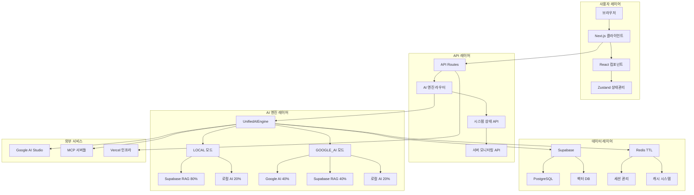

# 🏗️ 시스템 아키텍처

> **OpenManager Vibe v5.44.4** - 전체 시스템 아키텍처 (2025년 7주차 개발 진행 중)

## 📋 **개요**

OpenManager Vibe v5는 **AI 엔진 통합과 서버 관리를 위한 차세대 플랫폼**입니다. 2025년 5월 중순부터 7주간 개발하여 현재 안정적인 시스템 아키텍처를 구축했으며, Vercel 서버리스 환경에 최적화된 구조를 제공합니다.

## 🎯 **핵심 아키텍처 원칙**

### **1. 서버리스 최적화**

- **Vercel Edge Functions**: 전 세계 빠른 응답
- **자동 스케일링**: 트래픽에 따른 동적 확장
- **메모리 효율성**: 제한된 리소스 환경 최적화
- **콜드 스타트 최소화**: 최적화된 부팅 시간

### **2. AI 엔진 통합**

- **2개 모드 운영**: LOCAL/GOOGLE_AI 모드
- **지능형 라우팅**: 상황별 최적 AI 엔진 선택
- **응답 시간 최적화**: 620ms~1200ms 목표
- **한국어 처리**: 완전한 한국어 지원

### **3. 실시간 상태 관리**

- **Redis TTL 기반**: 자동 정리 시스템
- **페이지 이벤트 기반**: 90% 서버 부하 감소
- **다중 사용자**: 3-5명 동시 접속 지원
- **세션 관리**: 30분 자동 만료

## 🏗️ **전체 시스템 구조**

### **아키텍처 다이어그램**



### **레이어별 상세 구조**

#### **1. 프레젠테이션 레이어**

```typescript
// 클라이언트 사이드 구조
src/
├── app/                    # Next.js App Router
│   ├── page.tsx           # 메인 페이지
│   ├── dashboard/         # 대시보드
│   └── api/               # API 엔드포인트
├── components/            # React 컴포넌트
│   ├── unified-profile/   # 통합 프로필
│   ├── system/           # 시스템 컴포넌트
│   └── dashboard/        # 대시보드 컴포넌트
├── hooks/                # 커스텀 훅
│   ├── useSystemState.ts # 시스템 상태 훅
│   └── useAIEngine.ts    # AI 엔진 훅
└── lib/                  # 유틸리티
    ├── redis/            # Redis 관리
    └── ai/               # AI 엔진
```

#### **2. 비즈니스 로직 레이어**

```typescript
// 핵심 비즈니스 로직
export class UnifiedAIEngine {
  private mode: 'LOCAL' | 'GOOGLE_AI' = 'LOCAL';

  async processQuery(query: string): Promise<AIResponse> {
    const context = await this.collectContext(query);

    switch (this.mode) {
      case 'LOCAL':
        return this.processLocalMode(query, context);
      case 'GOOGLE_AI':
        return this.processGoogleAIMode(query, context);
    }
  }

  private async processLocalMode(
    query: string,
    context: string
  ): Promise<AIResponse> {
    // Supabase RAG (80%) + 로컬 AI (20%)
    const ragResponse = await this.supabaseRAG.process(query, context);
    const localResponse = await this.localAI.process(query);

    return this.combineResponses(ragResponse, localResponse, [0.8, 0.2]);
  }
}
```

#### **3. 데이터 액세스 레이어**

```typescript
// 데이터 관리 시스템
export class SystemStateManager {
  private redis: Redis;
  private supabase: SupabaseClient;

  async createSystemState(): Promise<SystemState> {
    const sessionId = generateUUID();
    const state = {
      id: sessionId,
      startTime: Date.now(),
      activeUsers: new Set<string>(),
      status: 'active',
    };

    // Redis TTL 설정 (35분)
    await this.redis.setex(
      `system:${sessionId}`,
      35 * 60,
      JSON.stringify(state)
    );

    return state;
  }
}
```

## ⚡ **성능 최적화 아키텍처**

### **1. 캐싱 전략**

#### **다층 캐싱 시스템**

```typescript
export class CacheManager {
  // L1: 메모리 캐시 (클라이언트)
  private memoryCache = new Map<string, CacheEntry>();

  // L2: Redis 캐시 (서버)
  private redis: Redis;

  // L3: Supabase 캐시 (데이터베이스)
  private supabase: SupabaseClient;

  async get(key: string): Promise<any> {
    // L1 캐시 확인
    const memoryResult = this.memoryCache.get(key);
    if (memoryResult && !this.isExpired(memoryResult)) {
      return memoryResult.data;
    }

    // L2 캐시 확인
    const redisResult = await this.redis.get(key);
    if (redisResult) {
      this.memoryCache.set(key, {
        data: JSON.parse(redisResult),
        timestamp: Date.now(),
      });
      return JSON.parse(redisResult);
    }

    // L3 캐시 확인 (데이터베이스)
    return this.fetchFromDatabase(key);
  }
}
```

### **2. 요청 최적화**

#### **페이지 이벤트 기반 처리**

```typescript
export function useOptimizedRequests() {
  const [isVisible, setIsVisible] = useState(true);
  const [lastRequest, setLastRequest] = useState(0);

  const makeRequest = useCallback(
    async (endpoint: string) => {
      const now = Date.now();

      // 중복 요청 방지 (1초 내)
      if (now - lastRequest < 1000) {
        return;
      }

      // 페이지가 보이지 않으면 요청 안함
      if (!isVisible) {
        return;
      }

      setLastRequest(now);
      return fetch(endpoint);
    },
    [isVisible, lastRequest]
  );

  useEffect(() => {
    const handleVisibilityChange = () => {
      setIsVisible(!document.hidden);
    };

    document.addEventListener('visibilitychange', handleVisibilityChange);
    return () =>
      document.removeEventListener('visibilitychange', handleVisibilityChange);
  }, []);
}
```

### **3. 메모리 관리**

#### **자동 메모리 정리**

```typescript
export class MemoryManager {
  private static instance: MemoryManager;
  private cleanupInterval: NodeJS.Timeout;

  constructor() {
    // 5분마다 메모리 정리
    this.cleanupInterval = setInterval(
      () => {
        this.cleanup();
      },
      5 * 60 * 1000
    );
  }

  private cleanup(): void {
    // 메모리 사용량 확인
    const memoryUsage = process.memoryUsage();
    const heapUsedMB = memoryUsage.heapUsed / 1024 / 1024;

    if (heapUsedMB > 200) {
      // 200MB 초과 시
      // 캐시 정리
      this.clearExpiredCache();

      // 가비지 컬렉션 실행
      if (global.gc) {
        global.gc();
      }
    }
  }
}
```

## 🔧 **모듈별 상세 구조**

### **1. AI 엔진 모듈**

```typescript
// AI 엔진 아키텍처
export interface AIEngine {
  name: string;
  weight: number;
  process(query: string, context: string): Promise<string>;
}

export class AIEngineOrchestrator {
  private engines: Map<string, AIEngine> = new Map();

  registerEngine(engine: AIEngine): void {
    this.engines.set(engine.name, engine);
  }

  async processWithMode(
    mode: 'LOCAL' | 'GOOGLE_AI',
    query: string
  ): Promise<string> {
    const selectedEngines = this.getEnginesForMode(mode);
    const results = await Promise.all(
      selectedEngines.map(engine => engine.process(query, ''))
    );

    return this.combineResults(
      results,
      selectedEngines.map(e => e.weight)
    );
  }
}
```

### **2. 서버 모니터링 모듈**

```typescript
// 서버 모니터링 아키텍처
export class ServerMonitor {
  private servers: Map<string, ServerInstance> = new Map();
  private metricsCollector: MetricsCollector;

  async collectMetrics(): Promise<ServerMetrics[]> {
    const metrics: ServerMetrics[] = [];

    for (const [id, server] of this.servers) {
      const metric = await this.metricsCollector.collect(server);
      metrics.push({
        serverId: id,
        timestamp: Date.now(),
        cpu: metric.cpu,
        memory: metric.memory,
        disk: metric.disk,
        network: metric.network,
      });
    }

    return metrics;
  }
}
```

### **3. 상태 관리 모듈**

```typescript
// 상태 관리 아키텍처
export class StateManager {
  private store: Zustand.Store;
  private persistLayer: PersistLayer;

  async updateState(key: string, value: any): Promise<void> {
    // 메모리 상태 업데이트
    this.store.setState({ [key]: value });

    // 영속성 레이어 업데이트
    await this.persistLayer.save(key, value);

    // 다른 클라이언트에 브로드캐스트
    await this.broadcast(key, value);
  }
}
```

## 📊 **성능 지표 및 모니터링**

### **현재 성능 지표**

| 구분            | 메트릭         | 현재 값 | 목표 값 | 상태         |
| --------------- | -------------- | ------- | ------- | ------------ |
| **응답 시간**   | LOCAL 모드     | 620ms   | 500ms   | 🔄 개선 중   |
| **응답 시간**   | GOOGLE_AI 모드 | 1200ms  | 1000ms  | 🔄 개선 중   |
| **메모리 사용** | 평균           | 180MB   | 200MB   | ✅ 양호      |
| **캐시 적중률** | Redis          | 85%     | 90%     | 🔄 개선 중   |
| **동시 사용자** | 최대           | 5명     | 10명    | 🎯 확장 계획 |

### **모니터링 대시보드**

```typescript
// 실시간 모니터링 시스템
export class PerformanceMonitor {
  private metrics: MetricsCollector;
  private alerts: AlertManager;

  async startMonitoring(): Promise<void> {
    setInterval(async () => {
      const currentMetrics = await this.metrics.collect();

      // 임계값 확인
      if (currentMetrics.responseTime > 2000) {
        await this.alerts.send('응답 시간 초과', currentMetrics);
      }

      if (currentMetrics.memoryUsage > 250 * 1024 * 1024) {
        await this.alerts.send('메모리 사용량 초과', currentMetrics);
      }

      // 메트릭 저장
      await this.saveMetrics(currentMetrics);
    }, 30000); // 30초 간격
  }
}
```

## 🔧 **개발 현황**

### **구현 완료 모듈**

✅ **AI 엔진 통합 아키텍처**  
✅ **2개 모드 운영 시스템**  
✅ **Redis TTL 기반 상태 관리**  
✅ **페이지 이벤트 기반 최적화**  
✅ **서버리스 환경 최적화**  
✅ **다층 캐싱 시스템**  
✅ **실시간 모니터링**  
✅ **자동 메모리 관리**

### **개발 진행 중**

🔄 **응답 시간 최적화**  
🔄 **캐시 적중률 개선**  
🔄 **동시 사용자 확장**  
🔄 **모니터링 고도화**  
🔄 **오류 처리 강화**

### **향후 계획**

🎯 **단기 (1-2주)**:

- 응답 시간 500ms/1000ms 달성
- 캐시 적중률 90% 달성
- 오류 처리 시스템 완성

🎯 **중기 (1개월)**:

- 동시 사용자 10명 지원
- 고급 모니터링 시스템
- 자동 스케일링 구현

🎯 **장기 (2-3개월)**:

- 마이크로서비스 아키텍처
- AI 엔진 확장성 개선
- 글로벌 CDN 최적화

## 📚 **아키텍처 문서**

### **관련 문서**

- [AI 시스템 아키텍처](./AI-시스템-아키텍처.md) - AI 엔진 상세 구조
- [서버 관리 시스템 가이드](./서버-관리-시스템-가이드.md) - 모니터링 시스템
- [배포 가이드](./배포-가이드.md) - Vercel 배포 구조
- [개발 과정](./개발-과정.md) - 아키텍처 발전 과정

### **기술 스택 상세**

- **프론트엔드**: Next.js 15, React 19, TypeScript, Tailwind CSS
- **백엔드**: Vercel Serverless, Node.js 20, API Routes
- **데이터베이스**: Supabase PostgreSQL, Redis (Upstash)
- **AI 엔진**: Google AI Studio, Supabase RAG, MCP
- **모니터링**: Vercel Analytics, 커스텀 메트릭
- **배포**: Vercel, GitHub Actions

---

> **아키텍처 현황**: 2025년 7월 2일 기준, 전체 시스템 아키텍처의 핵심 구조가 안정적으로 구현되어 운영 중이며, 지속적인 성능 최적화와 확장성 개선을 통해 더 견고한 플랫폼을 구축하고 있습니다. 🏗️
