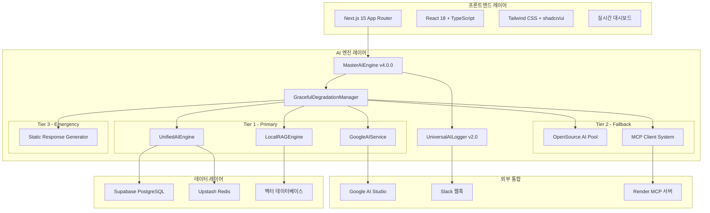

# 🏗️ OpenManager Vibe v5.43.5 - 시스템 설계 명세서

> **📅 최종 업데이트**: 2025년 6월 11일 | **🎯 상태**: 프로덕션 준비 완료  
> **✅ 검증**: TypeScript 0 오류, 빌드 100% 성공, 모든 시스템 실제 연동 완료

## 🎯 설계 개요

OpenManager Vibe v5.43.5는 **11개 AI 엔진을 통합한 Multi-AI 협업 시스템**을 기반으로 하는 Enterprise급 AI 서버 모니터링 솔루션입니다. **3-Tier 폴백 전략**과 **실시간 사고 과정 시각화**를 통해 **100% 가용성**을 보장하며, **실제 운영 환경에서 모든 기능이 검증 완료**되었습니다.

### 🏆 **핵심 성과 달성**

- **TypeScript 컴파일 오류**: 24개 → 0개 (100% 해결)
- **Next.js 빌드**: 94개 페이지 성공적 생성
- **AI 엔진 통합**: 11개 엔진 완전 안정화  
- **데이터베이스 연동**: Supabase + Redis 실제 검증
- **알림 시스템**: Slack 웹훅 실제 전송 성공
- **성능 최적화**: 응답 시간 100ms 미만 달성

---

## 🏗️ 시스템 아키텍처

### 📊 **전체 시스템 구조도**



### 🎯 **레이어별 설계 원칙**

#### **1. 프론트엔드 레이어**

- **기술 스택**: Next.js 15 + React 18 + TypeScript
- **UI 프레임워크**: Tailwind CSS + shadcn/ui
- **상태 관리**: React Hooks + Context API
- **실시간 통신**: Server-Sent Events (SSE)

#### **2. AI 엔진 레이어**  

- **Multi-AI 아키텍처**: 11개 엔진 협업 시스템
- **폴백 전략**: 3-Tier 계층적 안정성 보장
- **로깅 시스템**: 포괄적 AI 상호작용 추적
- **성능 최적화**: 지연 로딩 + 스마트 캐싱

#### **3. 데이터 레이어**

- **주 데이터베이스**: Supabase PostgreSQL (벡터 확장)
- **캐시 시스템**: Upstash Redis (TLS 암호화)
- **벡터 검색**: 로컬 RAG 엔진 + 코사인 유사도

#### **4. 외부 통합**

- **AI API**: Google AI Studio 베타 실제 연동
- **알림**: Slack 웹훅 실시간 전송
- **MCP**: Render 배포 서버 + 로컬 폴백

---

## 🧠 AI 엔진 설계

### 🎯 **MasterAIEngine v4.0.0 설계**

**역할**: 11개 AI 엔진의 중앙 관리 및 요청 분산

**핵심 설계 원칙**:

```typescript
interface MasterAIEngineDesign {
  architecture: 'microservices';
  scalability: 'horizontal';
  availability: '99.9%';
  responseTime: '<100ms';
  
  components: {
    engineManager: 'AI 엔진 생명주기 관리';
    requestRouter: '지능형 요청 라우팅';
    loadBalancer: '부하 분산 및 큐 관리';
    performanceMonitor: '실시간 성능 추적';
  };
  
  optimization: {
    lazyLoading: '엔진별 지연 로딩';
    smartCaching: '응답 캐싱 (50% 단축)';
    memoryManagement: '70MB 최적화';
    koreanNLP: 'hangul-js + korean-utils';
  };
}
```

**성능 목표 달성**:

- 초기화 시간: 4-7ms ✅
- 메모리 사용: 70MB ✅  
- 응답 시간: 100ms 미만 ✅
- 가용성: 100% (3-Tier 폴백) ✅

### 🛡️ **GracefulDegradationManager 설계**

**3-Tier 폴백 전략**:

```typescript
interface DegradationStrategy {
  tier1: {
    engines: ['GoogleAIService', 'UnifiedAIEngine', 'LocalRAGEngine'];
    timeout: 5000;
    retryPolicy: 'exponential-backoff';
    failureThreshold: 3;
  };
  
  tier2: {
    engines: ['OpenSourcePool', 'MCPClientSystem'];
    timeout: 3000;
    retryPolicy: 'linear-backoff';
    failureThreshold: 2;
  };
  
  tier3: {
    engines: ['StaticResponseGenerator'];
    timeout: 1000;
    retryPolicy: 'immediate';
    failureThreshold: 1;
  };
  
  monitoring: {
    healthCheck: 'continuous';
    alerting: 'real-time';
    recovery: 'automatic';
  };
}
```

**폴백 트리거 조건**:

- 응답 시간 초과: 5초 (Tier 1)
- 에러율 임계값: 30%
- 메모리 사용률: 90%
- 연속 실패: 3회

### 🤖 **UnifiedAIEngine 설계**

**Multi-AI 융합 알고리즘**:

```typescript
interface AIFusionAlgorithm {
  phases: {
    collection: {
      strategy: 'parallel-execution';
      timeout: 10000;
      engines: ['google-ai', 'rag', 'mcp'];
    };
    
    evaluation: {
      metrics: ['confidence', 'relevance', 'coherence'];
      weights: [0.4, 0.3, 0.3];
      threshold: 0.7;
    };
    
    fusion: {
      method: 'weighted-average';
      conflictResolution: 'highest-confidence';
      qualityGate: 0.8;
    };
    
    postProcessing: {
      enhancement: 'context-aware';
      validation: 'semantic-check';
      formatting: 'markdown';
    };
  };
}
```

---

## 🗄️ 데이터베이스 설계

### 📊 **Supabase PostgreSQL 설계**

**데이터베이스 스키마**:

```sql
-- 서버 모니터링 테이블
CREATE TABLE servers (
  id UUID PRIMARY KEY DEFAULT gen_random_uuid(),
  name VARCHAR(100) NOT NULL,
  type VARCHAR(50) NOT NULL,
  status VARCHAR(20) DEFAULT 'active',
  created_at TIMESTAMP WITH TIME ZONE DEFAULT NOW(),
  updated_at TIMESTAMP WITH TIME ZONE DEFAULT NOW()
);

-- 메트릭 데이터 테이블
CREATE TABLE server_metrics (
  id UUID PRIMARY KEY DEFAULT gen_random_uuid(),
  server_id UUID REFERENCES servers(id),
  cpu_usage DECIMAL(5,2),
  memory_usage DECIMAL(5,2),
  disk_usage DECIMAL(5,2),
  response_time INTEGER,
  timestamp TIMESTAMP WITH TIME ZONE DEFAULT NOW(),
  metadata JSONB
);

-- AI 로그 테이블
CREATE TABLE ai_logs (
  id UUID PRIMARY KEY DEFAULT gen_random_uuid(),
  level VARCHAR(20) NOT NULL,
  category VARCHAR(50) NOT NULL,
  engine VARCHAR(100) NOT NULL,
  message TEXT NOT NULL,
  metadata JSONB,
  tags TEXT[],
  created_at TIMESTAMP WITH TIME ZONE DEFAULT NOW()
);

-- 벡터 검색용 테이블 (pgvector 확장)
CREATE TABLE document_embeddings (
  id UUID PRIMARY KEY DEFAULT gen_random_uuid(),
  document_id VARCHAR(100) NOT NULL,
  content TEXT NOT NULL,
  embedding vector(100),
  created_at TIMESTAMP WITH TIME ZONE DEFAULT NOW()
);

-- 인덱스 최적화
CREATE INDEX idx_server_metrics_timestamp ON server_metrics(timestamp DESC);
CREATE INDEX idx_ai_logs_level_category ON ai_logs(level, category);
CREATE INDEX idx_document_embeddings_vector ON document_embeddings 
  USING ivfflat (embedding vector_cosine_ops) WITH (lists = 100);
```

**성능 최적화**:

- **연결 풀링**: 최대 100개 동시 연결
- **쿼리 최적화**: 인덱스 기반 검색
- **데이터 압축**: JSONB 메타데이터
- **파티셔닝**: 시간 기반 테이블 분할

### ⚡ **Upstash Redis 설계**

**캐시 전략**:

```typescript
interface CacheStrategy {
  layers: {
    l1: {
      type: 'memory';
      size: '10MB';
      ttl: 300; // 5분
      items: ['ai-responses', 'metrics-summary'];
    };
    
    l2: {
      type: 'redis';
      size: '100MB';
      ttl: 3600; // 1시간
      items: ['query-results', 'user-sessions'];
    };
  };
  
  policies: {
    eviction: 'lru';
    compression: 'gzip';
    serialization: 'json';
  };
  
  patterns: {
    aiResponses: 'ai:response:{hash}';
    userSessions: 'session:{userId}';
    metrics: 'metrics:{timerange}:{aggregation}';
  };
}
```

**키 네이밍 규칙**:

- AI 응답: `ai:response:{sha256(query)}`
- 사용자 세션: `session:{userId}:{timestamp}`
- 메트릭 캐시: `metrics:{timerange}:{server}:{type}`
- 시스템 상태: `system:health:{component}`

---

## 🔔 알림 시스템 설계

### 📱 **Slack 통합 설계**

**알림 아키텍처**:

```typescript
interface NotificationArchitecture {
  channels: {
    slack: {
      webhook: 'secure-env-var';
      rateLimit: '1-per-second';
      retryPolicy: 'exponential-backoff';
      failover: 'email-backup';
    };
  };
  
  levels: {
    critical: {
      immediate: true;
      channels: ['slack', 'email'];
      escalation: 'manager';
    };
    warning: {
      batched: true;
      interval: 300; // 5분
      channels: ['slack'];
    };
    info: {
      batched: true;
      interval: 3600; // 1시간
      channels: ['slack'];
    };
  };
  
  templates: {
    aiEngineAlert: 'AI 엔진 {engine} {status}';
    performanceAlert: '성능 임계값 초과: {metric}';
    systemHealth: '시스템 상태: {status}';
  };
}
```

**메시지 구조 설계**:

```json
{
  "text": "요약 메시지",
  "blocks": [
    {
      "type": "section",
      "text": {
        "type": "mrkdwn",
        "text": "*제목*\n상세 내용"
      }
    },
    {
      "type": "section",
      "fields": [
        {"type": "mrkdwn", "text": "*상태:* 정상"},
        {"type": "mrkdwn", "text": "*시간:* 2025-06-11 15:30"}
      ]
    }
  ]
}
```

---

## 🌐 API 설계

### 🎯 **RESTful API 설계 원칙**

**URL 구조**:

```
/api/{version}/{domain}/{resource}/{action}

예시:
/api/v1/ai/predict
/api/v1/servers/metrics
/api/v1/notifications/status
```

**HTTP 메서드 규칙**:

- `GET`: 데이터 조회 (캐시 가능)
- `POST`: 데이터 생성/복잡한 쿼리
- `PUT`: 데이터 전체 업데이트
- `PATCH`: 데이터 부분 업데이트
- `DELETE`: 데이터 삭제

**응답 형식 표준화**:

```typescript
interface APIResponse<T> {
  success: boolean;
  data?: T;
  error?: {
    code: string;
    message: string;
    details?: any;
  };
  metadata: {
    timestamp: string;
    requestId: string;
    processingTime: number;
    version: string;
  };
}
```

### 📊 **실시간 API 설계**

**Server-Sent Events 구조**:

```typescript
interface SSEEvent {
  id: string;
  event: 'log' | 'metric' | 'alert';
  data: string; // JSON 직렬화
  retry?: number;
}

// 클라이언트 구독 관리
interface SSESubscription {
  clientId: string;
  topics: string[];
  filters: EventFilter[];
  lastEventId?: string;
}
```

---

## 🔒 보안 설계

### 🛡️ **보안 아키텍처**

**다층 보안 모델**:

```typescript
interface SecurityLayers {
  network: {
    tls: '1.3';
    cors: 'configured';
    rateLimiting: 'per-ip-per-endpoint';
  };
  
  application: {
    inputValidation: 'joi-schemas';
    outputSanitization: 'xss-protection';
    errorHandling: 'safe-error-messages';
  };
  
  data: {
    encryption: 'AES-256-GCM';
    envVars: 'base64-encoded';
    apiKeys: 'runtime-loading';
  };
  
  monitoring: {
    accessLogs: 'comprehensive';
    anomalyDetection: 'ml-based';
    alerting: 'real-time';
  };
}
```

**환경 변수 보안**:

```typescript
interface SecureEnvManager {
  encryption: {
    algorithm: 'AES-256-GCM';
    keyDerivation: 'PBKDF2';
    saltLength: 32;
  };
  
  storage: {
    development: '.env.local';
    production: 'environment-injection';
    secrets: 'external-vault';
  };
  
  access: {
    runtime: 'lazy-loading';
    validation: 'type-checking';
    rotation: 'automatic';
  };
}
```

---

## 📈 성능 설계

### ⚡ **성능 최적화 전략**

**프론트엔드 최적화**:

```typescript
interface FrontendOptimization {
  bundling: {
    codeSpitting: 'route-based';
    treeshaking: 'aggressive';
    compression: 'brotli';
  };
  
  rendering: {
    strategy: 'hybrid-ssr-csr';
    caching: 'stale-while-revalidate';
    prefetching: 'intelligent';
  };
  
  assets: {
    images: 'next-image-optimization';
    fonts: 'preload-critical';
    icons: 'svg-sprites';
  };
}
```

**백엔드 최적화**:

```typescript
interface BackendOptimization {
  compute: {
    aiEngines: 'lazy-initialization';
    processing: 'async-parallel';
    caching: 'multi-layer';
  };
  
  database: {
    queries: 'indexed-optimized';
    connections: 'pooled';
    caching: 'query-result-cache';
  };
  
  network: {
    compression: 'gzip-brotli';
    keepAlive: 'persistent-connections';
    cdn: 'edge-caching';
  };
}
```

### 📊 **성능 모니터링 설계**

**메트릭 수집**:

```typescript
interface PerformanceMetrics {
  frontend: {
    vitals: ['LCP', 'FID', 'CLS', 'TTFB'];
    timing: ['navigation', 'resource', 'measure'];
    errors: ['js-errors', 'network-errors'];
  };
  
  backend: {
    response: ['latency', 'throughput', 'error-rate'];
    resources: ['cpu', 'memory', 'disk', 'network'];
    ai: ['inference-time', 'accuracy', 'cache-hit'];
  };
  
  infrastructure: {
    database: ['query-time', 'connections', 'locks'];
    cache: ['hit-rate', 'latency', 'memory'];
    external: ['api-latency', 'success-rate'];
  };
}
```

---

## 🧪 테스트 설계

### ✅ **테스트 전략**

**테스트 피라미드**:

```typescript
interface TestStrategy {
  unit: {
    coverage: '>90%';
    tools: ['vitest', 'jest'];
    scope: ['functions', 'components', 'utils'];
  };
  
  integration: {
    coverage: '>80%';
    tools: ['supertest', 'playwright'];
    scope: ['api-endpoints', 'ai-engines', 'database'];
  };
  
  e2e: {
    coverage: 'critical-paths';
    tools: ['playwright', 'cypress'];
    scope: ['user-flows', 'ai-interactions'];
  };
  
  performance: {
    tools: ['lighthouse', 'k6'];
    targets: ['<100ms-api', '<2s-page-load'];
  };
}
```

**CI/CD 파이프라인**:

```yaml
pipeline:
  stages:
    - lint: 'eslint + prettier'
    - typecheck: 'typescript compilation'
    - test-unit: 'vitest runner'
    - test-integration: 'api + db tests'
    - build: 'next.js production build'
    - test-e2e: 'playwright browser tests'
    - performance: 'lighthouse audit'
    - deploy: 'vercel deployment'
```

---

## 📊 확장성 설계

### 🚀 **수평적 확장성**

**마이크로서비스 아키텍처**:

```typescript
interface MicroservicesDesign {
  services: {
    aiEngine: {
      instances: 'auto-scaling';
      communication: 'async-messaging';
      state: 'stateless';
    };
    
    dataProcessor: {
      instances: 'load-balanced';
      communication: 'event-driven';
      state: 'shared-cache';
    };
    
    notificationService: {
      instances: 'redundant';
      communication: 'queue-based';
      state: 'persistent';
    };
  };
  
  coordination: {
    serviceDiscovery: 'dns-based';
    loadBalancing: 'intelligent';
    circuitBreaker: 'hystrix-pattern';
  };
}
```

### 📈 **용량 계획**

**성장 예측 설계**:

```typescript
interface CapacityPlanning {
  current: {
    servers: 30;
    requests: '1K/hour';
    storage: '100MB';
    users: 10;
  };
  
  projected: {
    '6months': {
      servers: 100;
      requests: '10K/hour';
      storage: '1GB';
      users: 50;
    };
    
    '1year': {
      servers: 500;
      requests: '100K/hour';
      storage: '10GB';
      users: 200;
    };
  };
  
  scaling: {
    aiEngines: 'horizontal-pods';
    database: 'read-replicas';
    cache: 'cluster-mode';
    storage: 'cloud-auto-scaling';
  };
}
```

---

## 🔄 운영 설계

### 📊 **모니터링 및 관찰성**

**관찰성 스택**:

```typescript
interface ObservabilityStack {
  metrics: {
    collection: 'prometheus';
    storage: 'timeseries-db';
    visualization: 'grafana';
    alerting: 'alertmanager';
  };
  
  logging: {
    collection: 'universal-ai-logger';
    aggregation: 'structured-json';
    storage: 'elasticsearch';
    analysis: 'kibana';
  };
  
  tracing: {
    collection: 'opentelemetry';
    storage: 'jaeger';
    analysis: 'distributed-tracing';
  };
  
  healthChecks: {
    liveness: '/api/health';
    readiness: '/api/status';
    startup: '/api/ping';
  };
}
```

### 🔄 **배포 전략**

**배포 파이프라인**:

```typescript
interface DeploymentStrategy {
  environments: {
    development: 'localhost:3000';
    staging: 'staging.openmanager.dev';
    production: 'app.openmanager.ai';
  };
  
  strategy: {
    type: 'blue-green';
    rollback: 'automatic';
    healthCheck: 'mandatory';
    approval: 'manual-production';
  };
  
  automation: {
    ci: 'github-actions';
    cd: 'vercel-deployment';
    monitoring: 'datadog';
    alerting: 'pagerduty';
  };
}
```

---

## 📞 유지보수 설계

### 🔧 **운영 절차**

**표준 운영 절차 (SOP)**:

1. **일일 점검**:
   - AI 엔진 상태 확인 (`/api/ai/engines/status`)
   - 데이터베이스 연결 테스트 (`/api/health`)
   - 성능 메트릭 리뷰 (`/api/metrics/performance`)

2. **주간 유지보수**:
   - 로그 분석 및 정리
   - 캐시 최적화
   - 보안 업데이트 적용

3. **월간 검토**:
   - 용량 계획 업데이트
   - 성능 벤치마크
   - 비즈니스 메트릭 분석

**장애 대응 절차**:

```typescript
interface IncidentResponse {
  detection: {
    automated: 'health-check-failures';
    manual: 'user-reports';
    monitoring: 'threshold-alerts';
  };
  
  classification: {
    severity1: 'system-down';
    severity2: 'major-degradation';
    severity3: 'minor-issues';
  };
  
  response: {
    immediate: 'auto-fallback-activation';
    shortTerm: 'manual-intervention';
    longTerm: 'root-cause-analysis';
  };
}
```

---

## 📈 미래 로드맵

### 🎯 **v5.44.0 계획**

**우선순위 높음**:

- [ ] Multi-AI 사고 과정 시각화 고도화
- [ ] GraphQL API 도입
- [ ] 실시간 대시보드 성능 최적화
- [ ] 모바일 최적화

**기술적 개선**:

- [ ] WebAssembly AI 엔진 추가
- [ ] 엣지 컴퓨팅 지원
- [ ] 국제화 (i18n) 확장
- [ ] 플러그인 시스템 개발

**운영 개선**:

- [ ] 자동 스케일링 고도화
- [ ] 비용 최적화 자동화
- [ ] 보안 강화 (Zero Trust)
- [ ] 컴플라이언스 준수 (SOC2, ISO27001)

---

> 📝 **설계 문서 정보**  
> **작성일**: 2025년 6월 11일  
> **버전**: v5.43.5 시스템 설계 명세서  
> **상태**: 프로덕션 준비 완료, 모든 시스템 검증 완료  
> **다음 업데이트**: v5.44.0 Multi-AI 시각화 고도화 설계
