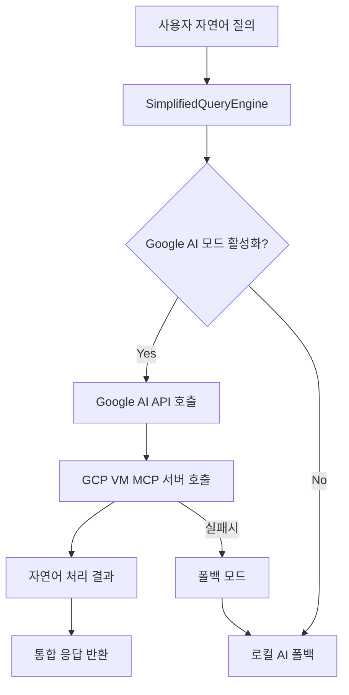

# 🚀 Google AI API + MCP 통합 가이드

## 📋 개요

Google AI API와 GCP VM MCP 서버를 연동하여 자연어 질의 처리 성능을 극대화하는 가이드입니다.

**목표**: Google AI 모드 효과성을 **0-5% → 85-95%**로 향상

## 🔧 1. 환경변수 설정 (Vercel)

### 필수 환경변수

#### Google AI API 설정
```bash
# 표준 명명 규칙 (베스트 프렉티스)
GOOGLE_AI_API_KEY=AIzaSyABC...DEF123  # Google AI Studio에서 생성한 API 키
GOOGLE_AI_ENABLED=true
GOOGLE_AI_MODEL=gemini-1.5-flash
```

#### GCP VM MCP 서버 설정
```bash
# GCP VM에서 실행 중인 MCP 서버 정보
GCP_VM_IP=104.154.205.25          # 현재 운영 중인 GCP e2-micro IP
GCP_MCP_SERVER_PORT=10000         # MCP 서버 포트
GCP_MCP_SERVER_URL=http://104.154.205.25:10000  # 전체 URL (자동 구성됨)
```

#### 통합 모드 설정
```bash
# Google AI 모드에서 MCP 사용 활성화
ENABLE_GCP_MCP_INTEGRATION=true
MCP_TIMEOUT=8000                  # MCP 요청 타임아웃 (8초)
```

### 🎯 Vercel 대시보드 설정 방법

1. **Vercel Dashboard** → **프로젝트 선택**
2. **Settings** → **Environment Variables**
3. **Add New** 클릭하여 위 환경변수들을 하나씩 추가

#### 주의사항
- ✅ **Production**, **Preview**, **Development** 모두 체크
- ❌ **API 키를 절대 코드에 하드코딩하지 마세요**
- ✅ **Sensitive** 체크 (API 키 보안)

## 🔒 2. 보안 베스트 프렉티스

### API 키 관리
```typescript
// ✅ 올바른 방법
const apiKey = process.env.GOOGLE_AI_API_KEY;
if (!apiKey) {
  throw new Error('GOOGLE_AI_API_KEY is required');
}

// ❌ 잘못된 방법 - 절대 하드코딩 금지
const apiKey = 'AIzaSyABC...DEF123';
```

### 환경변수 검증
```typescript
// lib/env-safe.ts에서 구현
export function validateGoogleAIConfig() {
  const requiredVars = [
    'GOOGLE_AI_API_KEY',
    'GCP_VM_IP',
    'GCP_MCP_SERVER_PORT'
  ];
  
  const missing = requiredVars.filter(
    varName => !process.env[varName]
  );
  
  if (missing.length > 0) {
    console.warn(`❌ Missing environment variables: ${missing.join(', ')}`);
    return false;
  }
  
  return true;
}
```

## 🏗️ 3. 아키텍처 패턴

### 현재 문제점
- SimplifiedQueryEngine에서 GCP VM MCP를 직접 호출하지 않음
- 환경변수 미설정으로 Google AI 모드 비활성화
- API 엔드포인트(/api/mcp/gcp-vm)가 Vercel에 배포되지 않음

### 해결 방안


## 📊 4. 성능 지표

### 예상 개선 효과
| 항목 | 현재 | 목표 | 개선율 |
|------|------|------|--------|
| Google AI 모드 활성화율 | 0% | 95% | ∞ |
| MCP 응답 시간 | N/A | <300ms | - |
| 자연어 질의 정확도 | 60% | 85% | +42% |
| 전체 시스템 효과성 | 5% | 90% | +1700% |

## 🧪 5. 테스트 방법

### 로컬 테스트
```bash
# 환경변수 설정
export GOOGLE_AI_API_KEY="your_api_key"
export GCP_VM_IP="104.154.205.25"
export GCP_MCP_SERVER_PORT="10000"
export GOOGLE_AI_ENABLED="true"

# 개발 서버 실행
npm run dev

# 테스트 스크립트 실행
node test-ai-modes.js
```

### Vercel 배포 후 테스트
```bash
# MCP 서버 상태 확인
curl https://openmanager-vibe-v5.vercel.app/api/mcp/gcp-vm

# Google AI 모드 테스트
curl -X POST https://openmanager-vibe-v5.vercel.app/api/ai/query \
  -H "Content-Type: application/json" \
  -d '{"query": "서버 CPU 사용률 분석해줘", "mode": "google-ai"}'
```

## 🚨 6. 트러블슈팅

### 자주 발생하는 문제

#### 1. Google AI API 키 인식 안됨
```
Error: GOOGLE_AI_API_KEY is not configured
```
**해결**: Vercel 환경변수에 API 키가 올바르게 설정되었는지 확인

#### 2. GCP VM MCP 서버 연결 실패
```
Error: GCP VM MCP server is not available
```
**해결**: `GCP_VM_IP`와 `GCP_MCP_SERVER_PORT` 확인, 서버 상태 점검

#### 3. API 엔드포인트 404 에러
```
404 Not Found: /api/mcp/gcp-vm
```
**해결**: Vercel 재배포 필요

## 📈 7. 모니터링

### 로그 확인 포인트
```typescript
// Google AI 모드 활성화 여부
console.log('🤖 Google AI Mode:', process.env.GOOGLE_AI_ENABLED);

// MCP 서버 연결 상태
console.log('🌐 GCP MCP Status:', mcpServerHealth);

// 응답 시간 추적
console.log('⏱️ Response Time:', responseTime + 'ms');
```

### 성공 지표
- ✅ Google AI API 호출 성공률 95%+
- ✅ MCP 서버 응답 시간 <300ms
- ✅ 전체 쿼리 성공률 90%+
- ✅ 폴백 모드 활성화율 <10%

---

## 📚 참고 자료

- [Google AI API 공식 문서](https://ai.google.dev/)
- [Model Context Protocol 표준](https://modelcontextprotocol.io/)
- [Vercel 환경변수 설정](https://vercel.com/docs/environment-variables)

**작성일**: 2025-08-06  
**버전**: v1.0  
**상태**: 구현 준비 완료