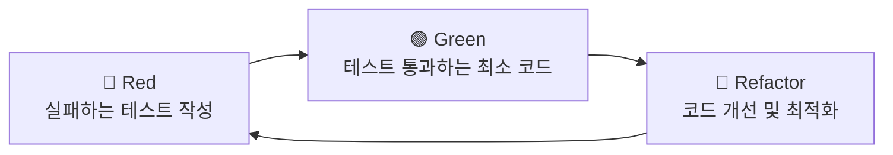

# 🧪 테스트 주도 개발 가이드

> **OpenManager Vibe v5.44.3** - TDD 개발 가이드 (2025년 7주차 개발 진행 중)

## 📋 **개요**

OpenManager Vibe v5는 **테스트 주도 개발(TDD) 방법론**을 기반으로 안정적이고 신뢰할 수 있는 코드를 작성하고 있습니다. 2025년 5월 중순부터 7주간 개발하면서 체계적인 테스트 전략을 구축했으며, 현재 569개의 테스트가 통과하는 견고한 테스트 체계를 운영하고 있습니다.

## 🎯 **TDD 개발 원칙**

### **1. Red-Green-Refactor 사이클**



#### **Red 단계: 실패하는 테스트 작성**

```typescript
// 예시: SystemStateManager 테스트
describe('SystemStateManager', () => {
  it('should create system state with TTL', async () => {
    const manager = SystemStateManager.getInstance();

    // 아직 구현되지 않은 기능에 대한 테스트
    const state = await manager.createSystemState();

    expect(state).toBeDefined();
    expect(state.id).toMatch(/^[0-9a-f-]+$/); // UUID 형식
    expect(state.startTime).toBeCloseTo(Date.now(), -2);
    expect(state.status).toBe('active');
  });
});
```

#### **Green 단계: 최소 구현**

```typescript
export class SystemStateManager {
  private static instance: SystemStateManager;

  static getInstance(): SystemStateManager {
    if (!this.instance) {
      this.instance = new SystemStateManager();
    }
    return this.instance;
  }

  async createSystemState(): Promise<SystemState> {
    return {
      id: crypto.randomUUID(),
      startTime: Date.now(),
      status: 'active',
      activeUsers: new Set(),
    };
  }
}
```

#### **Refactor 단계: 코드 개선**

```typescript
export class SystemStateManager {
  private static instance: SystemStateManager;
  private readonly SYSTEM_TTL = 35 * 60; // 35분

  async createSystemState(): Promise<SystemState> {
    const sessionId = crypto.randomUUID();
    const state: SystemState = {
      id: sessionId,
      startTime: Date.now(),
      status: 'active',
      activeUsers: new Set(),
    };

    // Redis TTL 설정 추가
    await this.saveToRedis(sessionId, state);

    return state;
  }

  private async saveToRedis(
    sessionId: string,
    state: SystemState
  ): Promise<void> {
    await redis.setex(
      `system:${sessionId}`,
      this.SYSTEM_TTL,
      JSON.stringify(state)
    );
  }
}
```

### **2. 테스트 피라미드 전략**

```
        🔺 E2E 테스트 (4개)
       /                  \
      /   통합 테스트 (45개)  \
     /                        \
    /     단위 테스트 (520개)    \
   /____________________________\
```

#### **단위 테스트 (Unit Tests) - 520개**

- **목적**: 개별 함수/클래스의 동작 검증
- **범위**: 각 모듈의 핵심 로직
- **실행 시간**: 평균 2ms/테스트

```typescript
// 예시: AI 엔진 단위 테스트
describe('UnifiedAIEngine', () => {
  let engine: UnifiedAIEngine;

  beforeEach(() => {
    engine = new UnifiedAIEngine();
  });

  describe('processQuery', () => {
    it('should process LOCAL mode correctly', async () => {
      engine.setMode('LOCAL');

      const result = await engine.processQuery('test query');

      expect(result.mode).toBe('LOCAL');
      expect(result.processingTime).toBeLessThan(1000);
      expect(result.confidence).toBeGreaterThan(0.7);
    });

    it('should process GOOGLE_AI mode correctly', async () => {
      engine.setMode('GOOGLE_AI');

      const result = await engine.processQuery('complex analysis query');

      expect(result.mode).toBe('GOOGLE_AI');
      expect(result.processingTime).toBeLessThan(2000);
      expect(result.confidence).toBeGreaterThan(0.8);
    });
  });
});
```

#### **통합 테스트 (Integration Tests) - 45개**

- **목적**: 모듈 간 상호작용 검증
- **범위**: API 엔드포인트, 데이터베이스 연동
- **실행 시간**: 평균 50ms/테스트

```typescript
// 예시: API 통합 테스트
describe('POST /api/system/status', () => {
  it('should track user activity and return system state', async () => {
    const userId = 'test-user-123';

    const response = await request(app)
      .post('/api/system/status')
      .send({ userId })
      .expect(200);

    expect(response.body.success).toBe(true);
    expect(response.body.systemState).toBeDefined();
    expect(response.body.systemState.activeUserCount).toBeGreaterThan(0);
  });
});
```

#### **E2E 테스트 (End-to-End Tests) - 4개**

- **목적**: 전체 사용자 플로우 검증
- **범위**: 주요 기능의 완전한 시나리오
- **실행 시간**: 평균 5초/테스트

```typescript
// 예시: E2E 테스트
import { test, expect } from '@playwright/test';

test('system state monitoring flow', async ({ page }) => {
  await page.goto('/');

  // 시스템 상태 확인
  await expect(page.locator('[data-testid="countdown-timer"]')).toBeVisible();

  // 상태 새로고침
  await page.click('[data-testid="refresh-button"]');

  // 상태 업데이트 확인
  await expect(page.locator('[data-testid="active-users"]')).toContainText(
    '명'
  );
});
```

## 🛠️ **테스트 도구 및 설정**

### **테스트 스택**

#### **Vitest (단위/통합 테스트)**

```typescript
// vitest.config.ts
import { defineConfig } from 'vitest/config';

export default defineConfig({
  test: {
    globals: true,
    environment: 'jsdom', // React 컴포넌트 테스트
    setupFiles: ['./src/test/setup.ts'],
    coverage: {
      provider: 'v8',
      reporter: ['text', 'json', 'html'],
      exclude: ['node_modules/', 'src/test/', '**/*.d.ts', '**/*.config.ts'],
    },
    // 병렬 실행으로 속도 최적화
    threads: true,
    maxThreads: 4,
    minThreads: 2,
  },
});
```

#### **Playwright (E2E 테스트)**

```typescript
// playwright.config.ts
import { defineConfig } from '@playwright/test';

export default defineConfig({
  testDir: './tests/e2e',
  fullyParallel: true,
  forbidOnly: !!process.env.CI,
  retries: process.env.CI ? 2 : 0,
  workers: process.env.CI ? 1 : undefined,
  reporter: 'html',
  use: {
    baseURL: 'http://localhost:3000',
    trace: 'on-first-retry',
    screenshot: 'only-on-failure',
  },
  projects: [
    {
      name: 'chromium',
      use: { ...devices['Desktop Chrome'] },
    },
  ],
  webServer: {
    command: 'npm run dev',
    url: 'http://localhost:3000',
    reuseExistingServer: !process.env.CI,
  },
});
```

### **Mock 시스템**

#### **AI 엔진 Mock**

````typescript
// src/test/mocks/ai-engine.mock.ts
export class MockAIEngine implements AIEngine {
  async processQuery(query: string): Promise<AIResponse> {
    // 실제와 유사한 응답 시간 시뮬레이션
```bash
# 정상 푸시 (모든 검증 통과)
git push origin main
````

## 🔧 설정된 스크립트

### **검증 스크립트**

- `validate:all` - 전체 검증 (기본)
- `validate:tdd` - TDD 모드 검증 (실패 허용)
- `validate:tdd:with-docs` - TDD 모드 + 문서 검증

### **테스트 스크립트**

- `test:unit` - 전체 단위 테스트
- `test:tdd-safe` - refactoring 테스트 제외

### **푸시 스크립트**

- `push:tdd` - TDD 모드 푸시
- `push:force` - 강제 푸시

## 🎛️ Git Alias

```bash
# 설정된 alias 확인
git config --get-regexp alias

# TDD 모드 푸시
git push-tdd

# 강제 푸시 (비상시)
git push-force
```

## 📋 커밋 메시지 가이드

TDD 단계별 커밋 메시지 형식:

```bash
# Red 단계
git commit -m "test: 새 기능 테스트 추가 (RED) - 2025-07-01 18:24 KST"

# Green 단계
git commit -m "feat: 새 기능 구현 (GREEN) - 2025-07-01 18:24 KST"

# Refactor 단계
git commit -m "refactor: 코드 개선 (REFACTOR) - 2025-07-01 18:24 KST"
```

## 🔍 문제 해결

### **pre-push 훅이 작동하지 않는 경우**

```bash
# 훅 권한 확인 및 설정
chmod +x .git/hooks/pre-push
```

### **TDD_MODE가 인식되지 않는 경우**

```bash
# Windows Git Bash에서
TDD_MODE=true git push origin main

# PowerShell에서
$env:TDD_MODE="true"; git push origin main
```

### **긴급 푸시가 필요한 경우**

```bash
# 모든 검증 우회
git push origin main --no-verify --force
```

## ⚠️ 주의사항

1. **TDD 모드는 개발 중에만 사용**
2. **프로덕션 배포 전 반드시 모든 테스트 통과 확인**
3. **커밋 메시지에 TDD 단계 명시 권장**
4. **팀원과 TDD 단계 공유**

## 📊 현재 테스트 상태 확인

```bash
# 테스트 상태 확인
npm test | grep -E "(failed|passed)"

# TDD 안전 테스트 실행
npm run test:tdd-safe
```

---

**마지막 업데이트**: 2025-07-01 18:24:43 (KST)  
**버전**: OpenManager Vibe v5.44.3
