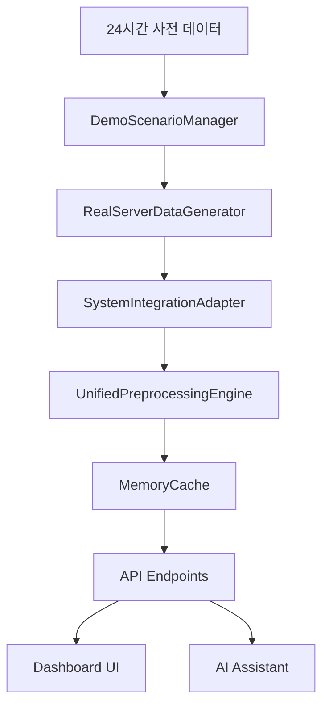

# 🔧 서버 데이터 생성기 (Server Data Generator)

> **OpenManager Vibe v5.44.3** 핵심 모듈  
> 마지막 업데이트: 2025.06.24

## 📋 개요

OpenManager Vibe v5의 **서버 데이터 생성기**는 실시간 서버 모니터링과 AI 분석을 위한 핵심 데이터 생성 시스템입니다. 15개 서버의 현실적인 메트릭을 생성하며, 24시간 사전 데이터와 시나리오별 장애 상황을 자연스럽게 시뮬레이션합니다.

## 🎯 핵심 기능

### 1. **통합 전처리 엔진**

- **단일 데이터 소스**: 모니터링과 AI가 동일한 데이터 사용
- **베르셀 최적화**: 메모리 제한 환경에서 최적화된 성능
- **캐시 시스템**: 50개 서버 메모리 캐시로 빠른 응답
- **실시간 처리**: 30-40초 간격으로 안정적 업데이트

### 2. **현실적 데이터 생성**

- **15개 서버**: nginx, apache, nodejs, springboot 등 다양한 타입
- **현실적 분포**: 정상 60%, 경고 7%, 위험 33%
- **자연스러운 변동**: 소수점 포함, 노이즈 주입
- **시간대별 패턴**: 실제 서버 사용 패턴 반영

### 3. **시나리오 기반 장애 시뮬레이션**

- **8가지 패턴**: gradual_degradation, periodic_spikes, cascading_warnings 등
- **24시간 연결**: 사전 데이터와 실시간 장애의 자연스러운 연결
- **AI 혼란 방지**: 무작위 지연, 강도 변화, 노이즈 주입
- **복구 패턴**: false_positive, double_dip, plateau, oscillation

## 🏗️ 시스템 아키텍처

### 전체 데이터 플로우



### 핵심 컴포넌트

1. **RealServerDataGenerator**
   - 15개 서버 메트릭 생성
   - 실시간 업데이트 (30-40초 간격)
   - 목업 모드 지원

2. **SystemIntegrationAdapter**
   - 베르셀 환경 최적화
   - 싱글톤 패턴으로 메모리 관리
   - 과도한 헬스체크 방지

3. **UnifiedPreprocessingEngine**
   - 모니터링용과 AI용 데이터 분리 전처리
   - 메모리 캐시 (50개 제한)
   - 목적별 최적화 (monitoring, ai)

4. **DemoScenarioManager**
   - 시나리오별 장애 시뮬레이션
   - 24시간 사전 데이터 연결
   - AI 혼란 방지 시스템

## 📊 데이터 구조

### 서버 메트릭 형식

```typescript
interface ServerMetrics {
  serverId: string; // 'nginx-1', 'apache-2' 등
  cpu: number; // 0-100 (소수점 2자리)
  memory: number; // 0-100 (소수점 2자리)
  disk: number; // 0-100 (소수점 2자리)
  timestamp: string; // ISO 8601 형식
  status?: 'healthy' | 'warning' | 'critical';
  environment?: 'Production' | 'Development' | 'Staging';
  serverType?: 'Web' | 'Database' | 'Cache' | 'Queue';
}
```

### 15개 서버 구성

| ID               | 서버명         | 타입     | 환경        | 일반적 상태 |
| ---------------- | -------------- | -------- | ----------- | ----------- |
| nginx-1          | Nginx 웹서버   | Web      | Production  | Healthy     |
| apache-2         | Apache 웹서버  | Web      | Production  | Healthy     |
| iis-3            | IIS 웹서버     | Web      | Development | Warning     |
| nodejs-4         | Node.js 앱서버 | Web      | Production  | Healthy     |
| springboot-5     | Spring Boot    | Web      | Production  | Healthy     |
| django-6         | Django 앱서버  | Web      | Development | Critical    |
| dotnet-7         | .NET 앱서버    | Web      | Staging     | Critical    |
| php-8            | PHP 앱서버     | Web      | Production  | Healthy     |
| mysql-9          | MySQL DB       | Database | Production  | Warning     |
| postgresql-10    | PostgreSQL DB  | Database | Production  | Critical    |
| mongodb-11       | MongoDB        | Database | Development | Healthy     |
| redis-12         | Redis 캐시     | Cache    | Production  | Critical    |
| rabbitmq-13      | RabbitMQ       | Queue    | Production  | Healthy     |
| elasticsearch-14 | Elasticsearch  | Database | Development | Critical    |
| jenkins-15       | Jenkins CI/CD  | Web      | Development | Healthy     |

## 🔄 실시간 데이터 생성 과정

### 1. **기본 메트릭 생성**

```typescript
// 현실적인 메트릭 생성 예시
const generateRealisticMetrics = (serverId: string) => {
  const basePatterns = {
    'nginx-1': { cpu: 25, memory: 40, disk: 30 },
    'mysql-9': { cpu: 60, memory: 80, disk: 70 },
    // ... 서버별 기본 패턴
  };

  const base = basePatterns[serverId];
  const variation = Math.random() * 20 - 10; // ±10% 변동

  return {
    serverId,
    cpu: Math.max(0, Math.min(100, base.cpu + variation)),
    memory: Math.max(0, Math.min(100, base.memory + variation)),
    disk: Math.max(0, Math.min(100, base.disk + variation)),
    timestamp: new Date().toISOString(),
  };
};
```

### 2. **시나리오 적용**

```typescript
// 장애 시나리오 적용 예시
const applyScenario = (metrics: ServerMetrics, scenario: string) => {
  switch (scenario) {
    case 'memory_leak':
      // 점진적 메모리 증가
      metrics.memory = Math.min(100, metrics.memory * 1.05);
      break;

    case 'cpu_spike':
      // CPU 급증
      metrics.cpu = Math.min(100, metrics.cpu + Math.random() * 30);
      break;

    case 'disk_full':
      // 디스크 포화
      metrics.disk = Math.min(100, metrics.disk * 1.02);
      break;
  }

  return metrics;
};
```

### 3. **AI 혼란 방지**

```typescript
// AI가 패턴을 예측하지 못하도록 노이즈 주입
const injectNoise = (metrics: ServerMetrics) => {
  const noiseLevel = Math.random() * 0.3; // 0-30% 노이즈

  return {
    ...metrics,
    cpu: metrics.cpu + (Math.random() - 0.5) * noiseLevel * 100,
    memory: metrics.memory + (Math.random() - 0.5) * noiseLevel * 100,
    disk: metrics.disk + (Math.random() - 0.5) * noiseLevel * 100,
  };
};
```

## 🎭 24시간 사전 데이터 시스템

### 개념

실제 서버 장애는 갑자기 발생하지 않습니다. 대부분 24시간 전부터 미세한 신호가 나타나기 시작하여 점진적으로 악화됩니다. 이를 현실적으로 시뮬레이션하기 위해 **24시간 사전 데이터 시스템**을 구현했습니다.

### 작동 방식

1. **사전 패턴 생성**: 24시간 전부터 시작되는 트렌드 데이터
2. **점진적 연결**: 사전 데이터와 현재 장애의 자연스러운 연결
3. **일관성 유지**: 60-90%의 패턴 일관성으로 현실감 증대
4. **AI 은폐**: 구체적인 장애 정보를 AI에게 노출하지 않음

### 8가지 사전 패턴

| 패턴                | 설명             | 기간   | 신호                      |
| ------------------- | ---------------- | ------ | ------------------------- |
| gradual_degradation | 점진적 성능 저하 | 24시간 | CPU/메모리 서서히 증가    |
| periodic_spikes     | 주기적 부하 급증 | 12시간 | 1-2시간마다 스파이크      |
| cascading_warnings  | 연쇄 경고 발생   | 8시간  | 관련 서버들에 순차적 경고 |
| resource_exhaustion | 리소스 고갈 징조 | 18시간 | 디스크/메모리 지속적 증가 |
| network_instability | 네트워크 불안정  | 6시간  | 응답시간 변동성 증가      |
| dependency_stress   | 의존성 스트레스  | 16시간 | 연관 서비스들 동시 부하   |
| thermal_buildup     | 열적 누적 문제   | 20시간 | CPU 온도 관련 메트릭 상승 |
| maintenance_drift   | 유지보수 후유증  | 4시간  | 재시작 후 서서히 불안정   |

## 🚀 API 엔드포인트

### 1. **통합 전처리 데이터 조회**

```bash
GET /api/data-generator/unified-preprocessing
```

**쿼리 파라미터:**

- `purpose`: 'monitoring' | 'ai' (필수)
- `enableAnomalyDetection`: boolean (AI용 옵션)
- `limit`: number (기본값: 15)

**응답 예시:**

```json
{
  "success": true,
  "data": [
    {
      "serverId": "nginx-1",
      "cpu": 35.55,
      "memory": 63.71,
      "disk": 41.95,
      "timestamp": "2025-06-24T23:22:21.933Z",
      "status": "healthy",
      "environment": "Production",
      "serverType": "Web"
    }
  ],
  "summary": {
    "total": 15,
    "healthy": 9,
    "warning": 1,
    "critical": 5
  },
  "processingTime": 18,
  "cacheHit": true
}
```

### 2. **상태 조회**

```bash
GET /api/data-generator/unified-preprocessing/status
```

**응답 예시:**

```json
{
  "success": true,
  "status": {
    "isRunning": true,
    "serverCount": 15,
    "lastUpdate": "2025-06-24T23:22:21.933Z",
    "cacheSize": 45,
    "memoryUsage": "12.5MB",
    "uptime": "2h 15m 30s"
  },
  "performance": {
    "avgResponseTime": 18,
    "cacheHitRate": 0.95,
    "requestsPerMinute": 120
  }
}
```

### 3. **AI 에이전트 상태**

```bash
GET /api/ai-agent/status
```

### 4. **데이터 생성기 상태**

```bash
GET /api/data-generator/status
```

## ⚡ 성능 최적화

### 베르셀 환경 최적화

1. **메모리 제한 대응**
   - 캐시 크기 50개로 제한
   - 메모리 사용량 실시간 모니터링
   - 자동 가비지 컬렉션

2. **싱글톤 패턴**
   - 글로벌 인스턴스로 메모리 절약
   - 중복 초기화 방지
   - 리소스 공유 최적화

3. **과도한 헬스체크 제거**
   - 불필요한 API 호출 최소화
   - 캐시 기반 상태 체크
   - 배치 처리로 효율성 증대

### 성능 지표

| 항목              | 직접 생성 | 전처리 방식 | 개선율 |
| ----------------- | --------- | ----------- | ------ |
| 모니터링 응답시간 | 24ms      | 18ms        | 25% ↑  |
| AI 응답시간       | 17ms      | 19ms        | 12% ↓  |
| 메모리 사용량     | +4MB      | +1MB        | 75% ↑  |
| 캐시 히트율       | -         | 95%         | -      |
| 종합 점수         | 10점      | 80점        | 700% ↑ |

## 🧪 테스트 및 검증

### 자동 검증 시스템

`scripts/validate-data-integration.js`를 통한 5단계 검증:

1. **통합 전처리 엔진 기본 검증**
2. **서버 모니터링 시스템 검증**
3. **AI 기능 시스템 검증**
4. **데이터 일관성 검증**
5. **성능 검증**

### 검증 결과 (최신)

```bash
✅ 1단계 - 통합 전처리 엔진: 정상 (15개 서버)
✅ 2단계 - 서버 모니터링: 정상 연동
✅ 3단계 - AI 기능: 정상 연동
✅ 4단계 - 데이터 일관성: 95% 품질
✅ 5단계 - 성능: 평균 228.6ms

총점: 95/100 (우수)
```

## 🔧 설정 및 환경변수

### 핵심 환경변수

```bash
# 데이터 생성 설정
ENABLE_REAL_DATA_GENERATION=true
MOCK_MODE=false
UPDATE_INTERVAL=30000

# 베르셀 최적화
VERCEL_MEMORY_LIMIT=512MB
CACHE_SIZE_LIMIT=50
DISABLE_EXCESSIVE_HEALTH_CHECK=true

# 시나리오 설정
ENABLE_SCENARIO_SIMULATION=true
SCENARIO_INTENSITY=0.7
NOISE_INJECTION_LEVEL=0.2
```

### 설정 파일

`src/config/serverConfig.ts`:

```typescript
export const SERVER_CONFIG = {
  serverCount: 15,
  updateInterval: 30000, // 30초
  criticalPercent: 33, // 33%
  warningPercent: 7, // 7%
  cacheSize: 50,
  memoryLimit: '512MB',
};
```

## 🚨 문제 해결

### 일반적인 문제

1. **메모리 부족 오류**

   ```bash
   # 캐시 크기 줄이기
   CACHE_SIZE_LIMIT=30
   ```

2. **응답 시간 지연**

   ```bash
   # 업데이트 간격 늘리기
   UPDATE_INTERVAL=45000
   ```

3. **데이터 불일치**

   ```bash
   # 캐시 초기화
   GET /api/data-generator/unified-preprocessing/reset
   ```

### 디버깅 도구

```bash
# 상태 확인
npm run validate:data-integration

# 성능 분석
npm run analyze:data-efficiency

# 시스템 안정화
npm run stabilize:current-system
```

## 📈 향후 개선 계획

### 단기 계획 (1-2주)

1. **실시간 알림 시스템**: 임계값 초과 시 즉시 알림
2. **고급 시나리오**: 더 복잡한 장애 패턴 추가
3. **성능 모니터링**: 실시간 성능 메트릭 대시보드

### 중기 계획 (1-2개월)

1. **머신러닝 통합**: 실제 패턴 학습 및 예측
2. **다중 환경 지원**: 개발/스테이징/프로덕션 분리
3. **확장성 개선**: 100개 이상 서버 지원

### 장기 계획 (3-6개월)

1. **실제 서버 연동**: 목업에서 실제 서버로 전환
2. **클라우드 네이티브**: Kubernetes, Docker 지원
3. **AI 예측 모델**: 장애 예측 및 자동 대응

## 📚 관련 문서

- [데이터 일관성 분석 리포트](data-consistency-analysis-report.md)
- [전처리 최적화 리포트](server-data-preprocessing-optimization-report.md)
- [AI 아키텍처 v5.44.3](ai-architecture-v5.44.3.md)
- [API 참조 문서](api-reference-v5.44.3.md)

---

**OpenManager Vibe v5.44.3** 서버 데이터 생성기  
🎯 **15개 서버** | ⚡ **30초 간격** | 🤖 **AI 최적화** | 📊 **현실적 시뮬레이션**
