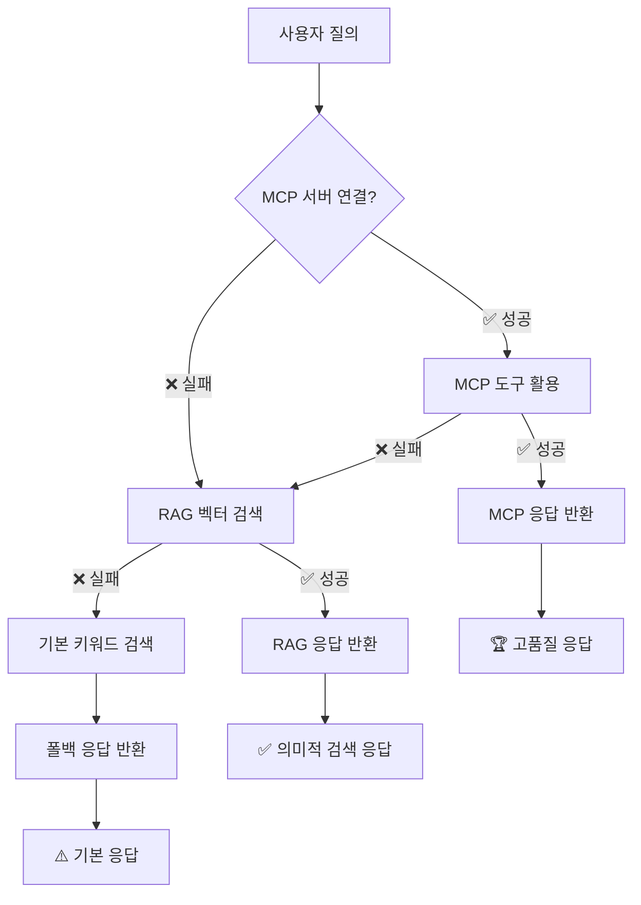

# ⚙️ 설정가이드 - Configuration Guide

> **OpenManager Vibe v5 MCP 및 시스템 설정 종합 가이드**  
> 개발환경부터 프로덕션까지 모든 설정을 다룹니다.

## 🎯 MCP 환경별 구성 - MCP Environment Configuration

### 🔧 개발환경 MCP (Cursor IDE)

**목적**: 코딩 및 개발 도구 지원  
**설정 파일**: `mcp-cursor.json`  
**활성화 범위**: 로컬 개발 환경만

#### 📁 포함 MCP 서버들

```json
{
  "mcpServers": {
    "openmanager-local": {
      "command": "node",
      "args": ["./mcp-server/server.js"],
      "env": {
        "NODE_ENV": "development",
        "MCP_MODE": "local"
      },
      "description": "로컬 MCP 서버 (개발 전용)"
    },
    "filesystem": {
      "command": "npx",
      "args": ["@modelcontextprotocol/server-filesystem", "./docs", "./src"],
      "description": "파일 시스템 조작 도구 (개발 필수)"
    },
    "git": {
      "command": "npx",
      "args": ["-y", "@smithery/git-mcp"],
      "description": "Git 브랜치 관리 및 커밋 자동화"
    },
    "browser-tools": {
      "command": "npx",
      "args": ["-y", "@modelcontextprotocol/server-brave-search"],
      "description": "웹 브라우저 자동화 및 스크래핑"
    }
  }
}
```

**주요 기능**:
- 📁 **filesystem**: 프로젝트 파일 읽기/쓰기
- 🌿 **git**: 브랜치 생성, 커밋, 푸시 자동화
- 🌐 **browser-tools**: 웹 검색 및 데이터 수집
- 🔧 **openmanager-local**: 프로젝트별 커스텀 도구

### 🚀 프로덕션 MCP (Render 배포)

**목적**: AI 분석 및 서버 모니터링 인텔리전스  
**설정 파일**: `mcp-render-ai.json`  
**활성화 범위**: Render 서버 환경

#### 🧠 AI 엔진 구성

```json
{
  "mcpServers": {
    "ai-engine": {
      "command": "node",
      "args": ["./mcp-server/server.js"],
      "env": {
        "NODE_ENV": "production",
        "AI_ENGINE_MODE": "true",
        "MCP_PORT": "3001"
      },
      "description": "서버 모니터링 AI 분석 엔진"
    }
  }
}
```

**주요 기능**:
- 📊 **서버 상태 분석**: CPU, 메모리, 네트워크 패턴 분석
- 🚨 **이상 징후 탐지**: 실시간 이상 패턴 감지
- ⚡ **성능 최적화**: 자동 성능 튜닝 제안
- 🔮 **예측 분석**: 리소스 사용량 예측

---

## 🌟 하이브리드 AI 아키텍처 - Hybrid AI Architecture

### 🔄 3단계 폴백 시스템



### 📊 환경별 엔진 우선순위

| 환경 | 1순위 | 2순위 | 3순위 | 특징 |
|------|-------|-------|-------|------|
| **Cursor 개발** | MCP (80%) | RAG (15%) | Basic (5%) | 완전한 MCP 지원 |
| **Vercel 프로덕션** | RAG (55%) | MCP (40%) | Basic (5%) | 파일 시스템 제약 |
| **오프라인 데모** | RAG (75%) | Basic (25%) | - | MCP 불가 |

---

## 🔧 환경변수 설정 - Environment Variables

### 🗄️ 필수 환경변수

#### Supabase 설정
```env
NEXT_PUBLIC_SUPABASE_URL=https://vnswjnltnhpsueosfhmw.supabase.co
NEXT_PUBLIC_SUPABASE_ANON_KEY=eyJhbGciOiJIUzI1NiIsInR5cCI6IkpXVCJ9...
SUPABASE_SERVICE_ROLE_KEY=eyJhbGciOiJIUzI1NiIsInR5cCI6IkpXVCJ9...
SUPABASE_JWT_SECRET=qNzA4/WgbksJU3xxkQJcfbCRkXhgBR...
```

#### Redis/KV 설정
```env
# Vercel KV (우선순위)
KV_REST_API_URL=https://charming-condor-46598.upstash.io
KV_REST_API_TOKEN=AbYGAAIjcDE5MjNmYjhiZDkwOGQ0...
KV_URL=rediss://default:AbYGAAIjcDE5MjNmYjhiZDkwOGQ0...

# Upstash Redis (호환성)
UPSTASH_REDIS_REST_URL=https://charming-condor-46598.upstash.io
UPSTASH_REDIS_REST_TOKEN=AbYGAAIjcDE5MjNmYjhiZDkwOGQ0...
```

#### MCP 서버 설정
```env
# MCP 서버 URL (Render 배포)
MCP_SERVER_URL=https://your-mcp-server.onrender.com
MCP_API_KEY=your-secure-api-key

# AI 엔진 모드
AI_ENGINE_MODE=true
MCP_TIMEOUT=30000
```

### 🌐 환경별 설정 파일 매핑

| 환경 | 설정 파일 | 환경변수 | MCP 서버 |
|------|-----------|----------|----------|
| **로컬 개발** | `.env.local` | 전체 | 로컬 + Cursor |
| **Vercel** | Vercel Dashboard | 프로덕션용 | Render 원격 |
| **Render** | 환경변수 설정 | MCP 전용 | 자체 서버 |

---

## 🛠️ 실제 설정 가이드 - Setup Guide

### 1️⃣ Cursor IDE MCP 설정 (원클릭 자동 설정)

#### 🚀 **방법 1: 자동 스크립트 (권장)**

프로젝트를 클론한 후 단 한 번의 명령어로 MCP 설정 완료:

```bash
# 프로젝트 클론
git clone [레포지토리-URL]
cd openmanager-vibe-v5

# 자동 MCP 설정 (패키지 설치 + 설정 적용)
npm run mcp:full-setup
```

#### 📋 **방법 2: 단계별 설정**

```bash
# 1. 필수 MCP 패키지 설치
npm run mcp:install

# 2. MCP 설정 적용
npm run mcp:setup

# 3. Cursor 재시작
```

#### 📁 **방법 3: 수동 설정 (고급 사용자)**

```bash
# 1. Cursor 설정 파일 위치
# Windows: %APPDATA%\Cursor\User\globalStorage\cursor.json
# macOS: ~/Library/Application Support/Cursor/User/globalStorage/cursor.json

# 2. MCP 설정 복사
cp mcp-cursor.json ~/.config/cursor/mcp.json

# 3. Cursor 재시작
```

### 2️⃣ 개발 서버 실행

```bash
# MCP 서버 포함 통합 모드
npm run dev:integrated

# MCP 없이 독립 실행
npm run dev:standalone

# 연결 상태 확인
curl http://localhost:3001/health
```

### 3️⃣ Render 배포 설정

```bash
# mcp-server 디렉토리 배포
cd mcp-server

# 환경변수 설정 (Render Dashboard)
NODE_ENV=production
AI_ENGINE_MODE=true
PORT=10000
```

### 4️⃣ Vercel 환경변수 설정

```bash
# Vercel CLI로 환경변수 추가
vercel env add NEXT_PUBLIC_SUPABASE_URL production
vercel env add KV_REST_API_URL production
vercel env add MCP_SERVER_URL production

# 환경변수 목록 확인
vercel env ls
```

---

## 🔍 설정 검증 - Configuration Validation

### 📊 MCP 연결 상태 확인

```typescript
// 개발 도구에서 실행
const mcpStatus = await fetch('/api/mcp/status').then(r => r.json());
console.log('MCP Status:', mcpStatus);

// 예상 응답
{
  "mcp_connected": true,
  "ai_engine_mode": true,
  "fallback_engines": ["RAG", "Basic"],
  "response_time": "120ms"
}
```

### 🧪 AI 엔진 테스트

```bash
# API 엔드포인트 테스트
curl -X POST https://openmanager-vibe-v5.vercel.app/api/ai/mcp/test \
  -H "Content-Type: application/json" \
  -d '{"query": "서버 상태 확인"}'

# 예상 응답
{
  "engine_used": "MCP",
  "response": "현재 6개 서버 중 5개 정상 동작 중",
  "confidence": 0.95,
  "response_time": "234ms"
}
```

### ⚙️ 환경별 설정 점검

```bash
# 로컬 개발 환경
npm run validate:env:local

# Vercel 프로덕션 환경
npm run validate:env:production

# MCP 서버 상태 (Render)
curl https://your-mcp-server.onrender.com/health
```

---

## 🚨 설정 문제 해결 - Configuration Troubleshooting

### 🔧 자주 발생하는 문제들

#### 1. MCP 연결 실패
```bash
# 증상: "MCP server not responding"
# 해결:
curl http://localhost:3001/health  # 로컬 서버 확인
npm run dev:integrated             # 통합 모드로 재시작
```

#### 2. 환경변수 누락
```bash
# 증상: "Environment variable not found"
# 해결:
cp .env.example .env.local
vercel env pull .env.vercel        # Vercel 환경변수 동기화
```

#### 3. AI 엔진 폴백
```bash
# 증상: "Using fallback engine"
# 확인: 이는 정상 동작 (RAG 엔진 사용)
# MCP 복구: Render 서버 재시작
```

#### 4. Redis 연결 오류
```bash
# 증상: "Redis connection failed"
# 해결:
echo $KV_REST_API_URL          # URL 확인
echo $KV_REST_API_TOKEN        # 토큰 확인
vercel env add KV_REST_API_URL # 재설정
```

### 🛠️ 설정 복구 명령어

```bash
# 전체 설정 초기화
npm run config:reset

# 환경변수 재설정
npm run config:env:setup

# MCP 서버 재시작
npm run mcp:restart

# 설정 유효성 검사
npm run config:validate
```

---

## 📚 고급 설정 - Advanced Configuration

### 🔄 환경변수 자동 매핑

```typescript
// src/lib/env.ts - 자동 환경변수 매핑
export const envConfig = {
  redis: {
    url: process.env.KV_REST_API_URL || process.env.UPSTASH_REDIS_REST_URL,
    token: process.env.KV_REST_API_TOKEN || process.env.UPSTASH_REDIS_REST_TOKEN
  },
  mcp: {
    serverUrl: process.env.MCP_SERVER_URL || 'http://localhost:3001',
    timeout: parseInt(process.env.MCP_TIMEOUT || '30000')
  }
};
```

### 🎛️ 커스텀 MCP 도구 개발

```typescript
// mcp-server/tools/custom-tool.ts
export class CustomAnalysisTool {
  name = "analyze_server_performance";
  description = "서버 성능 종합 분석";
  
  async execute(params: any) {
    // 커스텀 분석 로직
    return {
      status: "healthy",
      recommendations: ["메모리 최적화 필요"],
      confidence: 0.87
    };
  }
}
```

### 📊 성능 모니터링 설정

```typescript
// 실시간 MCP 성능 추적
const mcpMetrics = {
  responseTime: { avg: 150, max: 300 },
  successRate: 0.95,
  fallbackRate: 0.05,
  lastHealthCheck: new Date()
};
```

---

## ✅ 설정 완료 체크리스트 - Configuration Checklist

### 🚀 기본 설정
- [ ] `.env.local` 파일 생성 및 설정
- [ ] Cursor MCP 설정 완료
- [ ] 개발 서버 정상 실행 확인
- [ ] API 엔드포인트 응답 확인

### 🌐 프로덕션 설정
- [ ] Vercel 환경변수 모두 설정
- [ ] Render MCP 서버 배포 완료
- [ ] Redis/KV 연결 상태 정상
- [ ] Supabase 데이터베이스 연결 확인

### 🧠 AI 엔진 설정
- [ ] MCP → RAG → Basic 폴백 시스템 작동
- [ ] 벡터 DB 의미적 검색 가능
- [ ] 한국어 NLU 처리 정상
- [ ] AI 응답 품질 만족스러움

### 🔧 고급 설정
- [ ] 커스텀 MCP 도구 (선택사항)
- [ ] 성능 모니터링 대시보드
- [ ] 로그 수집 및 분석
- [ ] 자동 알림 시스템

---

**⚙️ Configuration Complete - Ready to Monitor Servers!**