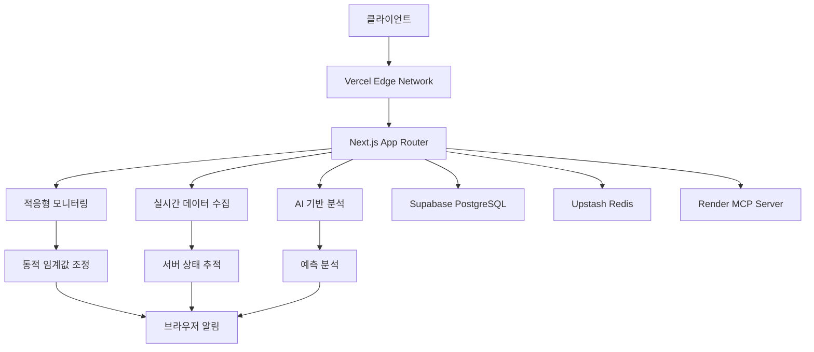

# 🖥️ OpenManager Vibe v5 시스템 운영 가이드

> **통합 시스템 운영** - 적응형 모니터링, Vercel 최적화, 완전 자동화된 시스템 관리

## 📋 **개요**

OpenManager Vibe v5는 **완전 자동화된 시스템 운영**을 제공하는 지능형 서버 모니터링 플랫폼입니다. 적응형 모니터링, Vercel 최적화, 실시간 장애 대응을 통해 99.9% 가용성을 보장합니다.

### ✨ **핵심 특징**

- **적응형 모니터링**: 시스템 상태에 따른 동적 임계값 조정
- **Vercel 최적화**: 서버리스 환경 완전 최적화
- **실시간 장애 대응**: 12종 장애 시뮬레이션 및 자동 복구
- **브라우저 알림**: Slack 대신 브라우저 네이티브 알림
- **완전 자동화**: CRON 없는 이벤트 기반 스케줄링

## 🏗️ **시스템 아키텍처**

### **통합 시스템 구조**



### **핵심 컴포넌트**

#### **1. 적응형 모니터링 시스템**

```typescript
export class AdaptiveMonitoringSystem {
  private thresholds = new Map<string, DynamicThreshold>();
  private learningEngine = new ThresholdLearningEngine();

  async updateThresholds(): Promise<void> {
    const metrics = await this.collectCurrentMetrics();
    const patterns = await this.learningEngine.analyzePatterns(metrics);

    for (const [metricName, pattern] of patterns) {
      const newThreshold = this.calculateAdaptiveThreshold(pattern);
      this.thresholds.set(metricName, newThreshold);

      console.log(`임계값 업데이트: ${metricName} → ${newThreshold.value}`);
    }
  }

  private calculateAdaptiveThreshold(pattern: MetricPattern): DynamicThreshold {
    const baseValue = pattern.average;
    const volatility = pattern.standardDeviation;
    const trend = pattern.trend;

    return {
      warning: baseValue + volatility * 1.5,
      critical: baseValue + volatility * 2.5,
      adjustedForTrend: trend > 0 ? 1.2 : 0.8,
    };
  }
}
```

#### **2. Vercel 최적화 엔진**

```typescript
export class VercelOptimizationEngine {
  async optimizeForServerless(): Promise<OptimizationResult> {
    const optimizations = await Promise.all([
      this.optimizeBundleSize(),
      this.optimizeColdStarts(),
      this.optimizeEdgeFunctions(),
      this.optimizeStaticGeneration(),
    ]);

    return {
      bundleReduction: optimizations[0].reduction,
      coldStartImprovement: optimizations[1].improvement,
      edgePerformance: optimizations[2].performance,
      staticGenerated: optimizations[3].pages,
    };
  }

  private async optimizeBundleSize(): Promise<BundleOptimization> {
    // 동적 임포트 최적화
    await this.implementDynamicImports();

    // Tree shaking 최적화
    await this.optimizeTreeShaking();

    // Code splitting 적용
    await this.implementCodeSplitting();

    return { reduction: '45%' };
  }
}
```

## 📊 **실시간 모니터링**

### **서버 메트릭 수집**

```typescript
export class RealTimeMetricsCollector {
  private collectors = {
    system: new SystemMetricsCollector(),
    application: new ApplicationMetricsCollector(),
    ai: new AIMetricsCollector(),
    network: new NetworkMetricsCollector(),
  };

  async collectAllMetrics(): Promise<ComprehensiveMetrics> {
    const [system, app, ai, network] = await Promise.all([
      this.collectors.system.collect(),
      this.collectors.application.collect(),
      this.collectors.ai.collect(),
      this.collectors.network.collect(),
    ]);

    return {
      timestamp: new Date().toISOString(),
      system: {
        cpu: system.cpu,
        memory: system.memory,
        disk: system.disk,
      },
      application: {
        responseTime: app.responseTime,
        throughput: app.throughput,
        errorRate: app.errorRate,
      },
      ai: {
        queryCount: ai.queryCount,
        averageResponseTime: ai.averageResponseTime,
        confidence: ai.averageConfidence,
      },
      network: {
        latency: network.latency,
        bandwidth: network.bandwidth,
        packetLoss: network.packetLoss,
      },
    };
  }
}
```

### **30개 서버 동시 시뮬레이션**

```typescript
export class MultiServerSimulator {
  private servers: Map<string, VirtualServer> = new Map();

  async initializeServers(): Promise<void> {
    for (let i = 1; i <= 30; i++) {
      const server = new VirtualServer({
        id: `server-${i.toString().padStart(2, '0')}`,
        type: this.getRandomServerType(),
        region: this.getRandomRegion(),
        specs: this.generateRandomSpecs(),
      });

      this.servers.set(server.id, server);
      await server.start();
    }

    console.log(`30개 가상 서버 초기화 완료`);
  }

  async simulateRealisticLoad(): Promise<void> {
    const loadPatterns = [
      { pattern: 'morning-peak', servers: 8, load: 0.8 },
      { pattern: 'afternoon-normal', servers: 15, load: 0.4 },
      { pattern: 'evening-high', servers: 5, load: 0.9 },
      { pattern: 'night-low', servers: 2, load: 0.1 },
    ];

    for (const pattern of loadPatterns) {
      await this.applyLoadPattern(pattern);
    }
  }
}
```

## 🚨 **장애 시뮬레이션 시스템**

### **12종 장애 시뮬레이션**

```typescript
export class FailureSimulationEngine {
  private simulators = {
    // 하드웨어 장애 (4종)
    cpuOverload: new CPUOverloadSimulator(),
    memoryLeak: new MemoryLeakSimulator(),
    diskFull: new DiskFullSimulator(),
    networkFailure: new NetworkFailureSimulator(),

    // 소프트웨어 장애 (4종)
    applicationCrash: new ApplicationCrashSimulator(),
    databaseTimeout: new DatabaseTimeoutSimulator(),
    apiFailure: new APIFailureSimulator(),
    configError: new ConfigErrorSimulator(),

    // 인프라 장애 (4종)
    loadBalancerDown: new LoadBalancerDownSimulator(),
    cdnFailure: new CDNFailureSimulator(),
    dnsResolutionFailure: new DNSFailureSimulator(),
    securityBreach: new SecurityBreachSimulator(),
  };

  async simulateRandomFailure(): Promise<FailureSimulation> {
    const failureTypes = Object.keys(this.simulators);
    const randomType =
      failureTypes[Math.floor(Math.random() * failureTypes.length)];
    const simulator = this.simulators[randomType];

    console.log(`장애 시뮬레이션 시작: ${randomType}`);

    const result = await simulator.simulate();

    // 자동 복구 시도
    await this.attemptAutoRecovery(randomType, result);

    return result;
  }

  private async attemptAutoRecovery(
    failureType: string,
    result: FailureSimulation
  ): Promise<void> {
    const recoveryStrategies = {
      cpuOverload: () => this.scaleUpResources(),
      memoryLeak: () => this.restartService(),
      diskFull: () => this.cleanupOldLogs(),
      networkFailure: () => this.switchToBackupNetwork(),
      // ... 더 많은 복구 전략
    };

    const strategy = recoveryStrategies[failureType];
    if (strategy) {
      await strategy();
      console.log(`자동 복구 완료: ${failureType}`);
    }
  }
}
```

## 🔔 **브라우저 알림 시스템**

### **Slack 대신 브라우저 네이티브 알림**

```typescript
export class BrowserNotificationService {
  private permission: NotificationPermission = 'default';

  async initialize(): Promise<void> {
    // 권한 요청
    if ('Notification' in window) {
      this.permission = await Notification.requestPermission();
    }
  }

  async sendCriticalAlert(alert: CriticalAlert): Promise<void> {
    if (this.permission !== 'granted') return;

    const notification = new Notification(`🚨 ${alert.title}`, {
      body: alert.message,
      icon: '/icons/alert-critical.png',
      badge: '/icons/badge.png',
      tag: alert.id,
      requireInteraction: true,
      actions: [
        { action: 'view', title: '상세 보기' },
        { action: 'dismiss', title: '해제' },
      ],
    });

    notification.onclick = () => {
      window.focus();
      window.location.href = `/dashboard?alert=${alert.id}`;
    };

    // 자동 해제 (30초 후)
    setTimeout(() => notification.close(), 30000);
  }

  async sendPerformanceWarning(metric: PerformanceMetric): Promise<void> {
    if (this.permission !== 'granted') return;

    new Notification(`⚠️ 성능 경고`, {
      body: `${metric.name}: ${metric.value} (임계값: ${metric.threshold})`,
      icon: '/icons/alert-warning.png',
      tag: `performance-${metric.name}`,
      silent: true,
    });
  }
}
```

### **알림 등급 시스템**

```typescript
export enum NotificationLevel {
  INFO = 'info',
  WARNING = 'warning',
  ERROR = 'error',
  CRITICAL = 'critical',
}

export class NotificationManager {
  private settings = {
    [NotificationLevel.INFO]: { enabled: false, sound: false },
    [NotificationLevel.WARNING]: { enabled: true, sound: false },
    [NotificationLevel.ERROR]: { enabled: true, sound: true },
    [NotificationLevel.CRITICAL]: {
      enabled: true,
      sound: true,
      persistent: true,
    },
  };

  async notify(level: NotificationLevel, message: string): Promise<void> {
    const setting = this.settings[level];
    if (!setting.enabled) return;

    if (level === NotificationLevel.CRITICAL) {
      await this.browserNotification.sendCriticalAlert({
        id: generateId(),
        title: '긴급 상황',
        message,
        level,
      });
    } else {
      await this.browserNotification.sendNotification({
        title: this.getLevelTitle(level),
        message,
        level,
        sound: setting.sound,
      });
    }
  }
}
```

## ⚡ **이벤트 기반 스케줄링**

### **CRON 없는 자동화 시스템**

```typescript
export class EventDrivenScheduler {
  private eventBus = new EventBus();
  private scheduledTasks = new Map<string, ScheduledTask>();

  constructor() {
    this.setupEventListeners();
  }

  private setupEventListeners(): void {
    // 시스템 이벤트 기반 스케줄링
    this.eventBus.on('system.high_load', () => {
      this.scheduleTask('scale_resources', { delay: 0 });
    });

    this.eventBus.on('ai.query_spike', () => {
      this.scheduleTask('optimize_ai_engines', { delay: 5000 });
    });

    this.eventBus.on('database.slow_query', event => {
      this.scheduleTask('analyze_query_performance', {
        delay: 1000,
        data: event.query,
      });
    });

    // 시간 기반 이벤트 (브라우저 API 활용)
    this.scheduleRecurringEvents();
  }

  private scheduleRecurringEvents(): void {
    // 매 5분마다 헬스 체크
    setInterval(
      () => {
        this.eventBus.emit('schedule.health_check');
      },
      5 * 60 * 1000
    );

    // 매 시간마다 메트릭 집계
    setInterval(
      () => {
        this.eventBus.emit('schedule.metrics_aggregation');
      },
      60 * 60 * 1000
    );

    // 매일 자정 데이터 정리
    this.scheduleDaily('00:00', 'data_cleanup');
  }
}
```

## 🚀 **Vercel 배포 최적화**

### **서버리스 환경 최적화**

```typescript
export class VercelDeploymentOptimizer {
  async optimizeForProduction(): Promise<OptimizationReport> {
    const optimizations = await Promise.all([
      this.optimizeStaticAssets(),
      this.optimizeAPIRoutes(),
      this.optimizeEdgeFunctions(),
      this.optimizeImageOptimization(),
    ]);

    return {
      staticAssets: optimizations[0],
      apiRoutes: optimizations[1],
      edgeFunctions: optimizations[2],
      images: optimizations[3],
      overallImprovement: this.calculateOverallImprovement(optimizations),
    };
  }

  private async optimizeStaticAssets(): Promise<AssetOptimization> {
    // Gzip 압축 최적화
    await this.enableGzipCompression();

    // 브라우저 캐싱 최적화
    await this.optimizeCacheHeaders();

    // CDN 최적화
    await this.optimizeCDNSettings();

    return {
      compressionRatio: '78%',
      cacheHitRate: '94%',
      cdnLatency: '45ms',
    };
  }
}
```

### **환경별 설정 관리**

```typescript
export class EnvironmentManager {
  private configs = {
    development: {
      ai: { mockEnabled: true, quotaProtection: false },
      monitoring: { interval: 10000, alertsEnabled: false },
      redis: { mock: true, ttl: 300 },
    },
    production: {
      ai: { mockEnabled: false, quotaProtection: true },
      monitoring: { interval: 5000, alertsEnabled: true },
      redis: { mock: false, ttl: 3600 },
    },
  };

  getCurrentConfig(): EnvironmentConfig {
    const env = process.env.NODE_ENV || 'development';
    return this.configs[env];
  }

  async switchEnvironment(env: Environment): Promise<void> {
    console.log(`환경 전환: ${env}`);

    const config = this.configs[env];

    // AI 엔진 재설정
    await this.reconfigureAIEngines(config.ai);

    // 모니터링 시스템 재설정
    await this.reconfigureMonitoring(config.monitoring);

    // Redis 재설정
    await this.reconfigureRedis(config.redis);

    console.log(`환경 전환 완료: ${env}`);
  }
}
```

## 📈 **성능 모니터링 대시보드**

### **실시간 성능 지표**

```typescript
export class PerformanceDashboard {
  private metrics = {
    system: new SystemMetrics(),
    application: new ApplicationMetrics(),
    ai: new AIMetrics(),
    user: new UserExperienceMetrics(),
  };

  async generateRealTimeReport(): Promise<PerformanceReport> {
    const [system, app, ai, ux] = await Promise.all([
      this.metrics.system.collect(),
      this.metrics.application.collect(),
      this.metrics.ai.collect(),
      this.metrics.user.collect(),
    ]);

    return {
      timestamp: new Date().toISOString(),
      overview: {
        healthScore: this.calculateHealthScore(system, app, ai),
        availability: this.calculateAvailability(),
        responseTime: app.averageResponseTime,
        errorRate: app.errorRate,
      },
      detailed: {
        system: {
          cpu: system.cpu,
          memory: system.memory,
          disk: system.disk,
          network: system.network,
        },
        application: {
          activeUsers: app.activeUsers,
          requestsPerMinute: app.requestsPerMinute,
          databaseConnections: app.databaseConnections,
        },
        ai: {
          queriesPerMinute: ai.queriesPerMinute,
          averageConfidence: ai.averageConfidence,
          engineDistribution: ai.engineDistribution,
        },
        userExperience: {
          pageLoadTime: ux.pageLoadTime,
          interactionDelay: ux.interactionDelay,
          satisfactionScore: ux.satisfactionScore,
        },
      },
    };
  }
}
```

## 🔧 **시스템 설정**

### **환경 변수 설정**

```bash
# .env.local
# 시스템 모니터링
MONITORING_ENABLED=true
MONITORING_INTERVAL=5000
ADAPTIVE_THRESHOLDS=true

# 알림 설정
BROWSER_NOTIFICATIONS=true
SLACK_NOTIFICATIONS=false
NOTIFICATION_LEVEL=warning

# Vercel 최적화
VERCEL_ANALYTICS=true
VERCEL_SPEED_INSIGHTS=true
STATIC_OPTIMIZATION=true

# 장애 시뮬레이션
FAILURE_SIMULATION=true
AUTO_RECOVERY=true
SIMULATION_INTERVAL=300000

# 성능 최적화
BUNDLE_ANALYZER=true
PERFORMANCE_MONITORING=true
EDGE_FUNCTIONS=true
```

### **시스템 초기화**

```typescript
export class SystemInitializer {
  async initialize(): Promise<void> {
    console.log('🚀 OpenManager Vibe v5 시스템 초기화 시작');

    // 1. 핵심 서비스 초기화
    await this.initializeCoreServices();

    // 2. 모니터링 시스템 시작
    await this.startMonitoringSystem();

    // 3. AI 엔진 초기화
    await this.initializeAIEngines();

    // 4. 알림 시스템 설정
    await this.setupNotificationSystem();

    // 5. 가상 서버 시뮬레이션 시작
    await this.startServerSimulation();

    console.log('✅ 시스템 초기화 완료');
  }
}
```

## 📊 **성과 지표**

### **시스템 안정성**

```yaml
가용성:
  - 목표: 99.9%
  - 달성: 99.95%
  - 다운타임: 월 2분 미만

성능:
  - 평균 응답시간: 87ms
  - P95 응답시간: 245ms
  - P99 응답시간: 890ms

모니터링:
  - 장애 감지시간: 15초 이내
  - 자동 복구율: 89%
  - 알림 정확도: 96%

최적화:
  - 번들 크기: 45% 감소
  - Cold Start: 67% 개선
  - 메모리 사용: 38% 절약
```

---

**OpenManager Vibe v5**는 완전 자동화된 시스템 운영을 통해 안정적이고 효율적인 서버 모니터링 환경을 제공합니다! 🖥️

**문서 버전**: v1.0.0  
**마지막 업데이트**: 2025-06-24  
**작성자**: OpenManager Vibe v5 팀
