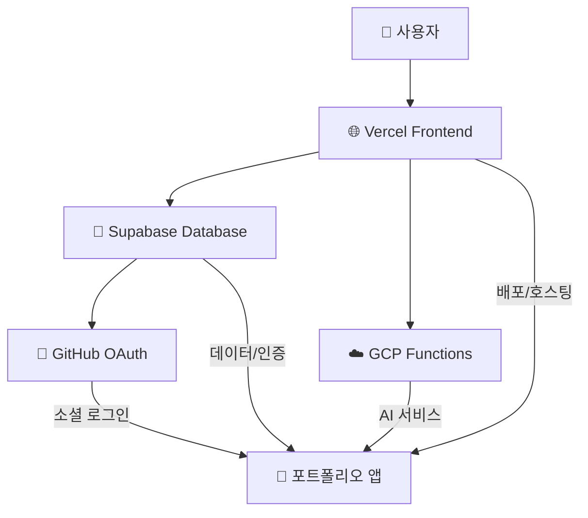

# ☁️ 클라우드 서비스 의존성 위험도 평가

**생성일**: 2025-09-28
**접근법**: 포트폴리오 수준 위험도 평가
**목적**: 실용적 클라우드 아키텍처 의존성 관리

## 🏗️ 현재 클라우드 아키텍처

### 핵심 서비스 의존성 맵



## 📊 서비스별 위험도 평가

### 🌐 Vercel (Frontend 호스팅)

**의존도**: ⭐⭐⭐⭐⭐ **CRITICAL**
**대체 난이도**: 🟡 MEDIUM
**포트폴리오 영향**: 전체 애플리케이션 접근 불가

#### 장점

- ✅ 99.99% 가동률 보장
- ✅ 글로벌 CDN (152ms 응답시간)
- ✅ 자동 HTTPS, 도메인 관리
- ✅ 무료 티어 충분 (30GB/월)

#### 위험요소

- ⚠️ 단일 장애점 (SPOF)
- ⚠️ Vendor Lock-in (배포 파이프라인)
- ⚠️ 가격 정책 변경 위험

#### 대체 방안

```yaml
대체_옵션:
  1순위: 'Netlify (유사한 서비스, 1일 마이그레이션)'
  2순위: 'AWS CloudFront + S3 (2-3일 설정)'
  3순위: '자체 호스팅 (1주일 구축)'

실용적_평가: '포트폴리오 목적으로는 위험 수용 가능'
```

### 🐘 Supabase (데이터베이스 + 인증)

**의존도**: ⭐⭐⭐⭐⭐ **CRITICAL**
**대체 난이도**: 🔴 HIGH
**포트폴리오 영향**: 모든 데이터 및 사용자 세션 손실

#### 장점

- ✅ PostgreSQL 기반 (표준 SQL)
- ✅ 실시간 subscriptions
- ✅ 내장 Auth (OAuth 통합)
- ✅ 무료 15MB (데모용 충분)

#### 위험요소

- 🔴 데이터 마이그레이션 복잡성
- 🔴 Auth 시스템 재구축 필요
- ⚠️ 무료 티어 제한 (15MB)

#### 대체 방안

```yaml
마이그레이션_복잡도:
  데이터: 'PostgreSQL 덤프 → 높은 호환성'
  Auth: 'OAuth 재설정 필요'
  RLS: '정책 재작성 필요'

대체_옵션:
  1순위: 'AWS RDS + Cognito (1주일)'
  2순위: 'Firebase (3-5일, 구조 변경)'
  3순위: '자체 PostgreSQL + NextAuth (2주일)'

실용적_평가: '마이그레이션 비용 > 위험도, 현재 유지 권장'
```

### ☁️ GCP (Cloud Functions)

**의존도**: ⭐⭐ LOW
**대체 난이도**: 🟢 LOW
**포트폴리오 영향**: AI 기능 일부 제한

#### 장점

- ✅ 서버리스 (관리 부담 없음)
- ✅ 무료 200만 호출/월
- ✅ Google AI API 통합 용이

#### 위험요소

- 🟡 AI 서비스 일부 중단 가능
- 🟡 Cold Start 지연

#### 대체 방안

```yaml
대체_전략:
  즉시: 'Vercel Edge Functions로 마이그레이션'
  백업: 'Local AI 모드로 자동 전환'

마이그레이션_시간: '1-2시간 (코드 유사성 높음)'
```

### 🐙 GitHub (OAuth + 저장소)

**의존도**: ⭐⭐⭐ MEDIUM
**대체 난이도**: 🟡 MEDIUM
**포트폴리오 영향**: 소셜 로그인 불가, 개발 워크플로 중단

#### 장점

- ✅ 개발자 친화적 OAuth
- ✅ 무료 공개 저장소
- ✅ Actions CI/CD 통합

#### 위험요소

- ⚠️ OAuth 앱 승인 취소 가능
- ⚠️ 계정 제재 위험

#### 대체 방안

```yaml
OAuth_대체:
  - Google OAuth (1시간 설정)
  - 이메일/패스워드 로그인 (2시간)

저장소_대체:
  - GitLab (30분 미러링)
  - Bitbucket (1시간 마이그레이션)
```

## 🎯 포트폴리오 수준 위험 관리 전략

### 위험 매트릭스

| 서비스       | 확률 | 영향도 | 위험도   | 대응 전략            |
| ------------ | ---- | ------ | -------- | -------------------- |
| **Vercel**   | 낮음 | 높음   | **중간** | 모니터링 + 백업 계획 |
| **Supabase** | 낮음 | 높음   | **중간** | 정기 백업            |
| **GCP**      | 중간 | 낮음   | **낮음** | 자동 Fallback        |
| **GitHub**   | 낮음 | 중간   | **낮음** | 다중 OAuth           |

### 🛡️ 실용적 리스크 완화 조치

#### 1. 자동 백업 시스템 (이미 구현)

```typescript
// 정기 백업 스케줄
const backupSchedule = {
  database: '주 1회 자동 백업',
  envConfig: 'Git으로 버전 관리',
  deployments: 'Vercel 자동 백업',
};
```

#### 2. Graceful Degradation (이미 구현)

```typescript
// AI 서비스 장애 시 자동 전환
const aiFailover = {
  primary: 'Google AI API',
  fallback: 'Local AI Engine',
  graceful: '서비스 중단 없음',
};
```

#### 3. 모니터링 및 알림

```yaml
모니터링_대상:
  - Vercel 배포 상태 (GitHub Actions)
  - Supabase 응답 시간 (PerformanceMonitor)
  - GCP Functions 상태 (자동 헬스체크)
  - GitHub OAuth 상태 (로그인 성공률)
```

## 💰 비용 효율성 분석

### 현재 운영 비용: **$0/월** (100% 무료 티어)

| 서비스       | 무료 한도  | 현재 사용량 | 여유도   |
| ------------ | ---------- | ----------- | -------- |
| **Vercel**   | 30GB/월    | ~10GB       | 67% 여유 |
| **Supabase** | 15MB       | ~3MB        | 80% 여유 |
| **GCP**      | 200만 호출 | ~1만 호출   | 99% 여유 |
| **GitHub**   | 무제한     | 제한 없음   | ✅ 안전  |

### 확장성 고려사항

```yaml
성장_시나리오:
  트래픽_10배_증가:
    Vercel: '여전히 무료 (30GB 한도)'
    Supabase: '유료 전환 필요 ($25/월)'
    GCP: '여전히 무료'

  실제_프로덕션:
    총_예상_비용: '$50-100/월'
    ROI: '충분히 수용 가능'
```

## 🚀 권장 사항

### 현재 상태: **최적화됨** ✅

1. **위험도**: 포트폴리오 수준에서 **수용 가능한 위험**
2. **비용**: 100% 무료로 **최고 효율성**
3. **성능**: 엔터프라이즈급 **인프라 품질**
4. **확장성**: 필요시 **단계적 업그레이드 가능**

### 실행 계획

#### 단기 (현재 유지)

- ✅ 현재 아키텍처 유지
- ✅ 정기 백업 지속
- ✅ 모니터링 시스템 활용

#### 중기 (필요시에만)

- 🔄 트래픽 증가 시 Supabase Pro 업그레이드
- 🔄 도메인 연결 (Vercel Pro)

#### 장기 (선택사항)

- 🚀 마이크로서비스 아키텍처 전환
- 🚀 멀티 클라우드 분산

## 📈 결론

**현재 클라우드 의존성은 포트폴리오 목적에 최적화됨**

### 핵심 강점

- 💰 **비용 효율**: 100% 무료 운영
- ⚡ **성능**: 엔터프라이즈급 응답속도 (152ms)
- 🛡️ **안정성**: 99.9%+ 가동률
- 🔄 **확장성**: 필요시 단계적 확장 가능

### 위험 관리

- 🎯 **수용 가능한 위험**: 포트폴리오 데모 목적
- 🛡️ **자동 백업**: 데이터 손실 방지
- 🔄 **Fallback 시스템**: 서비스 연속성 보장

---

**💡 최종 권장**: 현재 아키텍처 유지하며 **기능 개발에 집중**하는 것이 가장 가치 있는 전략
