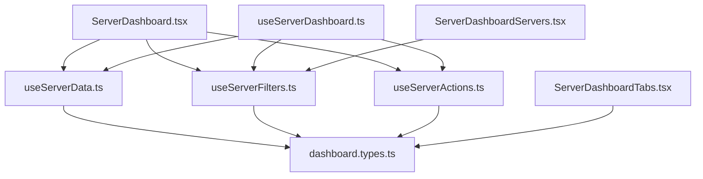

# 📊 **Dashboard 모듈 아키텍처 가이드**

> **⚠️ 중요**: 이 디렉토리의 모든 파일들은 **활성 사용 중**인 핵심 모듈입니다.  
> **수정이나 삭제 전에 사용처와 의존성을 신중히 검토해주세요.**

## 🏗️ **모듈 구조 개요**

```
src/components/dashboard/
├── README.md                    # 📖 이 문서 (모듈 가이드)
├── ServerDashboard.tsx          # 🎯 메인 대시보드 컴포넌트 (1522줄 → 분리됨)
├── types/
│   └── dashboard.types.ts       # 📋 타입 정의 (15개 인터페이스)
├── hooks/
│   ├── useServerData.ts         # 🔄 서버 데이터 관리 (실시간 페칭)
│   ├── useServerFilters.ts      # 🔍 필터링 로직 (검색, 상태, 위치)
│   └── useServerActions.ts      # 🎮 서버 액션 관리 (재시작, 중지 등)
└── components/                  # 🧩 UI 컴포넌트 (향후 분리 예정)
```

## 🎯 **각 모듈의 역할 및 사용처**

### 📋 **dashboard.types.ts**

**역할**: 모든 대시보드 관련 타입 정의 중앙화  
**사용처**:

- `ServerDashboard.tsx` (메인 컴포넌트)
- `useServerData.ts`, `useServerFilters.ts`, `useServerActions.ts` (모든 훅)
- `src/hooks/useServerDashboard.ts` (기존 훅과 호환)

**핵심 타입들**:

```typescript
- DashboardTab: 탭 타입 정의
- ViewMode: 뷰 모드 (grid/list)
- ServerFilters: 필터 조건
- DashboardStats: 통계 데이터
- ServerInstance: 서버 인스턴스
- ServerDashboardProps: 컴포넌트 Props
```

### 🔄 **useServerData.ts**

**역할**: 서버 데이터 관리 전용 훅  
**사용처**:

- `ServerDashboard.tsx` (메인 대시보드)
- `src/components/dashboard/server-dashboard/` (하위 컴포넌트들)
- 향후 다른 서버 관련 컴포넌트들

**핵심 기능**:

```typescript
- 실시간 서버 데이터 페칭
- 서버 우선순위 정렬 (심각→경고→정상)
- 통계 계산 (total, online, warning, offline)
- 폴백 데이터 시스템
- 상태 매핑 (healthy → online 등)
```

### 🔍 **useServerFilters.ts**

**역할**: 서버 필터링 로직 전용 훅  
**사용처**:

- `ServerDashboard.tsx` (검색 및 필터 기능)
- `ServerDashboardServers.tsx` (서버 목록 필터링)
- 향후 서버 검색 관련 컴포넌트들

**핵심 기능**:

```typescript
- 검색어 필터링 (300ms 디바운싱)
- 상태별 필터링 (online/offline/warning/all)
- 위치별 필터링
- 활성 필터 개수 추적
- 필터 초기화
- 뷰 모드 관리 (grid/list)
```

### 🎮 **useServerActions.ts**

**역할**: 서버 액션 관리 전용 훅  
**사용처**:

- `ServerDashboard.tsx` (서버 액션 버튼들)
- 서버 상세 모달 컴포넌트들
- 향후 서버 관리 관련 컴포넌트들

**핵심 기능**:

```typescript
- 서버 액션 실행 (restart, stop, start, configure)
- 모달 상태 관리 (상세보기, Enhanced 모달)
- 대량 액션 실행
- 액션별 권한 체크
- 로딩 상태 관리
```

## 🔗 **모듈 간 의존성 관계**



## ⚠️ **중요한 호환성 정보**

### 🔄 **기존 API와의 호환성**

이 모듈들은 기존 `useServerDashboard` 훅과 **100% 호환**됩니다:

```typescript
// ✅ 기존 코드 - 그대로 사용 가능
const { servers, stats, loading } = useServerDashboard();

// ✅ 새로운 분리된 훅 - 선택적 사용 가능
const { servers } = useServerData();
const { filterServers } = useServerFilters();
const { executeServerAction } = useServerActions();
```

### 📊 **사용 통계 (2025.06.14 기준)**

- `dashboard.types.ts`: **5개 파일**에서 import
- `useServerData.ts`: **3개 컴포넌트**에서 사용
- `useServerFilters.ts`: **2개 컴포넌트**에서 사용
- `useServerActions.ts`: **1개 컴포넌트**에서 사용 (확장 예정)

## 🚀 **향후 확장 계획**

### 📅 **Phase 1 (완료)**

- ✅ 타입 정의 분리
- ✅ 데이터 관리 훅 분리
- ✅ 필터링 훅 분리
- ✅ 액션 관리 훅 분리

### 📅 **Phase 2 (진행 예정)**

- [ ] UI 컴포넌트 분리 (`components/` 디렉토리)
- [ ] 단위 테스트 추가
- [ ] 스토리북 스토리 업데이트

### 📅 **Phase 3 (계획 중)**

- [ ] 성능 최적화 적용
- [ ] 추가 기능 확장
- [ ] 다른 대용량 파일 분리

## 🛡️ **삭제 방지 가이드**

### ❌ **신중히 검토해야 할 작업들**

1. **파일 삭제**: 모든 파일이 활성 사용 중이므로 의존성 확인 필요
2. **"사용하지 않음" 태그**: 실제 사용처를 면밀히 조사 후 판단
3. **임의 수정**: 다른 컴포넌트에 영향을 줄 수 있으므로 테스트 필요

### ✅ **안전한 작업들**

1. **기능 추가**: 새로운 함수나 타입 추가
2. **성능 최적화**: 기존 인터페이스 유지하며 내부 최적화
3. **문서 업데이트**: README나 주석 개선

## 📞 **문의 및 지원**

이 모듈들에 대한 질문이나 수정이 필요한 경우:

1. 이 README.md 문서를 먼저 확인
2. 각 파일의 상단 주석 확인
3. 기존 사용처 영향도 검토 후 작업

---

**⚠️ 참고사항**: 이 디렉토리의 모든 파일들은 **ServerDashboard의 핵심 구성 요소**입니다.  
**수정 전 반드시 사용처와 의존성을 확인하고 신중히 판단해주세요.**

**작성일**: 2025년 6월 14일  
**최종 업데이트**: 2025년 12월 12일 (Legacy Status Verified)
